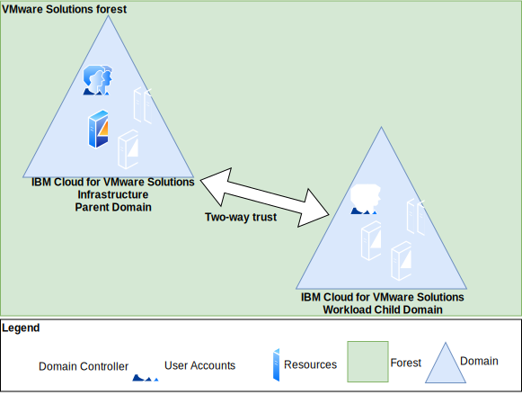

---

copyright:

  years:  2019, 2024

lastupdated: "2024-10-10"

subcollection: vmwaresolutions

---

{{site.data.keyword.attribute-definition-list}}

# Integrating the infrastructure domain with the workload domain
{: #adds-integration}

Integrating the {{site.data.keyword.vmwaresolutions_full}} infrastructure domain with the {{site.data.keyword.vmwaresolutions_short}} workload domain is not recommended. You must allow the workload domain controllers that are connected to the underlay network to communicate with the infrastructure domain controllers that are connected to the underlay network. For more information, see the following documents.

* [Description of support boundaries for Active Directory over NAT](https://learn.microsoft.com/en-us/troubleshoot/windows-server/active-directory/support-for-active-directory-over-nat){: external}
* [Steps to avoid registering unwanted NICs in DNS on a multihomed domain controller](https://learn.microsoft.com/en-us/troubleshoot/windows-server/networking/unwanted-nic-registered-dns-mulithomed-dc){: external}

However, if you need information about this integration, review the following models.
* {{site.data.keyword.vmwaresolutions_short}} forest with parent-child trust.
* {{site.data.keyword.vmwaresolutions_short}} forest with tree-root trust.
* Two-way forest trust.
* External trust.

## {{site.data.keyword.vmwaresolutions_short}} forest with parent-child trust
{: #adds-integration-parent-child}

This model creates a single forest by using the existing {{site.data.keyword.vmwaresolutions_short}} infrastructure domain as the parent and configuring a new {{site.data.keyword.vmwaresolutions_short}} workload child domain. As all parent-child domains use transitive two-way trusts by default, vSphere SSO can access all users from either domain. The following diagram shows the Active Directory Domain Services topology for this {{site.data.keyword.vmwaresolutions_short}} forest with parent-child trust model.

{: caption="{{site.data.keyword.vmwaresolutions_short}} forest with parent-child trust diagram" caption-side="bottom"}

## {{site.data.keyword.vmwaresolutions_short}} forest with tree-root trust
{: #adds-integration-treeroot}

This model creates a single forest by using the existing {{site.data.keyword.vmwaresolutions_short}} infrastructure domain as the parent and configuring a new {{site.data.keyword.vmwaresolutions_short}} workload parent domain. The tree-root trust is a two-way transitive trust between the two parent domains. The vSphere SSO connected to the {{site.data.keyword.vmwaresolutions_short}} infrastructure domain can access the users from the other parent domain.

If the other parent domain has a child domain, due to the two-way trust, those users are also accessible. The following diagram shows the Active Directory Domain Services topology for this {{site.data.keyword.vmwaresolutions_short}} forest with tree-root trust model.

{: caption="{{site.data.keyword.vmwaresolutions_short}} forest with tree-root trust diagram" caption-side="bottom"}

## Two-way forest trust
{: #adds-integration-twoway}

VMware always recommends two-way trusts for forest trusts. For more information, see [Microsoft Active Directory Trusts supported by VMware vCenter Single Sign-On](https://knowledge.broadcom.com/external/article?legacyId=2064250){: external}.

Because two-way trusts are used between the {{site.data.keyword.vmwaresolutions_short}} infrastructure forest and the {{site.data.keyword.vmwaresolutions_short}} workload forest, vSphere SSO can use this trust so users can be authenticated from all parent and child domains in the {{site.data.keyword.vmwaresolutions_short}} workload forest. The following diagram shows the Active Directory Domain Services topology for this two-way forest trust model.

{: caption="Two-way forest trust diagram" caption-side="bottom"}

## External trust
{: #adds-integration-external}

VMware always recommends two-way trusts for external trusts. For more information, see [Microsoft Active Directory Trusts supported by VMware vCenter Single Sign-On](https://knowledge.broadcom.com/external/article?legacyId=2064250){: external}. An external trust establishes a trust to a specific domain within a separate forest that is not joined through a forest trust.

The two-way trust between the {{site.data.keyword.vmwaresolutions_short}} infrastructure forest and the {{site.data.keyword.vmwaresolutions_short}} workload domain allows vSphere SSO to use the trust so users can be authenticated from the {{site.data.keyword.vmwaresolutions_short}} workload domain. The following diagram shows the Active Directory Domain Services topology for this external trust model.

{: caption="External trust diagram" caption-side="bottom"}

## Related links
{: #adds-integration-related}

* [Description of support boundaries for Active Directory over NAT](https://learn.microsoft.com/en-us/troubleshoot/windows-server/active-directory/support-for-active-directory-over-nat){: external}
* [Steps to avoid registering unwanted NICs in DNS on a multihomed domain controller](https://learn.microsoft.com/en-us/troubleshoot/windows-server/networking/unwanted-nic-registered-dns-mulithomed-dc){: external}
