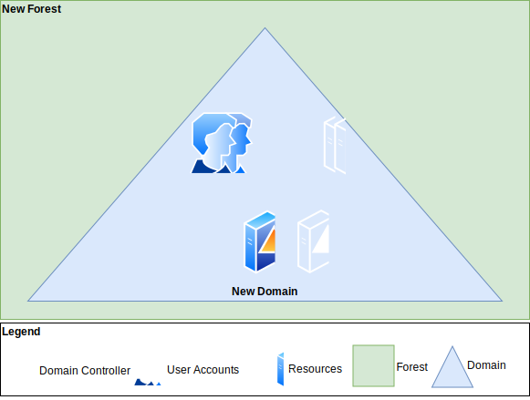
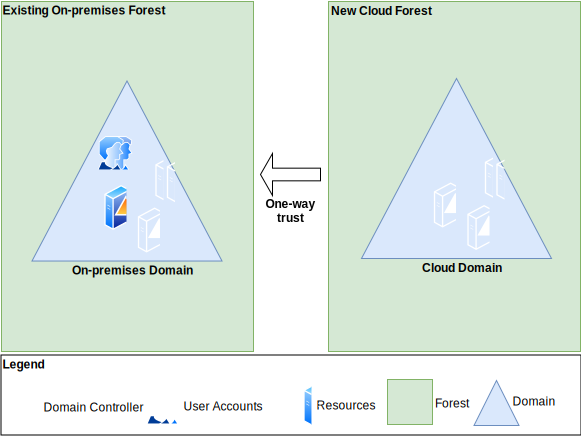
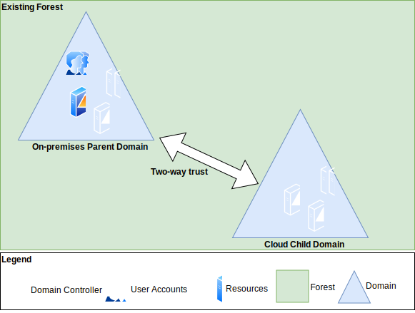
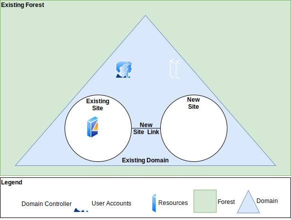
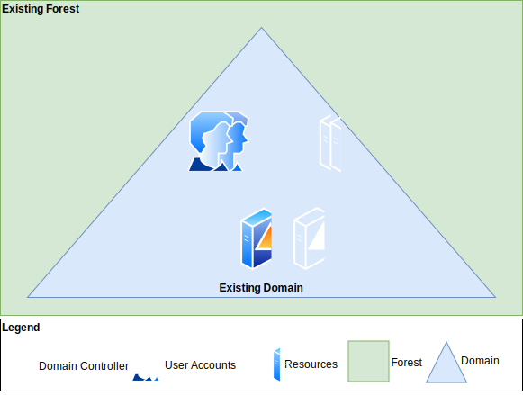

---

copyright:

  years:  2019, 2020

lastupdated: "2020-03-30"

subcollection: vmware-solutions

---

{:external: target="_blank" .external}
{:tip: .tip}
{:note: .note}
{:important: .important}

# IBM Cloud for VMware Solutions workload domain
{: #adds-wkld-domain}

Your customer workload VMs are using the network overlay virtualized network with customer Bring Your Own IP (BYOIP) address space, these IP ranges should be associated with the customer workload AD domain and not the {{site.data.keyword.vmwaresolutions_full}} infrastructure AD domain. We recommend that the {{site.data.keyword.vmwaresolutions_short}} infrastructure AD domain holds resources and user accounts for administration of the vCenter Server instance only, and that resources and user accounts for your workload VMs are held in a separate forest or domain.

The infrastructure appliances and VMs such as; vCenter and NSX Manager, are deployed on the underlay network with an IP address space that is assigned by IBM Cloud. Unless  configured, the customer workload VMs on the overlay networks will not be able to reach the AD domain controllers on the underlay network and the infrastructure appliances on the underlay network will not be able to reach the customer workload AD domain controllers on the overlay networks.

{{site.data.keyword.vmwaresolutions_short}} customers typically use one of the following models for their {{site.data.keyword.vmwaresolutions_short}} workload domain:

* New stand-alone AD forest/domain.
* New AD forest with trusts to existing forest.
* Extend forest and create a new domain.
* Extended domain with AD sites model.
* Extend domain.

## New stand-alone AD forest/domain model
{: #adds-wkld-domain-new-standalone}

This model deploys a stand-alone forest/domain with no trust. In this deployment model, a new forest and {{site.data.keyword.vmwaresolutions_short}} workload domain for your workloads hosted in your vCenter Server instance is configured which is different and separate from an existing AD that is running on-premises. The main reason for selecting this model is to keep accounts and resources separate between the two forests/domains. In this model, the customer would provision a minimum of two domain controllers as VMs hosted in each vCenter Server instance. These VMs would be connected to an overlay network and the new domain controllers would have the Primary Domain Controller role. All user credentials, service accounts, and computer objects reside in this {{site.data.keyword.vmwaresolutions_short}} workload domain hosted on these domain controllers. No AD network connectivity requirement between on-premises and IBM Cloud as nothing is shared between the two AD forests. The {{site.data.keyword.vmwaresolutions_short}} infrastructure domain is used for the user credentials and service accounts of your system administrators and the resource objects for the underlay connected infrastructure components only. The following diagram shows the AD DS topology for this stand-alone AD forest model.

{: caption="Figure 1. New stand-alone AD forest/domain diagram" caption-side="bottom"}

## New AD forest with trusts to existing forest model
{: #adds-wkld-domain-new-adf}

This model deploys a new forest/domain in IBM Cloud with a trust to an existing forest on-premises. If you are planning on using user accounts from your on-premises AD forest to resources running as VMs hosted on your vCenter Server instance in the {{site.data.keyword.vmwaresolutions_short}} workload forest/domain, you must establish at least a one-way trust to your AD forest/domain running in IBM Cloud. In this deployment model, your IC4V workload forest/domain becomes the resource domain where resource objects are located, and on-premises domain becomes the user account domain. You must have AD connectivity between on-premises and IBM Cloud. Typically, a two-way trust is not commonly deployed in this model as an alternative deployment pattern is used to extend Active Directory. The {{site.data.keyword.vmwaresolutions_short}} infrastructure domain is used for the user credentials and service accounts of your system administrators and the resource objects for the underlay connected infrastructure components only. The following diagram  shows the AD DS topology for this new forest with trusts model.

{: caption="Figure 2. New AD forest with trusts to existing forest diagram" caption-side="bottom"}

## Extend forest and create a new domain model
{: #adds-wkld-domain-ext-forest}

In this deployment model, you extend your existing AD forest from on-premises to IBM Cloud and create a new child domain, which means adding more domain controllers running as VMs hosted on your vCenter Server instance. This deployment is easy, flexible, and provides the following advantages:

* You are not required to set up additional trusts.
* Domain controllers in IBM Cloud are handling both accounts and resources.
* More resilient to network connectivity issues.

In this model, the customer would provision a minimum of two domain controllers as VMs hosted in each vCenter Server instance. These VMs would be connected to an overlay network and the new domain controllers would have the Primary Domain Controller role for the child domain. All user credentials, service accounts, and resource objects reside in this {{site.data.keyword.vmwaresolutions_short}} workload child domain that is hosted on these domain controllers, however, because of the two-way trust inherent in the parent-child relationship, the child domain resource objects can be access via the users in the parent domain and vice versa. Network connectivity is required between your data center and IBM for initial and on-going replication of data between the domain controllers. The following diagram shows the AD DS topology for this extended forest with new child domain model.

{: caption="Figure 3. Extend forest and create new domain diagram" caption-side="bottom"}

## Extend domain with AD sites model
{: #adds-wkld-domain-ext-sites}

In this model, the customer would provision a minimum of two domain controllers as VMs hosted in each vCenter Server instance. These VMs would be connected to an overlay network and this network would have connectivity to existing customer domain controllers in the enterprise. A new AD site would be configured in the existing forest/domain along with a new site link. The new domain controllers would be connected to the existing domain and moved into the new AD site. The AD site contains the overlay subnet. The new domain controllers would have the Additional Domain controller role while the existing domain controllers would have the Primary Domain Controller role. For more information, see [Understanding AD site topology](https://docs.microsoft.com/en-us/windows-server/identity/ad-ds/plan/understanding-active-directory-site-topology){:external}. The following diagram shows the AD DS topology for this extended domain with AD sites model.

{: caption="Figure 4. Extend domain with AD sites diagram" caption-side="bottom"}

The {{site.data.keyword.vmwaresolutions_short}} infrastructure domain is used for the user credentials and service accounts of your system administrators and the resource objects for the underlay connected infrastructure components only. The existing forest can be linked to the {{site.data.keyword.vmwaresolutions_short}} forest with the use of trusts if required.

## Extended domain model
{: #adds-wkld-domain-ext-domain}

This extended domain model is the simplest and with this model you can seamlessly set up and use IBM Cloud in a hybrid scenario with the least impact to the applications. Layer 2 network connectivity is required between your data center and IBM and is, therefore, an ideal model for VMware HCX. This model allows for the existing domain controllers to remain initially on-premises and these domain controllers will be accessible via the stretched layer 2 network from the migrated VMs. Domain and DNS configuration in the migrated VMs does not need to change for the migration. At the required time, the domain controllers can be migrated to the vCenter Server instance with no change.

Depending on the complexity of the AD DS, when the layer 2 network extension is removed, additional AD DS tasks might need to be performed if the complete forest/domain has not moved to IBM Cloud. The use of AD sites can help with the control of replication traffic across the layer 3 network between on-premises and IBM Cloud. See to the extended domain with AD sites model described in the previous section. The following diagram shows the AD DS topology for this extended domain model.

{: caption="Figure 5. Extended domain diagram" caption-side="bottom"}

## Restructuring AD domains
{: #adds-wkld-domain-restructure}

It is possible to restructure AD domains, however, the details are out of scope of this document. There are two types of restructure:

* Inter-forest restructure - When you migrate objects between forests, both the source domain and target domain environments exist simultaneously. This makes it possible for you to roll back to the source environment during the migration, if necessary.
* Intra-forest restructure - When you restructure domains within a forest, the migrated accounts no longer exist in the source domain.

For more information, see [ADMT Guide: Migrating and Restructuring Active Directory Domains](https://www.microsoft.com/en-us/download/confirmation.aspx?id=19188){:external}.

## Best practice guidance for AD in a vCenter Server instance
{: #adds-wkld-domain-bestpractice}

Best practice guidance for AD in a vCenter Server instance includes the following:

* To understand supported AD trusts, see [Microsoft Active Directory Trusts supported by VMware vCenter Single Sign-On (2064250)](https://kb.vmware.com/s/article/2064250){:external}.
* vCenter should be enabled with an identity source for authentication of all vCenter services as well as system administrators. This is configured by the {{site.data.keyword.vmwaresolutions_short}} automation ready for the customer to add their system administrator users. All systems administrators who will be managing the VMware Server instance should have user accounts that are members of this domain.
* A domain should be created to serve as a single point of access control for systems administrators supporting the VMware vSphere and NSX infrastructure components. This is configured by the {{site.data.keyword.vmwaresolutions_short}} automation.
* Two domain controllers should be deployed for resiliency. If you have selected the single VSI AD/DNS option you should provision a second Windows VSI and configure as a domain controller.
* The existing domain name is should not be changed.
* The existing ic4V-vCenter AD security group should not be changed.
* The existing user automation should not be changed, or its group membership be altered.
* The existing add-on service accounts should not be changed, or their groups membership altered.
* When deploying the {{site.data.keyword.vmwaresolutions_short}} workload domain controllers, deploy them in subnets that don’t have a route to a NAT gateway or other device that would provide outbound Internet access.
* Keep OS security patches up-to-date on all the domain controllers.
* Restrict ports and protocols that are allowed into the domain controllers by using NSX distributed firewall.
* Allow remote management access, like remote desktop protocol (RDP) only from trusted networks.
* Consider if encryption of the VM is required.
* If you have chosen the option to deploy AD servers into the vSphere cluster, provide Microsoft Windows licensing and activation for the servers to ensure compliance and availability.
* Integrate NSX VPN, if applicable, with AD SSO.
* Integrate vSphere ESXi hosts with AD SSO.
* Consider extending the existing AD security group structure in the {{site.data.keyword.vmwaresolutions_short}} infrastructure domain to provide additional segregation of duties. An example of this structure is provided in the following table. Individual user accounts should not exist in more than one of these groups, as they are mutually exclusive.

| AD security group name | Description | SSO role mapping |
|:-----------------------|:------------|:-----------------|
| NSX Enterprise Admins | Largest set of privileges. Should contain a small group of users responsible for administering all components of NSX, including all NSX operations (Deploy, Configure, Upgrade), and managing Security Policy. | Assign to “NSX Enterprise Administrator” role in NSX Manager |
| NSX Admins | Subset of “NSX Enterprise Administrator” group. For users that require permissions for NSX operations only, for example, install virtual appliances or configure port groups. | Assign to “NSX Administrator” role in NSX Manager |
| NSX Security Admins | Subset of “NSX Enterprise Administrator” group. For users that require permissions for NSX security only, for example, define data security policies, create port groups, and create reports for NSX modules. | Assign to “Security Administrator” role in NSX Manager. Initially use Global scope. |
| NSX Auditors | Subset of “NSX Enterprise Administrator” group. For users that require NSX READ-ONLY permissions. | Assign to “Auditor” role in NSX Manager. Initially use Global scope. |
| ESX Admins | This group is used when the ESXi hosts are added to Active Directory and allows for system administrators to connect to ESXi directly using vSphere client and via ssh to the ESXi console using named accounts instead of ‘root’. In the advanced settings of an ESXi host, the default group is named “ESX Admins”. This group name can be changed. If this is done, ensure that an identically named AD security group is also created. | This group must be defined in each ESXi host’s advanced settings (ConfigurationSoftwareAdvanced SettingsConfig.HostAgent.plugins.hostsvc.esxAdministratorGroup), but does not require special vCenter application level role or permissions. |
{: caption="Table 1. Active Directory security groups" caption-side="top"}

**Next topic:** [Integrating the infrastructure domain with the workload domain](/docs/vmwaresolutions?topic=vmware-solutions-adds-integration)

## Related links
{: #adds-wkld-domain-related}

* [Overview of {{site.data.keyword.vmwaresolutions_short}}](/docs/vmwaresolutions?topic=vmware-solutions-solution_overview)
* [Getting started with IBM Cloud for VMware Solutions](/docs/vmwaresolutions?topic=vmware-solutions-getting-started)
* [IBM Cloud for VMware Solutions: Take a look under the hood](/docs/vmwaresolutions?topic=vmware-solutions-under_the_hood)
