---

copyright:

  years:  2024

lastupdated: "2024-06-11"

subcollection: vmwaresolutions

---

{{site.data.keyword.attribute-definition-list}}

# Architecture pattern for deploying Client VPN into {{site.data.keyword.vcf-vpc}}
{: #arch-pattern-vcf-clientvpn}

This architecture pattern explains how to deploy Client VPN for VPC (Virtual Private Cloud) with an {{site.data.keyword.vcf-vpc}} deployment. Client VPN for VPC provides client-to-site connectivity, which allows remote devices to securely connect to the VPC network by using an OpenVPN software client. This solution is useful for VMware® administrators who want to connect to the {{site.data.keyword.cloud_notm}} from a remote location to manage an {{site.data.keyword.vcf-vpc}} instance.

An overview of this architecture pattern is shown in the following diagram.

{: caption="Using a client VPN with an {{site.data.keyword.vcf-vpc}} deployment" caption-side="bottom"}

## Deploying Client VPN into {{site.data.keyword.vcf-vpc-short}}
{: #arch-pattern-vcf-clientvpn-deploy}

The following diagram introduces the high-level steps to deploy Client VPN into {{site.data.keyword.vcf-vpc-short}}.

{: caption="Deploying Client VPN into {{site.data.keyword.vcf-vpc-short}}" caption-side="bottom"}

This architecture pattern deployment is summarized as follows:

1. Review general [planning considerations for VPN servers](/docs/vpc?topic=vpc-client-to-site-vpn-planning). 
2. Decide which VPN client authentication mode to use: certificate-based, user ID and passcode, or both.
3. [Create a Secrets Manager service instance](/docs/secrets-manager?topic=secrets-manager-create-instance) and create and upload your TLS certificates.
4. Create an [IAM service-to-service authorization](/docs/vpc?topic=vpc-client-to-site-authentication#creating-iam-service-to-service) for your VPN server and {{site.data.keyword.cloud_notm}} Secrets Manager.
5. Design your Client IPv4 address pool and network access, general routing, and VPN server placement. Use the {{site.data.keyword.vcf-vpc-short}} and Tier 0 private uplink VPC subnet or management subnet, depending on your networking requirements.
6. Provision a stand-alone VPN server in a subnet (or provision a VPN server in two subnets for better high availability). For more information, see [Creating a VPN server](/docs/vpc?topic=vpc-vpn-create-server).
7. [Create VPN routes](/docs/vpc?topic=vpc-vpn-client-to-site-routes) on your VPN server and [VPC routes](/docs/vpc?topic=vpc-create-vpc-route&interface=ui) on the {{site.data.keyword.vcf-vpc-short}}.
8. [Set up a client VPN environment](/docs/vpc?topic=vpc-vpn-client-environment-setup) and connect to the VPN server.

## Tips for deploying Client VPN into {{site.data.keyword.vcf-vpc-short}}
{: #arch-pattern-vcf-clientvpn-deploy-tips}

* When you create VPN routes, you can use `translate` option to translate the source IP to the VPN server's private IP address before it is sent out from the VPN server, making your VPN client IP address from Client IPv4 address pool invisible to the destination devices. This process eases VPC up routing configurations.
* Split tunnel is typically the mode what you would use if you need simultaneous access to the corporate network and {{site.data.keyword.vcf-vpc-short}}. Then, private traffic flows through the VPN interface to the VPN tunnel, and public traffic flows through the existing LAN interface. You can manage this process with VPN routes.
* The VMware Cloud Foundation instance uses {{site.data.keyword.cloud_notm}} DNS Server default IP addresses `161.26.0.7` and `161.26.0.8`. When you manage the VMware Cloud Foundation instance, you need to ensure that you can use the DNS server and resolve the VMware Cloud Foundation entries. So ensure that your VPN routes cover this range.

## Considerations
{: #arch-pattern-vcf-clientvpn-considerations}

When you design or deploy this architecture pattern, consider the following information:

* Design your IP addressing and VPN routing patterns. Think about the networks to be routed to the {{site.data.keyword.vcf-vpc-short}} and what NSX overlay networks you need to access from the VPN.  
* Review general [planning considerations for VPN servers](/docs/vpc?topic=vpc-client-to-site-vpn-planning).
* Decide your VPN client authentication mode. You can use certificate-based, user ID and passcode, or both.
* It is recommended to create private certificates with [these considerations](/docs/vpc?topic=vpc-client-to-site-authentication#using-private-certificate) in mind.

## Related links
{: #arch-pattern-vcf-clientvpn-links}

* [VPC network design](/docs/vmwaresolutions?topic=vmwaresolutions-vpc-vcf-vpc-deployment)
* [VPC client-to-site VPN servers](/docs/vpc?topic=vpc-vpn-client-to-site-overview&interface=ui)
