---

copyright:

  years:  2024, 2025

lastupdated: "2025-01-17"

subcollection: vmwaresolutions

---

{{site.data.keyword.attribute-definition-list}}

# Architecture pattern for deploying HCX on VMware Cloud Foundation standard architecture
{: #arch-pattern-vcf-hcx-std}

This architecture pattern explains how to deploy VMware HCX™ on {{site.data.keyword.vcf-vpc}} standard architecture deployment in {{site.data.keyword.vpc_short}}. With HCX, you can streamline workload migration, manage workload rebalancing, and ensure business continuity across data centers and clouds.

An overview of this architecture pattern is shown in the following diagram.

{: caption="HCX on VMware Cloud Foundation standard architecture" caption-side="bottom"}

To obtain image to install the required software in this architecture pattern, raise an {{site.data.keyword.cloud_notm}} Support ticket to {{site.data.keyword.vmwaresolutions_full}}.
{: important}

## Deploying HCX on VMware Cloud Foundation standard architecture deployment
{: #arch-pattern-vcf-hcx-std-deploy}

The following diagram introduces the high-level steps to deploy HCX on a VMware Cloud Foundation standard architecture.

{: caption="Deploying HCX on VMware Cloud Foundation standard architecture" caption-side="bottom"}

This architecture pattern deployment is summarized as follows:

1. Create one bare metal server VLAN interface for HCX Manager into the VPC (Virtual Private Cloud) management subnet. Attach the interface to the existing management security group. Add required DNS A and PTR records to the DNS service.
1. Deploy the HCX Cloud manager appliance and integrate it with vCenter and NSX manager. Plan and size your HCX deployment.
1. Create the required number of bare metal server VLAN interfaces with reserved IP addresses by using consecutive IP range into the VI workload domain's management (minimum 2) and vMotion (minimum 1) subnets for HCX appliances (IX and NEs). Attach each interface to the existing management and vMotion security groups.
1. Create HCX network profiles for a **combined management and uplink** and **vMotion** in HCX Manager by using the IP addresses created in the previous step.
1. Create an HCX compute profile for the HCX fleet components by using the created network profiles in HCX Manager.

## Considerations for deploying HCX on VMware Cloud Foundation standard architecture
{: #arch-pattern-vcf-hcx-std-considerations}

When you design or deploy this architecture pattern, consider the following information:

* Currently, {{site.data.keyword.vcf-vpc}} supports to be a source only when you create site peering and service mesh **over a public network**. Therefore, HCX shows as a source, but migration is still possible both ways. HCX appliances use {{site.data.keyword.vpc_short}} public gateway for the egress traffic. For more information, see [Architecture pattern for HCX site peering and service mesh in {{site.data.keyword.cloud_notm}}](/docs/vmwaresolutions?topic=vmwaresolutions-arch-pattern-vcf-hcx-xconnectivity).
* **Private networking** supports both **source and destination** HCX site peering deployments.

## Related links
{: #arch-pattern-vcf-hcx-std-links}

* [VPC network design](/docs/vmwaresolutions?topic=vmwaresolutions-vpc-vcf-vpc-deployment)
* [VMware HCX documentation](https://techdocs.broadcom.com/us/en/vmware-cis/hcx.html){: external}
