---

copyright:

  years:  2024, 2025

lastupdated: "2025-10-24"

subcollection: vmwaresolutions

---

{{site.data.keyword.attribute-definition-list}}

# Architecture pattern for HCX site peering and service mesh in {{site.data.keyword.cloud_notm}}
{: #arch-pattern-vcf-hcx-xconnectivity}

{{site.data.content.vms-deprecated-note}}

This architecture pattern explains how to deploy and configure connectivity for VMware HCX™ on {{site.data.keyword.vcf-vpc}} instances that are running on {{site.data.keyword.vpc_short}}. These connectivity patterns use a combination of {{site.data.keyword.cloud_notm}} native services and networking services that are provided by VMware NSX®.

This pattern assumes that HCX is deployed by following the guidance for the [consolidated architecture](/docs/vmwaresolutions?topic=vmwaresolutions-arch-pattern-vcf-hcx-con).

## Connectivity over private network
{: #arch-pattern-vcf-hcx-xconnectivity-private}

{{site.data.keyword.vcf-vpc}} can be both a target and a source for a site peering and service mesh over private network though Transit Gateway and Direct Link. HCX appliance uplinks use {{site.data.keyword.vpc_short}} routing capabilities to access on-premises, other {{site.data.keyword.vpc_short}} VMware or Classic VMware deployments.

The following diagram introduces the high-level steps to configure and deploy this connectivity type.

{: caption="Connectivity over private network" caption-side="bottom"}

This architecture pattern deployment is summarized as follows:

1. Provision a new or use an existing Transit Gateway or Direct Link to connect to the HCX replication partner network.
1. Validate that the management subnet in Virtual Private Cloud (VPC) and the other VMware® deployment's HCX management and uplink networks are routed and can communicate properly.
1. With Classic Infrastructure VMware and HCX deployments, ensure that you attached the Classic network as a Transit Gateway connection and routing toward the VPC prefixes or subnets is configured in the HCX appliances to point toward the {{site.data.keyword.cloud_notm}} private network's backend customer router (BCR). In addition, ensure that you have a new private portable subnet for private uplinks in the Classic Infrastructure, if you use that as the source or destination side HCX.
1. Create an HCX service mesh by using the compute profile created during the HCX deployment.
1. Use management subnet for HCX management and uplink traffic and vMotion subnets for vMotion traffic in VPC.
1. Create L2 extensions by using network extensions for the NSX overlay segments, if required.

## Connectivity over the internet
{: #arch-pattern-vcf-hcx-xconnectivity-public-internet}

Currently, {{site.data.keyword.vcf-vpc}} supports to be a source only when you create site peering and service mesh over a public network. Though HCX is used as a source, migration is possible both ways. In this model, HCX appliances use {{site.data.keyword.vpc_short}} public gateway for the egress traffic.

The following diagram introduces the high-level steps to configure and deploy this connectivity type.

{: caption="Connectivity over Public Internet" caption-side="bottom"}

This architecture pattern deployment is summarized as follows:

1. Establish site peering between on-premises and the VMware Cloud Foundation instance in {{site.data.keyword.vpc_short}}. The connection must be established from the VMware Cloud Foundation instance.
1. Egress connectivity to the internet is established through the public gateway that is attached to the management subnet. Here, the traffic is in principle just source NATed by using the floating IP address that is assigned to the public gateway as the new source IP address. You can use this floating IP address in your firewall rules, if needed.
1. Create a service mesh by using the compute profile created during the deployment.
1. Use management subnet for HCX management and uplink network interfaces in the network profiles. Use the vMotion subnet for vMotion traffic.
1. Create L2 extensions by using Network Extensions for the NSX overlay segments, if required.

HCX as Cloud target does not support NAT and floating IP addresses cannot be used to be as a direct target for HCX in this connectivity pattern.
{: important}

## Considerations for HCX site peering and service mesh in {{site.data.keyword.cloud_notm}}
{: #arch-pattern-vcf-hcx-xconnectivity-considerations}

When you design or deploy this architecture pattern, consider the following information:

* For detailed HCX network flows, see [Networks diagrams for VMware HCX](https://ports.broadcom.com/network-diagrams/VMware-HCX){: external}.
* Create a network profile that matches the required HCX network flows.
* Ensure your MTUs match end to end.
* Ensure that the networks are properly routed and possible firewall rules allow the required traffic at both the source and destination sites and between the HCX appliance uplinks.

## Related links
{: #arch-pattern-vcf-hcx-xconnectivity-links}

* [Architecture pattern for HCX - consolidated architecture](/docs/vmwaresolutions?topic=vmwaresolutions-arch-pattern-vcf-hcx-con)
* [VPC network design](/docs/vmwaresolutions?topic=vmwaresolutions-vpc-vcf-vpc-deployment)
* [VMware HCX documentation](https://techdocs.broadcom.com/us/en/vmware-cis/hcx.html){: external}
