---

copyright:

  years:  2024, 2025

lastupdated: "2025-01-31"

subcollection: vmwaresolutions

---

{{site.data.keyword.attribute-definition-list}}

# Architecture pattern for deploying Tanzu on VMware Cloud Foundation standard architecture
{: #arch-pattern-vcf-tanzu-std}

This architecture pattern explains how to deploy VMware Tanzu on {{site.data.keyword.vcf-vpc}} standard architecture deployment in {{site.data.keyword.vpc_short}}. Tanzu is a modular, cloud-native application platform that accelerates development, delivery, and operations across multiple clouds. With Tanzu, you can deploy containers on a Kubernetes-based platform that is integrated with VMware vSphere® and VMware NSX®.

An overview of this architecture pattern is shown in the following diagram.

{: caption="Tanzu on VMware Cloud Foundation standard architecture" caption-side="bottom"}

Tanzu can be deployed only on the VMware Cloud Foundation standard architecture.
{: important}

## Deploying Tanzu on VMware Cloud Foundation standard architecture deployment
{: #arch-pattern-vcf-tanzu-std-deploy}

The following diagram represents high-level deployment steps for Tanzu implementation. In this architecture pattern, Tanzu is deployed into NSX overlay at the VI workload domain.

{: caption="Deploying Tanzu on VMware Cloud Foundation standard architecture" caption-side="bottom"}

This architecture pattern deployment is summarized as follows:

1. Design IP addressing for the Tanzu networks on the VI workload domain's NSX overlay. Create VPC (Virtual Private Cloud) routes for routable Tanzu networks with VI workload Tier 0 HA VIP as the next-hop for these networks.
1. Deploy Tanzu on VI workload domain by following the VMware Cloud Foundation and Tanzu documentation.
1. Add DNS records to DNS Service as needed.

## Considerations for deploying Tanzu on VMware Cloud Foundation standard architecture
{: #arch-pattern-vcf-tanzu-std-considerations}

When you design or deploy this architecture pattern, note that Tanzu can be deployed only on the VMware Cloud Foundation standard architecture.
{: important}

## Related links
{: #arch-pattern-vcf-tanzu-std-links}

* [VPC network design](/docs/vmwaresolutions?topic=vmwaresolutions-vpc-vcf-vpc-deployment)
* [Developer ready infrastructure for VMware Cloud Foundation](https://techdocs.broadcom.com/us/en/vmware-cis/vcf/vvs/1-0/developer-ready-infrastructure-for-vmware-cloud-foundation.html){: external}
* [VMware Cloud Foundation with VMware Tanzu](https://docs.vmware.com/en/VMware-Cloud-Foundation/5.1/vcf-admin/GUID-9BEED8EB-0DD7-4AC1-A9ED-216EDEA97D6C.html){: external}
