---

copyright:

  years:  2024

lastupdated: "2024-01-29"

subcollection: vmwaresolutions

---

{{site.data.keyword.attribute-definition-list}}

# Architecture pattern for deploying Veeam on VMware Cloud Foundation consolidated architecture
{: #arch-pattern-vcf-veeam-con}

This architecture pattern explains how to deploy Veeam® on {{site.data.keyword.cloud_notm}} for VMware Cloud Foundation consolidated architecture deployment. With Veeam, you can increase the resiliency of your VMware Cloud Foundation instance and the workloads that are running on it through a secure backup and recovery solution.

An overview of this architecture pattern is shown in the following diagram.

{: caption="Figure 1. Veeam on VMware Cloud Foundation consolidated architecture" caption-side="bottom"}

To obtain image to install the required software in this architecture pattern, raise a support {{site.data.keyword.cloud_notm}} ticket to {{site.data.keyword.vmwaresolutions_full}}.
{: important}

## Deploying Veeam on VMware Cloud Foundation consolidated architecture deployment
{: #arch-pattern-vcf-veeam-con-deploy}

The following diagram introduces the high-level steps to deploy Veeam on a VMware Cloud Foundation consolidated architecture. In this architecture pattern, Veeam VBR is deployed on an {{site.data.keyword.vpc_short}} Virtual Server and Veeam Proxies is deployed into the management domain as virtual machines (VMs).

{: caption="Figure 2. Deploying Veeam on VMware Cloud Foundation consolidated architecture" caption-side="bottom"}

This architecture pattern deployment is summarized as follows:

1. Deploy an {{site.data.keyword.vpc_short}} virtual server instance into the management subnet and attach its vNIC to the management security group. Add required DNS A and PTR records to the DNS service according to the  Veeam documentation and your solution requirements.
1. Plan and size your deployment. Install and configure Veeam VBR into the Virtual Server instance. Obtain a license through the [VMware Solutions console](/infrastructure/vmware-solutions/console/instances/licenses).
1. Provision the required number of VPC (Virtual Private Cloud) file shares to the primary backup storage and attach it to the virtual server instance. Attach and configure storage to Veeam VBR.
1. Provision {{site.data.keyword.cloud_notm}} Object Storage and create buckets for the secondary backup storage. Attach and configure storage to Veeam VBR.
1. Create the required number of bare metal server VLAN interfaces with reserved IP addresses by using consecutive IP range into management subnet for Veeam Proxies. Attach to equivalent management security groups. Add relevant entries to the DNS Service.
1. Deploy Veeam proxies to VMs by using the management DPG and the allocated IP addresses in the management domain of the consolidated VMware Cloud Foundation deployment.

## Considerations for deploying Veeam on VMware Cloud Foundation consolidated architecture
{: #arch-pattern-vcf-veeam-con-considerations}

When you design or deploy this architecture pattern, consider the following information:

* Follow Veeam best practices when designing your solution.
* When using Veeam as a backup solution, design the wanted resiliency with storage selection, for use {{site.data.keyword.vpc_short}} file shares or block storage in combination with {{site.data.keyword.cloud_notm}} Object Storage.
* When replicating with Veeam to on-premises or other VMware cloud, you need to establish connectivity to the replication source or target, depending on the wanted target.
* Design your connectivity by using the available connectivity pattern for Veeam replication.

## Related links
{: #arch-pattern-vcf-veeam-con-links}

* [Architecture pattern for Veeam replication connectivity in {{site.data.keyword.cloud_notm}}](/docs/vmwaresolutions?topic=vmwaresolutions-arch-pattern-vcf-veeam-xconnectivity)
* [Ordering Veeam stand-alone licenses](/docs/vmwaresolutions?topic=vmwaresolutions-veeam_ordering_licenses)
* [VPC network design](/docs/vmwaresolutions?topic=vmwaresolutions-vpc-vcf-vpc-deployment)
* [Veeam Backup & Replication ports and protocols](https://helpcenter.veeam.com/docs/backup/vsphere/used_ports.html?ver=120){: external}
* [Veeam Help Center](https://www.veeam.com/documentation-guides-datasheets.html?productId=8&version=product%3A8%2F221){: external}
