---

copyright:

  years:  2024

lastupdated: "2024-02-02"

subcollection: vmwaresolutions

---

{{site.data.keyword.attribute-definition-list}}

# Architecture pattern for Veeam replication connectivity in {{site.data.keyword.cloud_notm}}
{: #arch-pattern-vcf-veeam-xconnectivity}

This architecture pattern explains how to deploy and configure Veeam® replication connectivity on {{site.data.keyword.cloud}} for VMware Cloud Foundation instances that are running on {{site.data.keyword.vpc_short}}. These connectivity patterns use a combination of {{site.data.keyword.cloud_notm}} native services and networking services that are provided by VMware NSX®.

This pattern assumes that Veeam is deployed by following the guidance for [consolidated](/docs/vmwaresolutions?topic=vmwaresolutions-arch-pattern-vcf-veeam-con) or [standard](/docs/vmwaresolutions?topic=vmwaresolutions-arch-pattern-vcf-veeam-std) architecture models.

## Replication connectivity over private network
{: #arch-pattern-vcf-veeam-xconnectivity-private}

When replicating over a private network, the {{site.data.keyword.cloud_notm}} for VMware Cloud Foundation instance needs to connect to on-premises or Classic VMware® and Veeam deployments. The connectivity can be established by using Transit Gateways or Direct Link.  

The following diagram introduces the high-level steps to configure and deploy this connectivity type.

{: caption="Figure 1. Replication connectivity over private network" caption-side="bottom"}

This architecture pattern deployment is summarized as follows:

1. Provision new or use an existing Transit Gateway or Direct Link to connect to the Veeam replication partner network.
1. Validate that the management subnet and on-premises VMware and Veeam networks can communicate. 
1. With Classic VMware and Veeam deployments, ensure that you configured static routes for the {{site.data.keyword.vpc_short}} prefixes or subnets with the backend customer router (BCR) as the next hop.
1. Configure Veeam replication between {{site.data.keyword.cloud_notm}} and on-premises proxies by following the Veeam documentation and best practices.

## Replication connectivity over the internet
{: #arch-pattern-vcf-veeam-xconnectivity-public-internet}

When replicating over a public network, the {{site.data.keyword.cloud_notm}} for VMware Cloud Foundation instance needs to connect to on-premises VMware and Veeam deployments. 

Two alternative patterns are introduced for this connectivity.

In this first alternative pattern, the connectivity is established by using VPC (Virtual Private Cloud) VPNaaS site-to-site IPsec VPN. The following diagram introduces the high-level steps to configure and deploy this connectivity type.

{: caption="Figure 2. Connectivity over Public Internet using VPC VPNaaS" caption-side="bottom"}

This architecture pattern deployment is summarized as follows:

1. Deploy VPC VPN as a Service - Site to Site Gateway. You can use the NSX private uplink subnet in VPC; many IP addresses are available for the VPN Gateway.
1. Establish an IPsec VPN between {{site.data.keyword.vpc_short}} and your on-premises networks. You can use either policy-based or route-based tunnels.
1. With policy-based VPN tunnels, ensure that at least the management and the management subnets of VI workload domains are included. With route-based tunnels, create VPC routes to the on-premises networks and ensure that the on-premises networks have a route to at least to the management and the management subnets of VI workload domains.
1. Configure Veeam replication between {{site.data.keyword.cloud_notm}} and on-premises proxies by following the Veeam documentation and best practices.

In this second alternative pattern, the connectivity is established by using NSX Tier 0 IPsec VPN and integrated routing with VPC networking (VPC routes). The following diagram introduces the high-level steps to configure and deploy this connectivity type.

{: caption="Figure 3. Replication connectivity over Public Internet using NSX Tier 0 IPsec VPN" caption-side="bottom"}

This architecture pattern deployment is summarized as follows:

1. Create a VPN endpoint in the Tier 0 gateway by using one of the floating IP addresses provisioned for the Tier 0 HA public VIP.
1. Establish an IPsec VPN between {{site.data.keyword.vpc_short}} and your on-premises networks. You can use either policy-based or route-based tunnels.
1. With policy-based VPN tunnels, ensure that at least the management and the management subnets of VI workload domains are included in the local networks. With route-based tunnels, use BGP or create static routes in Tier 0 gateway to the on-premises networks and ensure that the on-premises networks have a route to at least to tthe management and the management subnets of VI workload domains.
1. Create a VPC route to the on-premises networks by using Tier 0's private HA VIP as the next-hop. This route is required for the Veeam components in the management subnet to reach the on-premises network.
1. Configure Veeam replication between {{site.data.keyword.cloud_notm}} and on-premises proxies by following the Veeam documentation and best practices.

## Considerations for Veeam replication connectivity in {{site.data.keyword.cloud_notm}}
{: #arch-pattern-vcf-veeam-xconnectivity-considerations}

When you design or deploy this architecture pattern, consider the following information:

* Design your network flows carefully. For more information about ports and protocols, see [Veeam Backup & Replication ports and protocols](https://helpcenter.veeam.com/docs/backup/vsphere/used_ports.html?ver=120){: external}.
* Ensure that the used {{site.data.keyword.vpc_short}} security groups and firewall rules allow the replication traffic.
* Ensure that the networks are properly routed and possible firewall rules allow the required traffic at both source and destination sites.
* Ensure that your MTUs match end to end, and that your VPN can handle shorter inner MTU across the Internet.

## Related links
{: #arch-pattern-vcf-veeam-xconnectivity-links}

* [Architecture pattern for Veeam - consolidated architecture](/docs/vmwaresolutions?topic=vmwaresolutions-arch-pattern-vcf-veeam-con)
* [Architecture pattern for Veeam - standard architecture](/docs/vmwaresolutions?topic=vmwaresolutions-arch-pattern-vcf-veeam-std)
* [Ordering Veeam stand-alone licenses](/docs/vmwaresolutions?topic=vmwaresolutions-veeam_ordering_licenses)
* [VPC network design](/docs/vmwaresolutions?topic=vmwaresolutions-vpc-vcf-vpc-deployment)
* [Veeam Backup & Replication ports and protocols](https://helpcenter.veeam.com/docs/backup/vsphere/used_ports.html?ver=120){: external}
* [Veeam Help Center](https://www.veeam.com/documentation-guides-datasheets.html?productId=8&version=product%3A8%2F221){: external}
