---

copyright:

  years:  2024

lastupdated: "2024-06-11"

subcollection: vmwaresolutions

---

{{site.data.keyword.attribute-definition-list}}

# Architecture pattern for deploying Zerto on VMware Cloud Foundation consolidated architecture
{: #arch-pattern-vcf-zerto-con}

This architecture pattern explains how to deploy Zerto on {{site.data.keyword.vcf-vpc}} consolidated architecture deployment in {{site.data.keyword.vpc_short}}. With Zerto, you can increase the resiliency of your VMware Cloud Foundation instance and the workloads through a continuous data protection-based disaster recovery and data protection solution.

An overview of this architecture pattern is shown in the following diagram.

{: caption="Figure 1. Zerto on VMware Cloud Foundation consolidated architecture" caption-side="bottom"}

To obtain the image to install the required software in this architecture pattern, raise an {{site.data.keyword.cloud_notm}} Support ticket to {{site.data.keyword.vmwaresolutions_full}}.
{: important}

## Deploying Zerto on VMware Cloud Foundation consolidated architecture deployment
{: #arch-pattern-vcf-zerto-con-deploy}

The following diagram introduces the high-level steps to deploy Zerto on a VMware Cloud Foundation consolidated architecture. In this architecture pattern, Zerto appliances are deployed into the management domain as virtual machines (VMs).

{: caption="Figure 2. Deploying Zerto on VMware Cloud Foundation consolidated architecture" caption-side="bottom"}

This architecture pattern deployment is summarized as follows:

1. Create a bare metal server VLAN interface into management subnet for Zerto ZVM. Attach to equivalent management security groups. Add required DNS A and PTR records to the DNS service according to the Zerto documentation and your solution requirements.
1. Deploy Zerto ZVM into VMware® VM and attach it to the management DPG by using the provisioned IP address. Plan and size your deployment. Obtain a license through the [VMware Solutions console](/infrastructure/vmware-solutions/console/instances/licenses).
1. Create the required number of bare metal server VLAN interfaces with reserved IP addresses by using consecutive IP range into management subnet for Zerto VRAs. Attach to equivalent management security groups in Virtual Private Cloud (VPC).
1. Configure Zerto ZVM and deploy VRAs by using the IP addresses attached to the VLAN interfaces.

## Considerations for deploying Zerto on VMware Cloud Foundation consolidated architecture
{: #arch-pattern-vcf-zerto-con-considerations}

When you design or deploy this architecture pattern, consider the following information:

* Follow Zerto best practices when you design your solution.
* When you replicate with Zerto to on-premises or other VMware cloud, you need to establish connectivity to the replication source or target, depending on the wanted target.
* Design your connectivity by using the available connectivity pattern for Zerto replication.

## Related links
{: #arch-pattern-vcf-zerto-con-links}

* [Architecture pattern for Zerto replication connectivity in {{site.data.keyword.cloud_notm}}](/docs/vmwaresolutions?topic=vmwaresolutions-arch-pattern-vcf-zerto-xconnectivity)
* [Ordering Zerto stand-alone licenses](/docs/vmwaresolutions?topic=vmwaresolutions-zerto_ordering_licenses)
* [VPC network design](/docs/vmwaresolutions?topic=vmwaresolutions-vpc-vcf-vpc-deployment)
* [Zerto network ports and protocols](https://help.zerto.com/bundle/Admin.VC.HTML.90/page/Port_Usage.htm){: external}
* [Zerto product documentation](https://help.zerto.com){: external}
