---

copyright:

  years:  2024

lastupdated: "2024-06-11"

subcollection: vmwaresolutions

---

{{site.data.keyword.attribute-definition-list}}

# Architecture pattern for Zerto replication connectivity in {{site.data.keyword.cloud_notm}}
{: #arch-pattern-vcf-zerto-xconnectivity}

This architecture pattern explains how to deploy and configure Zerto replication connectivity on {{site.data.keyword.vcf-vpc}} instances that are running on {{site.data.keyword.vpc_short}}. These connectivity patterns use a combination of {{site.data.keyword.cloud_notm}} native services and networking services that are provided by VMware NSX®.

This pattern assumes that Zerto is deployed by following the guidance for [consolidated](/docs/vmwaresolutions?topic=vmwaresolutions-arch-pattern-vcf-zerto-con) or [standard](/docs/vmwaresolutions?topic=vmwaresolutions-arch-pattern-vcf-zerto-std) architecture models.

## Replication connectivity over private network
{: #arch-pattern-vcf-zerto-xconnectivity-private}

When you replicate over a private network, the {{site.data.keyword.vcf-vpc}} instance needs to connect to on-premises or Classic VMware® and Zerto deployments.

The following diagram introduces the high-level steps to configure and deploy this connectivity type.

{: caption="Replication connectivity over private network" caption-side="bottom"}

This architecture pattern deployment is summarized as follows:

1. Provision a new or use an existing Transit Gateway or Direct Link to connect to the Veeam® replication partner network.
1. Validate that the management subnet and the on-premises VMware and Zerto appliance networks can communicate.
1. With Classic VMware and Zerto deployments, ensure that you have routing configured toward BCR for the Virtual Private Cloud (VPC) prefixes or subnets.
1. Configure a virtual protection group (VPG) for replication between {{site.data.keyword.cloud_notm}} and on-premises environments.

## Replication connectivity over the Internet
{: #arch-pattern-vcf-zerto-xconnectivity-public-internet}

When you replicate over a public network, the {{site.data.keyword.vcf-vpc}} instance needs to connect to on-premises VMware and Zerto deployments. Two alternative patterns are introduced for this connectivity.

In this first alternative pattern, the connectivity is established by using VPC VPNaaS site-to-site IPsec VPN. The following diagram introduces the high-level steps to configure and deploy this connectivity type.

{: caption="Replication connectivity over Public Internet using VPC VPNaaS" caption-side="bottom"}

This architecture pattern deployment is summarized as follows:

1. Deploy VPC VPN as a Service - Site to Site Gateway. You can use the NSX private uplink subnet in VPC; many IP addresses are available for the VPN Gateway.
1. Establish an IPsec VPN between {{site.data.keyword.vpc_short}} and your on-premises networks. You can use either policy-based or route-based tunnels.
1. With policy-based VPN tunnels, ensure that at least the management and the management subnets of VI workload domains are included in the local networks. With route-based tunnels, create VPC routes to the on-premises networks and ensure that the on-premises networks have a route to at least to the management and the management subnets of VI workload domains.
1. Configure a virtual protection group (VPG) for replication between {{site.data.keyword.cloud_notm}} and on-premises environments.

In this second alternative pattern, the connectivity is established by using NSX Tier 0 IPsec VPN and integrated routing with VPC networking (VPC routes). The following diagram introduces the high-level steps to configure and deploy this connectivity type. 

{: caption="Replication connectivity over Public Internet with NSX Tier 0 IPsec VPN" caption-side="bottom"}

This architecture pattern deployment is summarized as follows:

1. Create a VPN endpoint in the Tier 0 gateway by using one of the floating IP addresses provisioned for the Tier 0 HA public VIP.
1. Establish an IPsec VPN between {{site.data.keyword.vpc_short}} and your on-premises networks. You can use either policy-based or route-based tunnels.
1. With policy-based VPN tunnels, ensure that at least the management and the management subnets of VI workload domains are included in the local networks. With route-based tunnels, use BGP or create static routes in Tier 0 gateway to the on-premises networks and ensure that the on-premises networks have a route to at least to the management and the management subnets of VI workload domains.
1. Create a VPC route to the on-premises networks by using Tier 0's private HA VIP as the next-hop. This route is required for the Zerto components in the management subnet to reach the on-premises network.
1. Configure a virtual protection group (VPG) for replication between {{site.data.keyword.cloud_notm}} and on-premises environments.

## Considerations for Zerto replication connectivity in {{site.data.keyword.cloud_notm}}
{: #arch-pattern-vcf-zerto-xconnectivity-considerations}

When you design or deploy this architecture pattern, consider the following information:

* Design your network flows carefully. For more information about ports and protocols, see [Zerto network ports and protocols](https://help.zerto.com/bundle/Admin.VC.HTML.90/page/Port_Usage.htm){: external}.
* Ensure that the used {{site.data.keyword.vpc_short}} security groups and firewall rules allow the replication traffic.
* Ensure that the networks are properly routed and possible firewall rules allow the required traffic at both source and destination sites.
* Ensure that your MTUs match end to end, and that your VPN can handle shorter inner MTU across the Internet.

## Related links
{: #arch-pattern-vcf-zerto-xconnectivity-links}

* [Architecture pattern for Zerto - consolidated architecture](/docs/vmwaresolutions?topic=vmwaresolutions-arch-pattern-vcf-zerto-con)
* [Architecture pattern for Zerto - standard architecture](/docs/vmwaresolutions?topic=vmwaresolutions-arch-pattern-vcf-zerto-std)
* [Ordering Zerto stand-alone licenses](/docs/vmwaresolutions?topic=vmwaresolutions-zerto_ordering_licenses)
* [VPC network design](/docs/vmwaresolutions?topic=vmwaresolutions-vpc-vcf-vpc-deployment)
* [Zerto product documentation](https://help.zerto.com){: external}
