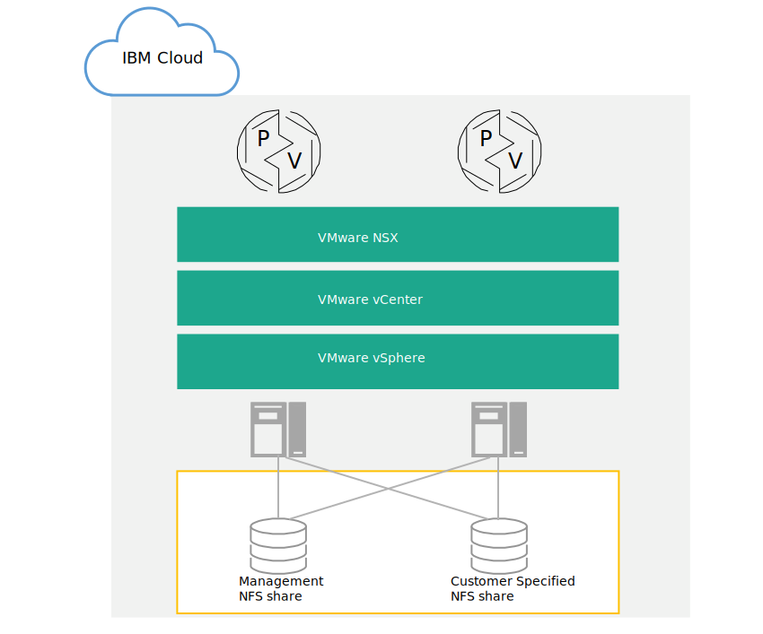

---

copyright:

  years:  2016, 2019

lastupdated: "2019-01-23"

---

{:tip: .tip}
{:note: .note}
{:important: .important}

# Attached storage infrastructure design

{{site.data.keyword.vmwaresolutions_full}} provides VMware technology that is deployed in an automated way within {{site.data.keyword.CloudDataCents_notm}} across the globe. Within the {{site.data.keyword.cloud_notm}} solutions portfolio, the base VMware vCenter Server on {{site.data.keyword.cloud_notm}} offering consists of up to 10 clusters each containing up to 59 vSphere hosts, a single Platform Services Controller (PSC), and a vCenter Server Appliance capable of managing up to 400 hosts and 4,000 virtual machines.

The architecture that is presented here complements the vCenter Server solution by adding attached storage as a shared storage device for the environment. The attached storage device is located within the same {{site.data.keyword.CloudDataCent_notm}} as the vCenter Server deployment and consists of a single Network file system (NFS) share or multiple NFS exports from the {{site.data.keyword.cloud_notm}}.

The following graphic provides the overall architecture of the attached storage on vCenter Server deployment.

Figure 1. High-level architecture of attached storage on {{site.data.keyword.cloud_notm}}

## Physical infrastructure design

The physical infrastructure consists of three main components: physical compute, physical storage, and physical network. The physical infrastructure includes the {{site.data.keyword.cloud_notm}} services network and the physical storage that is used by the infrastructure.

## Physical network design

Physical networking is handled by {{site.data.keyword.cloud_notm}}. The following section describes the physical network that is provided by the {{site.data.keyword.cloud_notm}} as it relates to attached storage.

### IBM Cloud network overview

The physical network of {{site.data.keyword.cloud_notm}} is separated into three distinct networks: Public, Private, and Management. For more information about the public, private, and management networks, see [Solution overview](/docs/services/vmwaresolutions/archiref/solution/solution_overview.html).

For more information about the {{site.data.keyword.cloud_notm}} network, see [The {{site.data.keyword.cloud_notm}} network](https://www.ibm.com/cloud-computing/bluemix/our-network){:new_window}.

Review the following information for a description of the services network that is part of the private network.

### Private services network

{{site.data.keyword.cloud_notm}} has a private services network that provides common services such as block storage, file storage, Object Storage, DNS resolvers, and NTP servers. This private network is separate from the customer private network and it enables environments to seamlessly connect to services located in the {{site.data.keyword.cloud_notm}}. The private network is multi-tiered in that servers and other infrastructure are connected to aggregated back-end customer switches (BCS). These aggregated switches are attached to a pair of separate routers such as back-end customer routers or BCR, for L3 networking. The private network also supports the ability to use jumbo frames, such as, MTU 9000, for physical host connections.

### VLANs

For more information about the VLANs, see the _Physical network design_ section in [Physical infrastructure design](/docs/services/vmwaresolutions/archiref/solution/design_physicalinfrastructure.html).

## Physical storage design

The following section describes the configuration of the attached storage device that is present in the {{site.data.keyword.cloud_notm}}. The attached storage device complements the existing vCenter Server solution. As a result, locally attached disks that are internal to the physical hosts aren't presented.

## Attached storage performance

Performance and Endurance storage are {{site.data.keyword.cloud_notm}} storage solutions that are designed to support high I/O applications that require predictable levels of performance. This predictable performance is achieved through the allocation of protocol-level input/output operations per second (IOPS) to individual volumes.

IOPS ranging from 100 through 48,000 can be ordered with storage sizes of 20 GB - 12 TB. Performance and Endurance storage volumes are available for both block storage and file storage.

In this design, the vCenter Server solution offers Endurance storage for attached storage. As a result, you can select and attach (via automation) Endurance NFS exports ranging in size from 20 GB to a maximum of 12 TB. The {{site.data.keyword.cloud_notm}} allows up to 64 vSphere ESXi hosts to connect to a single Endurance NFS export.

Endurance is available in three IOPS performance tiers to support varying application needs.

After an NFS share is ordered, it can be resized or reconfigured to allow for more or less IOPS.
{:note}

For detailed IOPS options, see the _Storage settings_ section in [Ordering vCenter Server instances](/docs/services/vmwaresolutions/vcenter/vc_orderinginstance.html).

In addition to the tiers of storage, {{site.data.keyword.cloud_notm}} Endurance storage supports a wide selection of application needs, including snapshots and replication, and encryption at rest in the {{site.data.keyword.CloudDataCent_notm}} locations.

### Related links

* [Solution overview](/docs/services/vmwaresolutions/archiref/solution/solution_overview.html)
