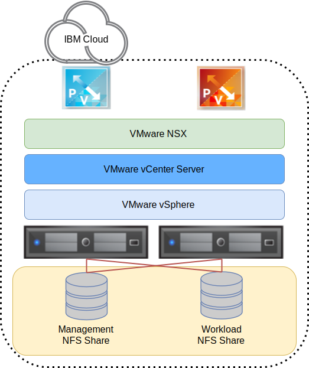

---

copyright:

  years:  2016, 2024

lastupdated: "2024-01-11"

subcollection: vmwaresolutions

---

{{site.data.keyword.attribute-definition-list}}

# Attached storage infrastructure design
{: #storage-infra-design}

{{site.data.keyword.vmwaresolutions_full}} provides VMware® technology that is deployed in an automated way within {{site.data.keyword.cloud_notm}} data centers across the globe. Within the VMware Solutions portfolio, the VMware vCenter Server® offering consists of up to 10 clusters. Each cluster contains up to 59 vSphere hosts, a single Platform Services Controller (PSC), and a vCenter Server Appliance capable of managing up to 400 hosts and 4,000 virtual machines.

The architecture that is presented here complements the vCenter Server solution by adding attached storage as a shared storage device for the environment. The attached storage device is located within the same {{site.data.keyword.cloud_notm}} data center as the vCenter Server deployment. The storage device consists of a single Network File System (NFS) share or multiple NFS exports from the {{site.data.keyword.cloud_notm}}.

The following graphic provides the overall architecture of the attached storage on vCenter Server deployment.

{: caption="Figure 1. High-level architecture of attached storage on {{site.data.keyword.cloud_notm}}" caption-side="bottom"}

## Physical infrastructure design
{: #storage-infra-design-phys-infra-design}

The physical infrastructure consists of three main components: physical compute, physical storage, and physical network. The physical infrastructure includes the {{site.data.keyword.cloud_notm}} services network and the physical storage that is used by the infrastructure.

## Physical network design
{: #storage-infra-design-phys-net-design}

Physical networking is handled by {{site.data.keyword.cloud_notm}}. The following section describes the physical network that is provided by the {{site.data.keyword.cloud_notm}} as it relates to attached storage.

### {{site.data.keyword.cloud_notm}} network overview
{: #storage-infra-design-ibm-cloud-net-ovw}

The physical network of {{site.data.keyword.cloud_notm}} is separated into three distinct networks: Public, Private, and Management. For more information about the public, private, and management networks, see [Overview of VMware Solutions](/docs/vmwaresolutions?topic=vmwaresolutions-solution_overview).

For more information about the {{site.data.keyword.cloud_notm}} network, see [{{site.data.keyword.cloud_notm}} global data centers](https://www.ibm.com/cloud/data-centers/){: external}.

Review the following information for a description of the services network that is part of the private network.

### Private services network
{: #storage-infra-design-private-net}

{{site.data.keyword.cloud_notm}} has a private services network that provides common services such as {{site.data.keyword.blockstoragefull}}, {{site.data.keyword.filestorage_full}}, Object Storage, DNS resolvers, and NTP servers. This private network is separate from the customer private network and it enables environments to seamlessly connect to services located in the {{site.data.keyword.cloud_notm}}. The private network is multitiered in that servers and other infrastructure are connected to aggregated back-end customer switches (BCS). These aggregated switches are attached to a pair of separate routers such as back-end customer routers or BCR, for L3 networking. The private network also supports the ability to use jumbo frames, such as, MTU 9000, for physical host connections.

### VLANs
{: #storage-infra-design-vlans}

For more information about the VLANs, see the _Physical network design_ section in [Physical infrastructure design](/docs/vmwaresolutions?topic=vmwaresolutions-design_physicalinfrastructure).

## Physical storage design
{: #storage-infra-design-phys-storage-design}

The following section describes the configuration of the attached storage device that is present in the {{site.data.keyword.cloud_notm}}. The attached storage device complements the existing vCenter Server solution. As a result, locally attached disks that are internal to the physical hosts aren't presented.

## Attached storage performance
{: #storage-infra-design-perf}

Performance and endurance storage are {{site.data.keyword.cloud_notm}} storage solutions that are designed to support high I/O applications that require predictable levels of performance. This predictable performance is achieved through the allocation of protocol-level input/output operations per second (IOPS) to individual volumes.

IOPS ranging from 100 through 96,000 can be ordered with storage sizes of 20 GB - 24 TB. Performance and endurance storage volumes are available for both {{site.data.keyword.blockstorageshort}} and {{site.data.keyword.filestorage_short}}.

In this design, vCenter Server offers endurance storage for attached storage. As a result, you can select and attach (through automation) endurance NFS exports ranging in size from 20 GB to a maximum of 24 TB. The {{site.data.keyword.cloud_notm}} allows up to 96 vSphere ESXi hosts to connect to a single endurance NFS export.

Endurance storage is available in three IOPS performance tiers to support varying application needs.

After an NFS share is ordered, it can be resized or reconfigured to allow for more or less IOPS.
{: note}

For detailed IOPS options, see the _Storage settings_ section in [Ordering vCenter Server instances](/docs/vmwaresolutions?topic=vmwaresolutions-vc_orderinginstance-req).

In addition to the tiers of storage, {{site.data.keyword.cloud_notm}} endurance storage supports a wide selection of application needs, including snapshots and replication, and encryption at rest in the {{site.data.keyword.cloud_notm}} data center locations.

## Related links
{: #storage-infra-design-related}

* [Overview of VMware Solutions](/docs/vmwaresolutions?topic=vmwaresolutions-solution_overview)
