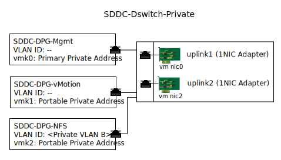

---

copyright:

  years:  2016, 2020

lastupdated: "2020-03-30"

subcollection: vmwaresolutions

---

{:tip: .tip}
{:note: .note}
{:important: .important}

# Attached storage infrastructure management
{: #storage-infra-mgmt}

Infrastructure management refers to the VMware components that are managing the vSphere ESXi infrastructure.

For more information about the components, see [Virtual infrastructure design](/docs/vmwaresolutions?topic=vmwaresolutions-design_virtualinfrastructure).

## Virtual networking design
{: #storage-infra-mgmt-visual-net-design}

The network virtualization that is used in this design uses the existing vSphere Distributed Switch (vDS) associated with the private network and specified in [Overview of {{site.data.keyword.vmwaresolutions_short}}](/docs/vmwaresolutions?topic=vmwaresolutions-solution_overview).

## vSphere Distributed Switch
{: #storage-infra-mgmt-vsphere-ds}

Another VLAN is created within the vCenter Server solution and used to attach the NFS mount point to the ESXi hosts in the existing cluster. Because the vCenter Server solution has a vSphere Distributed Switch associated with the private network, another port group is created and tagged with the additional VLAN number since this additional VLAN isn't native.

The following table describes the default settings of the new port group.

Don't change these default settings.
{:important}

| Port Group Name | SDDC-DPG-NFS |
|:--------------- |:------------ |
| Port binding | Static |
| VLAN type | Private VLAN B |
| Load balancing | Route base on originating virtual port |
| Active Uplinks | Uplink1 and uplink2 |
{: caption="Table 1. NFS port group summary" caption-side="top"}

In addition to the creation of the vDS port group for NFS storage traffic, a VMkernel port is created on each vSphere ESXi host during the deployment and assigned to the SDDC-DPG-NFS port group. The VMkernel port is also assigned an IP address from the private portable subnet that is associated with the attached storage VLAN, that is, Private VLAN B and its MTU is set to 9000 to support jumbo frames.

{: caption="Figure 1. Private vDS Port groups and uplinks" caption-side="bottom"}

### vSphere host static routing
{: #storage-infra-mgmt-vsphere-routing}

Although the vDS is configured with a new port group and a VMkernel port is assigned to the port group, the solution creates a static route on each vSphere ESXi host in the deployment so that all NFS traffic traverses the VLAN and subnet for NFS. The static route is created in `/etc/rc.local.d/local.sh` so that it persists across host restarts.

**Next topic:** [Configuration and settings for attached storage](/docs/vmwaresolutions?topic=vmwaresolutions-storage-settings)

## Related links
{: #storage-infra-mgmt-related}

* [Overview of {{site.data.keyword.vmwaresolutions_short}}](/docs/vmwaresolutions?topic=vmwaresolutions-solution_overview)
