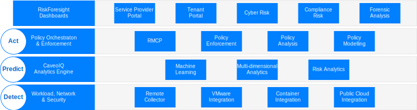
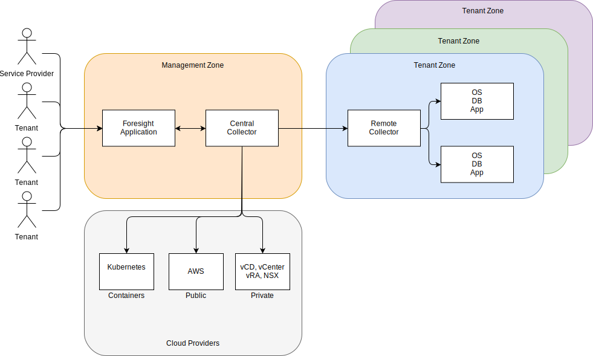

---

copyright:

  years:  2016, 2021

lastupdated: "2021-10-21"

subcollection: vmwaresolutions

---

{{site.data.keyword.attribute-definition-list}}

# Architecture overview for Caveonix RiskForesight
{: #caveonix-arch}

The Caveonix RiskForesight architecture is shown in the following diagram.

{: caption="Figure 1. Architecture for Caveonix RiskForesight" caption-side="bottom"}

Caveonix RiskForesight architecture has four layers:
* Detect - The Detect module is fully integrated into the VMware® stack and many public clouds. By using plug-ins, RiskForesight uses vCenter and NSX Manager as Asset Repositories, collecting details on virtual machines (VMs), networks, and network flows. Remote Collectors scan workloads, operating systems, and applications to allow a “full-stack” view of compliance and vulnerabilities.
* Predict - The Predict module uses analytics to identify risky assets and mitigation steps with risk reduction models to improve the risk posture.
* Act - The Act module implements the mitigation steps based on prioritization and automated protective actions to provide proactive workload protection from risks due to cyberthreats.
   * RMCP – The Risk Management Control Plane (RMCP) provides continuous and proactive protection of the workloads, by monitoring the full-stack within private, public, and managed cloud data centers.
   * Policy Manager - Currently supports three types of machine learning jobs per organization; Caveo Logs, Caveo Networks, Caveo Scan. Based on the anomalies found in the data, you can configure the policies and actions for user-defined conditions. These actions might include selecting the job type, configuring Boolean conditions for the Anomaly score, and defining the action when the condition is true. For example,
      * Job: "Caveo Logs" Anomaly score is > 90 then Mark asset for quarantine and send notification to slack Channel.
      * Job: "Caveo Network" Anomaly score is > 95 then quarantine the asset and send email notification and also send UI notification.
* Dashboards - The dashboards, through role-based access, provide the ability for a service provider, such as an IT department, to allocate IT assets to tenants or business units. Business units then assign these IT assets to applications. These applications match business and IT services, are subject to a Business Impact Assessment, and subject to a compliance regime such as: NIST, NESA, PCI, ISO, and HIPAA. These applications are then subject to a number of scans such as vulnerability, NSX flows, software, and log data. These scans allow visibility into what is running, and the cyberrisk and compliance risk associated with the applications. Drilling down through these dashboards, compliance and security users, can see a prioritized list of actions to mitigate and enable automatable enforcement actions in the Predict and Act modules. RiskForesight provides both a unified dashboard to identify assets in the hybrid cloud and a heat map analysis for cyberrisks, compliance configuration risks, key trends, and metrics of security operation. It enables users to quickly determine the nature and location of risks and what actions to take that use an intuitive and powerful visualization tool.

These dashboards provide the following functions.
* A prioritized view of cyberrisk and compliance risks across hybrid cloud with Detect, Predict, Act dashboard views.
* The ability for a user to visually interact with data to quickly identify assets at risk, based on risk priorities.
* Easy-to-use graphs, metrics, and filters to develop insight into the identified risks.
* Interactive drill-downs for greater depth of information on application data flows, vulnerabilities or configuration issues across locations, organizations, applications, and assets.
* Allow the user to develop complete knowledge of the operational stack that includes, infrastructure, platform, application, and data.
* The ability to visualize and enforce policies for segmentation of networks, VMs, or applications across the hybrid cloud.

## Zones
{: #caveonix-arch-zones}

Caveonix RiskForesight has the concept of zones.

{: caption="Figure 2. Caveonix RiskForesight zones" caption-side="bottom"}

* Management or Service Provider Zone - The management or service provider zone includes the following components:
   * RiskForesight Application - Contains multiple components and is described in detail in the Application Components section.
   * Central Collector – Collects information from the cloud providers and tenant zones.
* Cloud Providers - This zone provides the infrastructure on which applications are hosted:
   * Private – VMware on {{site.data.keyword.cloud}}, and on-premises, VMware infrastructure platforms. These platforms are integrated into RiskForesight through: vCenter, NSX Manager, VMware Cloud Director (vCD), or vRealize Automation (vRA).
   * Public – Currently the only public cloud provider that is supported is AWS. {{site.data.keyword.cloud_notm}} is available soon.
   * Containers - Currently only AWS Elastic Kubernetes Service (EKS) is supported. {{site.data.keyword.cloud_notm}} Private and {{site.data.keyword.cloud_notm}} Kubernetes Services coming later.
* Tenant or Customer Environment Zone – Used to separate tenants, customer, or business units. A remote collector is required because workloads exist in these zones. For a minimum deployment, you need one remote collector, but for a general deployment, you need one Remote Collector per tenant/customer/business unit.

**Next topic**: [Detailed design](/docs/vmwaresolutions?topic=vmwaresolutions-caveonix-detailed)
