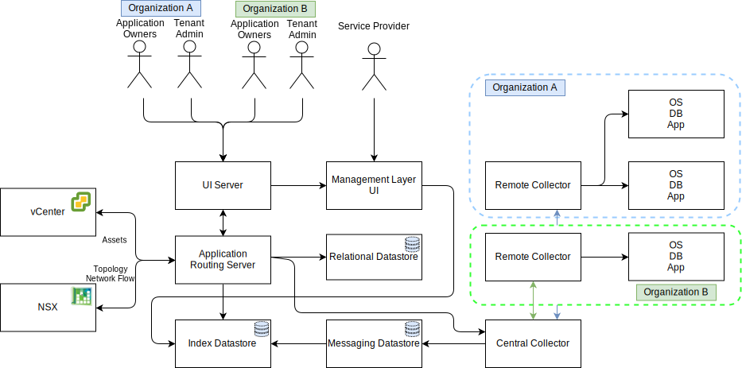

---

copyright:

  years:  2016, 2020

lastupdated: "2020-09-21"

subcollection: vmwaresolutions

---

# Detailed design
{: #caveonix-detailed}

The following diagram and descriptions provide information about the RiskForesight application components.

{: caption="Figure 1. Application components" caption-side="bottom"}

- Graphical user interface - Web interface that you can use to access RiskForesight application.
- Central Collector - Collects different types of data payload that come from the plug-ins and make it available in the messaging store. RiskForesight supports the following types of payloads:
    - Scan
    - Logs
    - Netflows
    - Software
    - Workload metadata
- Central Router - Manages all integration touch-points with the VMware Orchestration layer. All the RiskForesight plug-ins must communicate with the Central Router to get authorized to communicate with the RiskForesight ecosystem.
- API Server - Is the REST endpoint middleware that connects the GUI and the backend data stores. Also, it validates the user access requests and manages the RBAC.
- vCenter Data Collector - The plug-in extracts the virtual machine (VM) details from vCenter. The generic plug-in uses the VMware APIs to connect to vCenter and extracts workload relevant information. After the information is available, the plug-in packages the payload and sends it to the Central Collector.
- vCD Data Collector - The plug-in extracts the VM details from the VMware vCloud Director. The generic plug-in uses the VMware APIs to connect to the VMware vCloud Director and extracts the workload-related information. After the information is available, the plug-in packages the payload and sends it to the Central Collector.
- vCD Network Data Collector - The plug-in extracts Netflow details from the VMware vCD. The generic plug-in uses the VMware APIs to connect to the VMware NSX and extracts Network, FW, Security Rules, and Security Groups. After the information is available, the plug-in packages the payload and send it to the Central Collector.
- Network Data Collector - A plug-in that extracts Netflow details from the VMware vCenter. The generic plug-in uses VMware APIs to connect to VMware NSX and extracts network, firewall, security rules, and security groups information. After the information is available, the plug-in packages the payload and sends it to the Central Collector.
-  Remote Collector - Resides in the tenant environment or other location where it has network access to tenant VMs. It handles all compliance and cyber risk scanning.
- Relational Datastore - Maintains the following types of metadata:
    - Cloud Service Provider
    - Tenant
    - Assets
    - Scan Results
    - Software
    - Daily or weekly aggregated data set
- Messaging Datastore - RiskForesight uses persistent messaging queue to provide zero data loss and offload back pressure to the components.
- Index Datastore - It indexes and stores the incoming raw data for each tenant for further analysis to support the multi-tenant capability.
- Plug-ins – Reside in the Application Routing server and include the setup and integration with VMware components to synchronize all VMs along with their tenant information.

The following table shows the ports and protocols that are required for each component.

| Component | Protocol / Ports |
|---|---|
| UI | 443 |
| API | 443, 1337 |
| RiskForesight | 8082, 8083, 8084|
| Central collector (cluster) | 8080 |
| Remote collector | 8081 |
| Relational datastore primary or secondary | 5432 |
| Messaging datastore cluster | 9092 |
| Index datastore primary nodes | 9200, 9300, 5601, 443 |
{: caption="Table 1. Ports and protocols" caption-side="top"}

The following diagram shows the network topology with the Caveonix portable private subnet that is associated with Private VLAN A. You are responsible for managing the IP address space for this subnet so that you can manually scale out from the “all-in-one” to the fully distributed deployment model, through the partially distributed model as needed.

{: caption="Figure 2. Network diagram" caption-side="bottom"}

The IP Subnet, VLAN assignments are described in the following table.

| VLAN | Subnet type | Description |
|---|---|---|
| Public | Primary | Assigned to physical hosts for public network access. Not used upon initial deployment. |
| Public | Portable | Assigned for uplink and NAT usage on `customer-nsx-esg`. |
| Public | Portable | Assigned for uplink NAT usage on `mgmt-nsx-esg`. |
| Public | Portable | Assigned for uplink NAT usage on `hcx-mgmt-esg`, if Hybridity Bundle selected. |
| Private A | Primary | Assigned to physical hosts assigned by {{site.data.keyword.cloud}}. Used by the management interface for vSphere management traffic. |
| Private A | Portable | Assigned to VMs that function as management components. |
| Private A | Portable | Assigned to NSX VTEP. |
| Private A | Portable | Assigned to HCX for internal usage, if Hybridity bundle selected. |
| Private A | Portable | Assigned for uplink usage on the customer-nsx-esg. |
| Private A | Portable | Assigned to HCX, if Hybridity bundle selected. |
| Private A | Portable | Assigned to Zerto VRAs, if Zerto option selected. |
| Private A | Portable | Assigned for Caveonix RiskForesight, if Caveonix option selected. |
| Private B | Primary | Not used upon initial deployment. |
|  Private B | Portable |Assigned for vSAN, if in use. |
| Private B | Portable | Assigned for NAS, if in use. |
| Private B | Portable | Assigned for vMotion. |
{: caption="Table 2. VLAN and subnets" caption-side="top"}

**Next topic:** [Deployment models for Caveonix RiskForesight](/docs/vmwaresolutions?topic=vmwaresolutions-caveonix-deploy)
