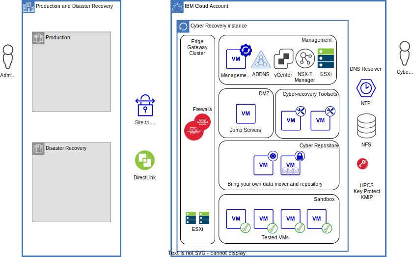

---

copyright:

  years:  2023

lastupdated: "2023-09-11"

subcollection: vmwaresolutions

---

{{site.data.keyword.attribute-definition-list}}

# Cyber recovery with Bring Your Own appliances
{: #cr-byo-overview}

Cyber recovery is one of five functions that are described in the [NIST Cybersecurity framework](https://www.nist.gov/cyberframework){: external}. It is defined as the development and implementation of appropriate activities to maintain plans for resilience and to restore any capabilities or services that are impaired due to a cyber-security incident. The other four functions are identify, protect, detect, and respond.

This documentation describes a high-level architecture that can be used to assist with your custom cyber-recovery requirements. The solution architecture uses a {{site.data.keyword.vmwaresolutions_full}} vCenter Server®, and your choice of bring your own data mover with immutable data storage.

This solution is suitable for clients who want to extend their own existing backup solution with an isolated recovery environment while minimizing costs.

{: caption="Figure 1. Architecture for cyber-recovery isolated environment with bring your own data mover and immutable repository" caption-side="bottom"}

Key elements of the solution architecture include:

* A vCenter Server instance used for cyber-recovery tasks only, deployed in an {{site.data.keyword.cloud_notm}} account restricted to cyber-recovery activities. For more information about vCenter Server instances, see [Overview of VMware Solutions](/docs/vmwaresolutions?topic=vmwaresolutions-solution_overview).
* The vCenter Server instance can use VMware vSAN or use NFS datastores, see [Physical storage design](/docs/vmwaresolutions?topic=vmwaresolutions-design_physicalinfrastructure#design_physicalinfrastructure-storage-design).
* The vCenter Server instance does not host production or disaster recovery workloads.
* The vCenter Server instance includes a gateway cluster to host your choice of one of the following to protect vCenter Server instance networks. It also provides a network air gap between the production environment and the isolated recovery environment:

   * Juniper® vSRX appliances
   * FortiGate® Security Appliance
   * FortiGate® Virtual Appliance
   * Bring your own gateway appliance

* The solution architecture does not preclude any of the vCenter Server options, such as Caveonix, Entrust, and VMware Aria® Operations™.
* Optionally, you can use encryption with Hyper Protect Crypto Services, Key Protect, and the VMware KMIP service. For more information, see [KMIP for VMware overview](/docs/vmwaresolutions?topic=vmwaresolutions-kmip_standalone_considerations).
* The BYO (Bring Your Own) data mover and immutable repository is your backup technology that you want to instantiate within the isolated recovery environment.
* The management VM is your automation server that can be used to automate a number of cybertasks such as:

   * Opening and closing the air-gap
   * Automate the mounting of backups and scanning by your cybertoolsets
   * Creating sandboxes

* Sandboxes can be provisioned by using VMware NSX-T™ overlay segments, logical routing, distributed firewall, and network address translation to provide network-isolated zones to mount cyber-recovery backups for inspection by your cybertoolsets.
* Cybertoolsets are customer-supplied tools that run as virtual machines in the isolated recovery environment and access your cyber-backups for verification and analysis.
* Cyberadmins are customer personnel who are authorized to access the isolated recovery environment and are different than admins that manage the production and disaster recovery environments to promote separation of duties.
* Jump servers are used by your cyberadmins to access the isolated recovery environment.
* The air gap enables network connectivity between the production environment and the isolated recovery environment only when required.
* The solution architecture is independent of the location of the production environment. However, network connectivity is required between the production environment and the cyber-recovery site.

[The definitive guide to ransomware: readiness, response, and remediation](https://www.ibm.com/downloads/cas/EV6NAQR4){: external} provides an overview of ransomware history, its current prevalence, and resources to help fortify organizations and technical-level guidance on techniques to protect networks before an attack can happen. Also, a recovery guidance if an attacker makes it through defenses.

## How to
{: #cr-byo-overview-how-to}

Consider using a separate {{site.data.keyword.cloud}} account to deploy your cyber-recovery instance into. This process promotes separation of duties between ownership of any other production or disaster recovery solution that you might host in {{site.data.keyword.cloud_notm}}.

To create your custom cyber-recovery solution based on a VMware vCenter Server instance, follow the [procedure to order vCenter Server instances](/docs/vmwaresolutions?topic=vmwaresolutions-vc_orderinginstance-procedure):

1. In Step 4, select **Primary**.
2. In Step 7, order a gateway cluster with your preferred firewall option:
    * If you select Juniper vSRX, see [Ordering Juniper vSRX](/docs/vmwaresolutions?topic=vmwaresolutions-juniper-ordering).
    * If you select FortiGate, see [Ordering FortiGate Virtual Appliance](/docs/vmwaresolutions?topic=vmwaresolutions-fortinetvm_ordering).
    * If you select Bring Your Own gateway appliance, see the installation instructions that are provided by your firewall vendor.
    * If you select FortiGate Security Appliance, see [Create FortiGate Security Appliance 10 Gbps](https://cloud.ibm.com/netsec/firewalls/multi-vlan/provision#create).

After your vCenter Server instance is provisioned:

1. Configure your firewalls by using the vendor’s documentation as a guide and the following information:
   * [{{site.data.keyword.cloud_notm}} IP ranges](/docs/cloud-infrastructure?topic=cloud-infrastructure-ibm-cloud-ip-ranges)
   * [Ports that are used for deployment and Day 2 operations](/docs/vmwaresolutions?topic=vmwaresolutions-vmwaresol_ports-deploy-day2ops)
   * [Ports used by VMware](/docs/vmwaresolutions?topic=vmwaresolutions-vmwaresol_ports-vmwareuses)
   * [Ports for services](/docs/vmwaresolutions?topic=vmwaresolutions-vmwaresol_ports-services)

2. To understand how to use Ansible on your management VM to open and close firewall ports, see [Creating the airgap by using Juniper vSRX](/docs/vmwaresolutions?topic=vmwaresolutions-veeam-cr-sag-vsrx).
3. Deploy your jump hosts. For more information, see [Deploying virtual machines](https://docs.vmware.com/en/VMware-vSphere/7.0/com.vmware.vsphere.vm_admin.doc/GUID-39D19B2B-A11C-42AE-AC80-DDA8682AB42C.html){: external}.
4. Deploy your custom data mover and immutable repository by following the vendor’s instructions.
5. Deploy your cybertoolset by following the vendor’s instructions.
6. To understand how to use the scripting capabilities of your Bring Your Own data mover and immutable repository solution to be more automated, see [Instant restore](/docs/vmwaresolutions?topic=vmwaresolutions-veeam-cr-sag-instantrestore) and [Creating a Veeam Linux managed server](/docs/vmwaresolutions?topic=vmwaresolutions-veeam-cr-sag-lnxmgdsvr).

Review the following information about network connectivity for your cyber-recover instance:

* [Architecture pattern for using Transit Gateway with a vCenter Server with NSX-T instance](/docs/vmwaresolutions?topic=vmwaresolutions-arch-pattern-nsx-t-transit-gw)
* [Architecture pattern for using IPsec over Direct Link with a vCenter Server with NSX-T instance](/docs/vmwaresolutions?topic=vmwaresolutions-arch-pattern-nsx-t-direct-link-ipsec)
* [Architecture pattern for using Direct Link with NSX-T edge cluster in colocation](/docs/vmwaresolutions?topic=vmwaresolutions-arch-pattern-direct-link-edge)
* [Architecture pattern for using Direct Link with NSX-T and EVPN](/docs/vmwaresolutions?topic=vmwaresolutions-arch-pattern-direct-link-evpn)
* [Virtual Private Network (VPN)](https://docs.vmware.com/en/VMware-NSX-T-Data-Center/3.2/administration/GUID-A8B113EC-3D53-41A5-919E-78F1A3705F58.html){: external}
* [Adding a cross-account connection](/docs/transit-gateway?topic=transit-gateway-adding-cross-account-connections&interface=ui)

## Related links
{: #cr-byo-overview-related}

* [Commvault - Enterprise data solutions](https://www.commvault.com){: external}
* [Dell PowerProtect DD Virtual edition data sheet](https://www.delltechnologies.com/asset/en-my/products/data-protection/technical-support/h17925-dellemc-powerprotect-ddve-ds.pdf){: external}
* [IBM Spectrum Protect](https://www.ibm.com/products/data-protection-and-recovery){: external}
* [IBM Spectrum Protect Plus](https://www.ibm.com/products/ibm-spectrum-protect-plus){: external}
* [Rubrik - Remote and Branch Office backup software](https://www.rubrik.com/solutions/remote-branch-office){: external}
