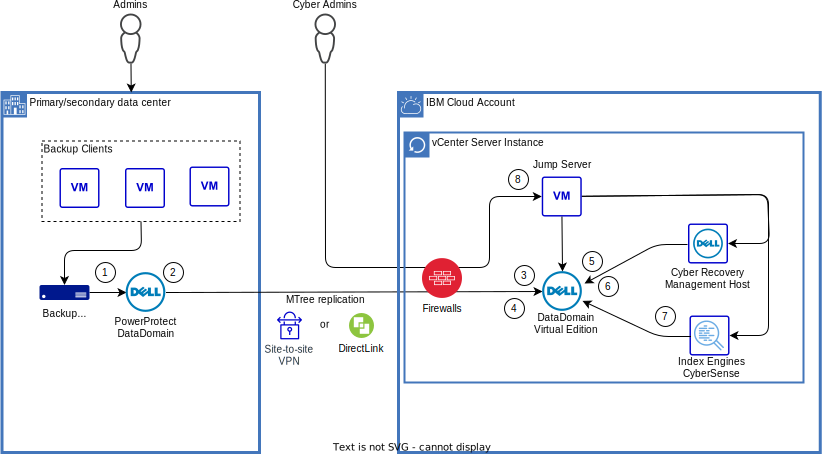
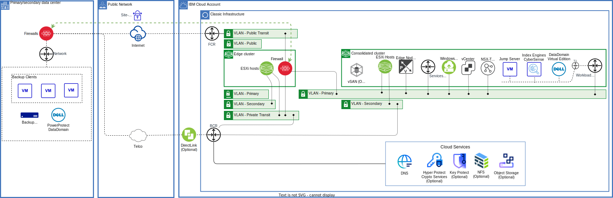

---

copyright:

  years:  2023, 2025

lastupdated: "2025-09-08"

subcollection: vmwaresolutions

---

{{site.data.keyword.attribute-definition-list}}

# Cyber recovery with Dell
{: #cr-dell-overview}

A {{site.data.keyword.vcf-auto}} instance can host a Dell® Cyber Recovery vault.

The Dell Cyber Recovery vault maintains your mission-critical business data and technology configurations in a secure, air-gapped vault environment that can be used for recovery and analysis.

The {{site.data.keyword.cloud}} solution is based on the Dell PowerProtect DataDomain Virtual Edition (DDVE) storage appliance that is hosted on a vCenter Server® instance. The DDVE stores the replicated data from a production DataDomain (DD) system. The data on the DDVE can be recovered back to the production DD system when needed. The production DD system can be on-premises or deployed in {{site.data.keyword.cloud_notm}} or another cloud provider.

The DDVE in the Cyber Recovery vault is air-gapped from the network most of the time and is only connected when the Cyber Recovery software triggers replication from the production DD system to the DDVE in the Cyber Recovery vault.

Multiple production PowerProtect DD systems can replicate data to multiple DDVE appliances in the Cyber Recovery vault.

You can also deploy the Index Engines™ CyberSense® appliance to validate and analyze your data in the Cyber Recovery vault. CyberSense scans the backup data in the DDVE to validate its integrity and identify malicious changes indicative of cyberattack. CyberSense uses a combination of over 200 full-content-based analytics and machine learning to detect corruption. If data corruption is identified, CyberSense provides forensic tools to diagnose and recover, including reports on files that were impacted so they can be replaced with the last known good version to ensure business operations return to normal with minimal downtime.

The Dell Cyber Recovery vault in {{site.data.keyword.cloud_notm}} architecture is suitable for clients who are using Dell PowerProtect DD technology in the production environment and are looking to protect business data in the cloud.
 
## Cyber recovery with Dell overview
{: #cr-dell-overview-ovw}

The following diagram shows the high-level architecture:

{: caption="Overview of Dell Cyber Recovery vault on VMware Solutions" caption-side="bottom"}

The production environment, in the primary and secondary data centers can be on premises or deployed in {{site.data.keyword.cloud_notm}} or another cloud provider.

The Admins are people in your organization who maintain your production environment and have no access to the Cyber Recovery vault, while the Cyber Admins are you staff that manage the Cyber Recovery vault.

Within your {{site.data.keyword.cloud_notm}} account, you order a vCenter server instance with the following add-on services:

* Edge Gateway – The edge gateway hosts the firewall appliances.
* A firewall – Juniper®, FortiGate®, or Bring Your Own firewall is supported.

After provisioning, you have full administrative access to the vCenter Server instance to deploy the following components the use your own licenses:

* One or more DataDomain Virtual Edition appliances.
* Cyber Recovery.

The diagram also shows:

1. Backup applications like Dell Avamar, NetWorker, or PowerProtect Data Manager back up your mission-critical business data and technology configurations to a MTree in the production DD system.
2. A deduplication process is performed in the production DD system to expedite the replication process so that connection time to the Cyber Recovery vault is as short as possible.
3. The Cyber Recovery software controls the virtual air gap between the production DD system and the Cyber Recovery vault, by disabling the replication ports on the DDVE system in the Cyber Recovery vault when Cyber Recovery policies are idle.
4. A policy, which can be scheduled, orchestrates the workflow between the production DD system and the Cyber Recovery vault DDVE. A policy is a combination of objects, such as PowerProtect DD storage and applications, and jobs, such as synchronization, copy, and lock. Data from the production DD system enters the Cyber Recovery vault DDVE through DD series MTree replication.
5. Within the Cyber Recovery vault, the Cyber Recovery software creates point-in-time (PIT) retention-locked copies that can be validated and then used for recovery of the production system.
6. PowerProtect DD Retention Lock provides data immutability for a specified time and is enabled on a per-MTree basis, while the retention time is set on a per-file basis. Retention Lock is recommended as an extra cyber-resiliency measure.
7. If Index Engines™ CyberSense® software is installed, then this software is used by the Cyber Recovery software to validate and analyze your data in the DDVE.
8. Your Cyber Admins manage the Cyber Recovery vault by using the jump hosts.
 
## Cyber recovery with Dell architecture
{: #cr-dell-architecture}

The following diagram shows more details of the vCenter Server instance architecture:

{: caption="Architecture of Dell Cyber Recovery vault on VMware Solutions" caption-side="bottom"}

The primary and secondary data centers:

* Backup clients – Your servers or virtual machines that are being backed up.
* Backup application – Your backup applications like Dell Avamar, NetWorker, or PowerProtect Data Manager.
* PowerProtect DataDomain – Your production DD system in which an MTree is configured to designate the backup data that needs to be replicated to the Cyber Recovery vault.

Public network - You can connect to your Cyber Recovery vault by using one or more of the following methods:

* Site-to-site VPN – Uses an IPsec VPN across the internet.
* {{site.data.keyword.cloud_notm}} Direct Link – You extend your network through your telco to one of the {{site.data.keyword.cloud_notm}} PoPs.

{{site.data.keyword.cloud_notm}} account:

* vCenter Server instance - used for the Cyber Recovery vault only, deployed in an {{site.data.keyword.cloud_notm}} account restricted to Cyber Recovery vault activities. For more information about vCenter Server instances, see [Overview of VMware Solutions](/docs/vmwaresolutions?topic=vmwaresolutions-solution_overview).

The vCenter Server instance:

* Can use VMware vSAN™ or NFS data stores. For more information, see [Physical storage design](/docs/vmwaresolutions?topic=vmwaresolutions-design_physicalinfrastructure#design_physicalinfrastructure-storage-design).
* Does not host production or disaster recovery workloads.
* Includes an edge cluster to host your choice of one of the following to protect vCenter Server instance networks:
   * Juniper vSRX appliances
   * FortiGate Security Appliance
   * FortiGate Virtual Appliance
   * Bring Your Own gateway appliance
* Can include any of the vCenter Server options, such as Caveonix RiskForesight™ and VMware Aria® Operations.
* Optionally, you can use encryption with Hyper Protect Crypto Services, Key Protect, and the VMware KMIP™ service. For more information, see [KMIP for VMware overview](/docs/vmwaresolutions?topic=vmwaresolutions-kmip_standalone_considerations).

* VMware NSX® – NSX is used to create overlay segments, routers, and firewalling on the vCenter Server instance.
* Jump server – After the vCenter Server instance is provisioned, you must upload Windows OVF, OVA, or ISO files to vCenter so that you can install one or more jump servers. The Windows jump servers have the following requirements:
    * 2 vCPU
    * 8 GB RAM
    * 1 NIC
    * 150 GB disk

* DDVE – You must upload the OVA file and license file so that you can install one or more DDVE appliances. The appliances have the following requirements:
    * 2-8 vCPU
    * 6-64 GB RAM
    * 2 NICs
    * Minimum of 3 disks
        * One 250 GB root disk
        * One 10 GB NVRAM disk
        * Minimum of one 1 TB metadata disk

* Cyber Recovery – The Cyber Recovery management host is a VM with the following requirements:
    * One of the following operating systems with the most recent updates, patches, and security patches:
        * CentOS Linux Version 7.6 and 7.7
        * Red Hat Enterprise Linux Version 7.4, 7.5, 7.6, and 7.7
        * SUSE Linux Enterprise Server Version 12 SP3 and 12 SP4
    * 4 GB RAM
    * 50 GB disk space
    * 1.5 GB available space to extract the Cyber Recovery software
    * 10 GB or more available space for installation of the Cyber Recovery software

* CyberSense - You must upload the OVA file and the license file so that you can install the CyberSense appliance. The appliance has the following requirements:
    * 20 vCPU
    * 196 GB RAM
    * 4 NICs
    * 4 disks:
        * 120 GB
        * 1 TB
        * 832 GB
        * 100 MB
 
## How to use Cyber recovery with Dell
{: #cr-dell-howto}

Consider using a separate {{site.data.keyword.cloud_notm}} account to deploy your Dell Cyber Recovery vault instance into. This process promotes separation of duties between ownership of any other production or disaster recovery solution that you might host in {{site.data.keyword.cloud_notm}}.

The minimum number of hosts in a consolidated cluster is three, and the minimum host configuration is 128 GB RAM and 20 cores at 2.2 GHz giving a total of 384 GB RAM and 132 GHz in the cluster for both management and customer workloads. The number of clusters, the number of hosts in the cluster and the cores and RAM in the hosts can be scaled. For more information, see [CPU Model and RAM](/docs/vmwaresolutions?topic=vmwaresolutions-vc_orderinginstance-consold-cluster#vc_orderinginstance-cpumodel).

If you plan to use CyberSense, you must size the hosts considering that the appliance requires 20 vCPU and 196 GB RAM.

* For vSAN storage, see [vSAN Storage](/docs/vmwaresolutions?topic=vmwaresolutions-vc_orderinginstance-consold-cluster#vc_orderinginstance-vsan-storage).
* For NFS storage, see [NFS Storage](/docs/vmwaresolutions?topic=vmwaresolutions-vc_orderinginstance-consold-cluster#vc_orderinginstance-nfs-storage).

To create your Dell Cyber Recovery vault based on a {{site.data.keyword.vcf-auto-short}} instance, follow the procedure to [order a {{site.data.keyword.vcf-auto-short}} instance](/docs/vmwaresolutions?topic=vmwaresolutions-vc_orderinginstance-procedure):

1. In Step 5, select **Primary instance**.
2. In Step 7, order **Private network only** for **Networking type**.
3. In Step 9, order a gateway cluster with your preferred firewall option:
    * If you select Juniper vSRX, see [Ordering Juniper vSRX](/docs/vmwaresolutions?topic=vmwaresolutions-juniper-ordering).
    * If you select FortiGate, see [Ordering FortiGate Virtual Appliance](/docs/vmwaresolutions?topic=vmwaresolutions-fortinetvm_ordering).
    * If you select Bring Your Own gateway appliance, see the installation instructions that are provided by your firewall vendor.
    * If you select FortiGate Security Appliance, see [Create FortiGate Security Appliance 10 Gbps](/netsec/firewalls/multi-vlan/provision#about){: external}.

After your vCenter Server instance is provisioned:

1. Configure your firewalls by using the vendor’s documentation as a guide and the following information:
   * [{{site.data.keyword.cloud_notm}} IP ranges](/docs/infrastructure-hub?topic=infrastructure-hub-ibm-cloud-ip-ranges)
   * [Ports that are used for deployment and Day 2 operations](/docs/vmwaresolutions?topic=vmwaresolutions-vmwaresol_ports-deploy-day2ops)
   * [Ports used by VMware components](/docs/vmwaresolutions?topic=vmwaresolutions-vmwaresol_ports-vmwareuses)
   * [Ports for services](/docs/vmwaresolutions?topic=vmwaresolutions-vmwaresol_ports-services)

2. Upload your OVF, OVA, and ISO files.
3. Deploy a Windows VM for a jump server.
4. Deploy one or more DDVEs.
5. Deploy a Linux VM and install the Cyber Recovery software.
6. Optionally, install CyberSense.

## Related links
{: #cr-dell-overview-related}

* [Architecture pattern for using Transit Gateway with a vCenter Server with NSX-T instance](/docs/vmwaresolutions?topic=vmwaresolutions-arch-pattern-nsx-t-transit-gw)
* [Architecture pattern for using IPsec over Direct Link with a vCenter Server with NSX-T instance](/docs/vmwaresolutions?topic=vmwaresolutions-arch-pattern-nsx-t-direct-link-ipsec)
* [Architecture pattern for using Direct Link with NSX-T edge cluster in colocation](/docs/vmwaresolutions?topic=vmwaresolutions-arch-pattern-direct-link-edge)
* [Architecture pattern for using Direct Link with NSX-T and EVPN](/docs/vmwaresolutions?topic=vmwaresolutions-arch-pattern-direct-link-evpn)
* [Virtual Private Network (VPN)](https://techdocs.broadcom.com/us/en/vmware-cis/nsx/nsxt-dc/3-2/administration-guide/virtual-private-network-vpn.html){: external}
* [Adding a cross-account connection](/docs/transit-gateway?topic=transit-gateway-adding-cross-account-connections&interface=ui)
* [Dell PowerProtect DD Virtual edition data sheet](https://www.delltechnologies.com/asset/en-my/solutions/apex/technical-support/dell-apex-protection-storage-data-sheet.pdf){: external}
