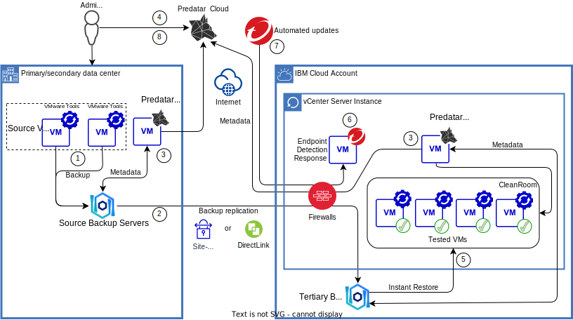

---

copyright:

  years:  2023, 2025

lastupdated: "2025-05-01"

subcollection: vmwaresolutions

---

{{site.data.keyword.attribute-definition-list}}

# Cyber recovery with Predatar
{: #cr-predatar-overview}

A {{site.data.keyword.vcf-auto}} instance can host Predatar® Cyber Recovery Orchestration and a Predatar CleanRoom™.

Predatar Cyber Recovery Orchestration automates and orchestrates the recovery and malware scanning of backups into a Predatar CleanRoom. This process allows organizations to understand which of their virtual machines (VMs) fail to meet their required objectives and might jeopardize a quick recovery from a cyberattack. For more information, see [Protect your data against ransomware attacks](https://predatar.com/){: external}.

This architecture is suitable for clients who are using either or both of the following in the source environment:

* IBM Spectrum Protect with IBM Spectrum Protect for Virtual Environments.
* IBM Spectrum Protect Plus.

The following {{site.data.keyword.cloud}} products can be used to host the Predatar Cyber Recovery Orchestration and Predatar CleanRoom:

* An {{site.data.keyword.cloud_notm}} vCenter Server instance is ordered with the following add-on services:
    * Edge Gateway – The edge gateway hosts the firewall appliances.
    * A firewall – Juniper®, Fortigate®, or Bring Your Own Firewall is supported.
* One or more Red Hat Enterprise Linux (RHEL) {{site.data.keyword.cloud_notm}} bare metal servers are ordered and used as either:
    * IBM Spectrum Protect with IBM Spectrum Protect for Virtual Environments.
    * IBM Spectrum Protect Plus vSnap servers.

If you are completing an instant mount from object storage, then the vSnap is used for caching read and holding writes, so that a VM hosted on the vCenter Server instance can be used.
{: note}
 
## Cyber recovery with Predatar overview
{: #cr-predatar-overview-ovw}

The following diagram shows the high-level architecture:

{: caption="Overview of Predatar on VMware Solutions" caption-side="bottom"}

1. VMs with VMware Tools including the Thin Agent (also known as Guest Introspection) installed, are backed up to the source backup servers.
2. Backup data is replicated from the source backup servers to the {{site.data.keyword.cloud_notm}} hosted tertiary backup servers.
3. Metadata is collected from the source backup servers and the tertiary backup servers by the Predatar Agents and sent to the Predatar Cloud.
4. Predatar Cyber Recovery Orchestration is used to automate the recovery and testing of the VMs and provides reports and notifications.
5. In the CleanRoom, recovery tests use the instant mount restore type from the vSnap server to stream the backup files to the ESXi hosts to quickly restore the VM. Recovery tests can be performed with or without orchestrating a malware scan. If you are using IBM Spectrum Protect with IBM Spectrum Protect for Virtual Environments, recoveries are from the VMware datastore.
6. If a recovery test includes a malware scan, agentless End-point Detection Response (EDR) tools are used to scan and cleanse recovered workloads. The EDR tools are selected from the Gartner leading EDR platforms and use a combination of file signature scanning, machine learning, in-memory analysis (for the identification of fileless malware), variant protection, behavioral analysis and monitoring for scripts, injection, and ransomware to check for any active or dormant threats in the recovered workload.
7. The EDR components are continuously updated and correlated for automatic protection.
8. At the completion of the recovery test, metrics for that VM are saved and become available for reporting.
 
## Cyber recovery with Predatar architecture
{: #cr-predatar-architecture}

The following diagram shows more details of the vCenter Server instance architecture:

{: caption="Architecture of Predatar on VMware Solutions" caption-side="bottom"}

Primary or secondary data center:

* Source VMs – The client VMs that need to be protected by the Predatar service. The VMs require VMware Tools thin agents that are part of VMware Endpoint Protection, also known as Guest Introspection, which are installed on them so that when they are recovered into the CleanRoom they can be scanned. For more information, see [Endpoint Protection](https://techdocs.broadcom.com/us/en/vmware-cis/nsx/vmware-nsx/3-2/administration-guide/security/endpoint-protection.html){: external}.
* Thin agent – The Thin agent, also known as File Introspection driver, is the file introspection agent that is running inside the VM, which is part of VMware Tools. It is a generic and lightweight agent that facilitates offloading files and processes for scanning.
* Source backup servers – These servers are part of the client’s IBM Spectrum Protect with IBM Spectrum Protect for Virtual Environments or IBM Spectrum Protect Plus environment and are configured to replicate backups to the tertiary backup server.
* Predatar Virtual Appliance – Consists of:
    * VM – A customer-provided Microsoft Windows 2012 or later VM that is used to host the Predatar Agent.
    * Predatar Agent - a small-footprint client that is hosted on the customer’s VM and sends queries to one, or more, IBM Spectrum Protect/Spectrum Protect Plus servers and sends the queries to the Predatar Cloud.

Predatar Cloud:

* Predatar Cloud - Predatar is a SaaS cloud solution that is hosted in the Predatar Cloud. Predatar currently has clouds in Dallas, London, and Frankfurt. They are all provided by {{site.data.keyword.cloud_notm}} and are used to hold customers’ IBM Spectrum Protect and Protect Plus metadata.
* Metadata - Predatar stores an unlimited amount of metadata history in its multitenant data lake. This data is used by Predatar to power the platform’s analytics and machine learning capabilities.
* Client access - Role-based access controls (RBAC) are used to govern access to data and can be configured at a granular level for customers.

{{site.data.keyword.cloud_notm}} account:

* vCenter Server instance - used for cyber-recovery tasks only, deployed in an {{site.data.keyword.cloud_notm}} account restricted to cyber-recovery activities. For more information about vCenter Server instances, see [Overview of VMware Solutions](/docs/vmwaresolutions?topic=vmwaresolutions-solution_overview).

The vCenter Server instance:

* Can use VMware vSAN or NFS data stores. For more information, see [Physical storage design](/docs/vmwaresolutions?topic=vmwaresolutions-design_physicalinfrastructure#design_physicalinfrastructure-storage-design).
* Does not host production or disaster recovery workloads, but would temporarily be used to recover an infected machine and then clean it in the CleanRoom.
* Includes an edge cluster to host your choice of one of the following to protect vCenter Server instance networks:
   * Juniper vSRX appliances.
   * FortiGate Security Appliance.
   * FortiGate Virtual Appliance.
   * Bring your own gateway appliance.
* Can include any of the vCenter Server options, such as Caveonix, Entrust, and VMware vRealize Operations.
* Optionally, you can use encryption with Hyper Protect Crypto Services, Key Protect, and the VMware KMIP service. For more information, see [KMIP for VMware overview](/docs/vmwaresolutions?topic=vmwaresolutions-kmip_standalone_considerations).

*  Tertiary backup servers – One or more hardened Red Hat Enterprise Linux [{{site.data.keyword.cloud_notm}} Bare Metal Servers](https://www.ibm.com/products/bare-metal-servers){: external} to host the following components:
   * IBM Spectrum Protect with IBM Spectrum Protect for Virtual Environments. For more information, see [IBM Storage Protect Cloud Blueprints](https://www.ibm.com/support/pages/node/1128567){: external}.
   * IBM Spectrum Protect Plus vSnap servers. For more information, see [IBM Spectrum Protect Plus Blueprints](https://www.ibm.com/support/pages/node/1119489){: external}.

* Predatar Virtual Appliance – Consists of:
   * VM – A customer provided Microsoft Windows 2012 or later VM that is used to host the Predatar Agent.
   * Predatar Agent - a small-footprint client that is hosted on the customer’s VM and sends queries to one or more IBM Spectrum Protect/Spectrum Protect Plus servers and sends the queries to the Predatar Cloud.

* Predatar CleanRoom - The Predatar CleanRoom is a patented concept that brings together virtualized compute, storage, and networking to form a recovery target that supports both automated recovery testing and orchestrated malware scanning. The vCenter server instance with VMware vSphere and NSX-T provides the virtualized compute, storage, and networking.

## How to use Cyber recovery with Predatar
{: #cr-predatar-howto}

You can use a separate {{site.data.keyword.cloud_notm}} account to deploy your Predatar CleanRoom instance into. This process promotes separation of duties between ownership of any other production or disaster recovery solution that you might host in {{site.data.keyword.cloud_notm}}.

The minimum number of hosts in a consolidated cluster is three, and the minimum host configuration is 128 GB RAM and 20 cores at 2.2 GHz giving a total of 384 GB RAM and 132 GHz in the cluster for both management and customer workloads. The number of clusters, the number of hosts in the cluster and the cores and RAM in the hosts can be scaled. See [CPU Model and RAM](/docs/vmwaresolutions?topic=vmwaresolutions-vc_orderinginstance-consold-cluster#vc_orderinginstance-cpumodel).

* For vSAN Storage, see [vSAN Storage](/docs/vmwaresolutions?topic=vmwaresolutions-vc_orderinginstance-consold-cluster#vc_orderinginstance-vsan-storage).
* For NFS storage, see [NFS Storage](/docs/vmwaresolutions?topic=vmwaresolutions-vc_orderinginstance-consold-cluster#vc_orderinginstance-nfs-storage).

The smallest {{site.data.keyword.cloud_notm}} Classic Bare metal server for the IBM Spectrum Protect Plus vSnap server is 4 x 1 TB disks, which gives 2 TB in RAID 6. The largest single server is 34 x 12 TB disks, which gives 384 TB in RAID 6.

For more information about small, medium, and large configurations with direct-to-cloud or disk-to-cloud tiering models, see [IBM Spectrum Protect
Cloud Blueprint for IBM Cloud](https://www.ibm.com/support/pages/system/files/inline-files/IBM%20Spectrum%20Protect%20Cloud%20Blueprint%20for%20IBM%20Cloud%20V2.0.pdf){: external}.

To create your Predatar CleanRoom based on a {{site.data.keyword.vcf-auto-short}} instance, follow the procedure to [order a {{site.data.keyword.vcf-auto-short}} instance](/docs/vmwaresolutions?topic=vmwaresolutions-vc_orderinginstance-procedure):

1. In Step 4, select **Primary**.
2. In Step 6, order **Private Networks**.
3. In Step 7, order an edge gateway cluster with your preferred firewall option:
    * If you select Juniper vSRX, see [Ordering Juniper vSRX](/docs/vmwaresolutions?topic=vmwaresolutions-juniper-ordering).
    * If you select FortiGate, see [Ordering FortiGate Virtual Appliance](/docs/vmwaresolutions?topic=vmwaresolutions-fortinetvm_ordering).
    * If you select Bring Your Own gateway appliance, see the installation instructions that are provided by your firewall vendor.
    * If you select FortiGate Security Appliance, see [Create FortiGate Security Appliance 10 Gbps](https://cloud.ibm.com/netsec/firewalls/multi-vlan/provision#about){: external}.

After your vCenter Server instance is provisioned:

1. Configure your firewalls by using the vendor’s documentation as a guide and the following information:
   * [{{site.data.keyword.cloud_notm}} IP ranges](/docs/infrastructure-hub?topic=infrastructure-hub-ibm-cloud-ip-ranges)
   * [Ports that are used for deployment and Day 2 operations](/docs/vmwaresolutions?topic=vmwaresolutions-vmwaresol_ports-deploy-day2ops)
   * [Ports used by VMware components](/docs/vmwaresolutions?topic=vmwaresolutions-vmwaresol_ports-vmwareuses)
   * [Ports for services](/docs/vmwaresolutions?topic=vmwaresolutions-vmwaresol_ports-services)

2. Deploy A Windows VM.
3. Deploy the Predatar Agent.

To order {{site.data.keyword.cloud_notm}} Classic Bare Metal servers, see [Building a custom bare metal server](/docs/bare-metal?topic=bare-metal-ordering-baremetal-server).

1. For the operating system vendor, select Red Hat and for version select 8.x (64 bit).
2. Select the required server profile.
3. Select the required number and size of disks.
4. Ensure that you select the same Private VLAN that the vCenter Server instance is deployed on to.

## Related links
{: #cr-predatar-overview-related}

* [Architecture pattern for using Transit Gateway with a vCenter Server with NSX-T instance](/docs/vmwaresolutions?topic=vmwaresolutions-arch-pattern-nsx-t-transit-gw)
* [Architecture pattern for using IPsec over Direct Link with a vCenter Server with NSX-T instance](/docs/vmwaresolutions?topic=vmwaresolutions-arch-pattern-nsx-t-direct-link-ipsec)
* [Architecture pattern for using Direct Link with NSX-T edge cluster in colocation](/docs/vmwaresolutions?topic=vmwaresolutions-arch-pattern-direct-link-edge)
* [Architecture pattern for using Direct Link with NSX-T and EVPN](/docs/vmwaresolutions?topic=vmwaresolutions-arch-pattern-direct-link-evpn)
* [Virtual Private Network (VPN)](https://techdocs.broadcom.com/us/en/vmware-cis/nsx/vmware-nsx/3-2/administration-guide/virtual-private-network-vpn.html){: external}
* [Adding a cross-account connection](/docs/transit-gateway?topic=transit-gateway-adding-cross-account-connections&interface=ui)
* [Predatar](https://predatar.com/){: external}
* [Predatar cyber orchestration](https://predatar.com/){: external}
