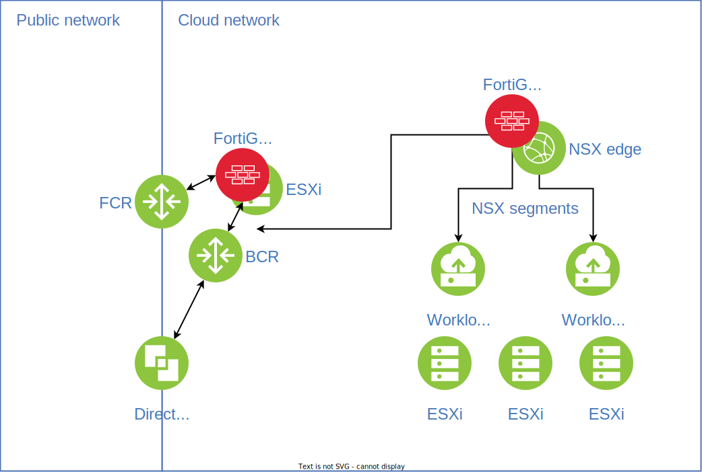

---

copyright:

  years:  2022, 2023

lastupdated: "2023-09-11"

subcollection: vmwaresolutions

---

{{site.data.keyword.attribute-definition-list}}

# Fortinet FortiGate virtual machine (VM) design
{: #fortigate-design}

The FortiGate® VM solution complements the {{site.data.keyword.vmwaresolutions_full}} offerings by providing next–generation firewall (NGFW) capabilities for networks within your VMware® estate. These services are provided by one or more pairs of FortiGate virtual appliances that are deployed to your VMware environment.

FortiGate VM does not replace NSX–T™ but rather complements and enhances the existing VMware NSX® architecture when installed into your VMware vCenter Server® instance on {{site.data.keyword.cloud}}. FortiGate VM is deployed as a pair of virtual appliances with one network interface (port1) configured for management access and nine available network interfaces in the client’s data plane. With appropriate configuration of networks and routes, you can use FortiGate VM to provide network security between all tiers of your network topology.

## Topologies
{: #fortigate-design-topologies}

You can deploy a FortiGate VM according to several different strategies as Figure 1 illustrates.

{: caption="Figure 1. FortiGate VM deployment topologies" caption-side="bottom"}

In this figure, FCR is the {{site.data.keyword.cloud_notm}} front–end (public) customer router, and BCR is the {{site.data.keyword.cloud_notm}} back–end (private) customer router. For more information about the {{site.data.keyword.cloud_notm}} network design, see [Physical network design](/docs/vmwaresolutions?topic=vmwaresolutions-design_physicalinfrastructure).

### {{site.data.keyword.cloud_notm}} edge services
{: #fortigate-design-topologies-edge}

You can deploy a VMware ESXi™ gateway cluster as part of your vCenter Server instance. This cluster is configured to peer with the {{site.data.keyword.cloud_notm}} customer routers to provide firewall and gateway services for {{site.data.keyword.cloud_notm}} public and private VLANs of your choice. While you can deploy any virtual firewall technology of your choice to this gateway cluster, {{site.data.keyword.cloud_notm}} features FortiGate VM as an option for these firewall and gateway services. Using this approach, your FortiGate VM appliances can provide services such as:

* The firewall between public and private networks.
* The firewall between your private VLANs and the subnets within them. For example, you can deploy separate clusters for workload and management on to separate VLANs and use the edge to limit connectivity between management and workload.
* Network peering between your private environment (including your NSX edges and networks) and external environments (such as your on–premises networks).
* Advanced firewall services such as VPN and IPS for these networks.

In the previous figure, this topology is illustrated by the FortiGate-VM Edge component.

### Virtual firewall appliance
{: #fortigate-design-topologies-virtual-firewall}

You can also deploy FortiGate VM as a virtual firewall appliance directly within your management and workload networks. With this approach, your FortiGate VM appliances can achieve the following functions:

* Gateway firewall between public and private networks such as NAT, firewall, and VPN
* Gateway firewall between the private network and NSX overlays
* Gateway firewall between different workload tiers within your NSX overlay networks

Additionally, FortiGate VM can use service chaining to integrate directly with NSX–T.

In the previous figure, these topologies are illustrated by the FortiGate-VM Internal component.

## Related links
{: #fortigate-design-related}

* [Solution overview](/docs/vmwaresolutions?topic=vmwaresolutions-fortigate-overview)
* [Implementation and management](/docs/vmwaresolutions?topic=vmwaresolutions-fortigate-implementation)
