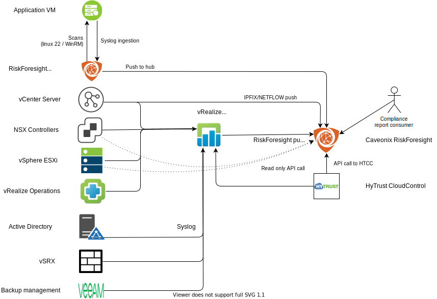

---

copyright:

  years:  2020

lastupdated: "2020-07-10"

subcollection: vmwaresolutions

---

{:shortdesc: .shortdesc}
{:tip: .tip}
{:note: .note}
{:important: .important}
{:external: target="_blank" .external}

# Caveonix integration
{: #fss-caveonix}

The IBM Cloud for VMware Regulated Workloads requires Caveonix RiskForesight for continuous compliance monitoring. The IBM Cloud for VMware Regulated Workloads architecture is designed to enable ease of compliance to NIST and other necessary compliance certifications as required of the client that uses the IBM Cloud for VMware Regulated Workloads offering.

{: caption="Figure 1. Caveonix data flows" caption-side="bottom"}

## Management cluster
{: #fss-caveonix-management}

[Caveonix RiskForesight](https://www.caveonix.com/){:external} provides a comprehensive cloud workload protection platform for IBM Cloud for VMware Regulated Workloads that delivers a common Risk Management Control Plane (RMCP) for continuous and proactive protection of management and edge workloads.

With the RMCP, you maintain continuous and real-time visibility into workload deployments at scale, incorporating the latest cyberthreats and regulatory compliance needs. You are also evaluating workload-specific cyber and compliance risks and providing proactive defense by using agentless enforcement at network, security, and compute control planes of deployment.

RiskForesight’s unique Risk Management Control Plane (RMCP) interface slashes or eliminates needless security blind spots and compliance gaps, restoring customers’ risk visibility and confidence in compliant deployments.

{: caption="Figure 2. Caveonix components" caption-side="bottom"}

## Edge cluster
{: #fss-caveonix-edge}

Caveonix RiskForesight is used to continuously monitor compliance of the edge cluster as it does for the management cluster.

## Workload cluster
{: #fss-caveonix-workload}

Caveonix RiskForesight can optionally monitor compliance of client workloads. Enabling the use of RiskForesight for workload compliance monitoring requires appropriate rules and policies on the perimeter security appliance that protects the client workloads.

**Next topic**: [Business continuity](/docs/vmwaresolutions?topic=vmwaresolutions-fss-budr)

## Related links
{: #fss-caveonix-related}

* [IBM Cloud compliance programs](https://www.ibm.com/cloud/compliance)
* [Caveonix RiskForesight](/docs/vmwaresolutions?topic=vmwaresolutions-caveonix_considerations)
