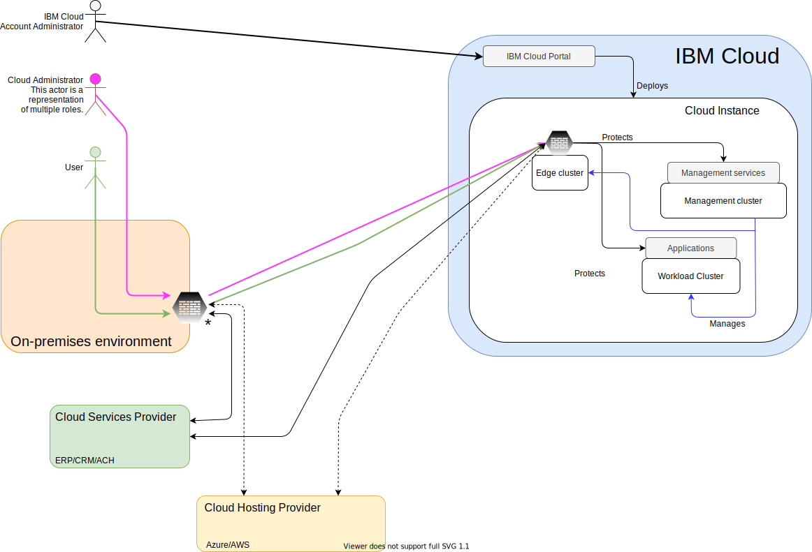

---

copyright:

  years:  2020

lastupdated: "2020-04-10"

subcollection: vmware-solutions

---

{:shortdesc: .shortdesc}
{:tip: .tip}
{:note: .note}
{:important: .important}

# FSS Cloud system context
{: #fss-context}

Although the FSS Cloud is a self-contained design, there are external dependencies that are necessary. FSS Cloud is designed without the use of IBM Cloud shared offerings such as VSIs and shared storage offerings.

{: caption="Figure 1. FSS Cloud context" caption-side="bottom"}

Connections between the on-premises environment, CSP, CHP, and IBM Cloud traverse the internet and are required to use IBM Cloud Direct Link, IPSec or other secure protocol.

* IBM Cloud Administrator - Manages the clients IBM Cloud account through the IBM Cloud portal. The IBM Cloud administrator is the only administrator who can add or remove hosts or services from the cloud account.
* FSS Cloud Administrator - Manages the virtualized environment that is the FSS Cloud instances. The FSS Cloud Administrator manages all compute, storage, and network resources that are consumed by the client applications. For simplicity, the administrator shown is a convergence of multiple administration roles. Separation of duties might require dedicated virtualization, network, and security administrator roles.
* User - consumes the resources available in the FSS Cloud instances to run their applications. The user has no access to the management plane.
* IBM Cloud data centers - supply the needed racks, cooling, and power to support the vSphere hosts used to build out the regions of the FSS Cloud.
* IBM Cloud network services - enable the connection of the FSS Cloud to the internet, via the frontside network, and via private connection to client over the backside network through IBM Cloud network offerings such as DirectLink.
* Edge cluster - provides compute, storage, and network services to support the gateway appliance.
* Edge gateway appliance - protects the management plane and supports secure network communication between the FSS Cloud management region and the client.
* Management cluster - provides compute, storage, and network services to support management functions.
* Management services - enable administrators to monitor, operate, and maintain the infrastructure to ensure it is compliant, secure, and available to support client applications.
* Workload clusters - provides compute, storage, and network services to support client applications and operations.
* Applications - applications are VMs that deliver services to the client that support business operations.
* Workload edge services cluster (optional) - deployed where necessary to protect client applications. The cluster is only necessary where dedicated resources are wanted or required for a gateway appliance.
* On-premises facilities - client existing facilities.
* CSP (Cloud Service Provider) - deliver ancillary services to the client. Examples might include credit card transaction processing or ACH services.
* CHP (Cloud Hosting Provider) - can provide hosting services to support disaster recovery or specialized application hosting.

**Next topic**: [FSS Cloud zero-trust model](/docs/vmwaresolutions?topic=vmware-solutions-fss-separation-of-duties)

## Related links
{: #fss-context-related}

* [IBM Cloud compliance programs](https://www.ibm.com/cloud/compliance){:external}
