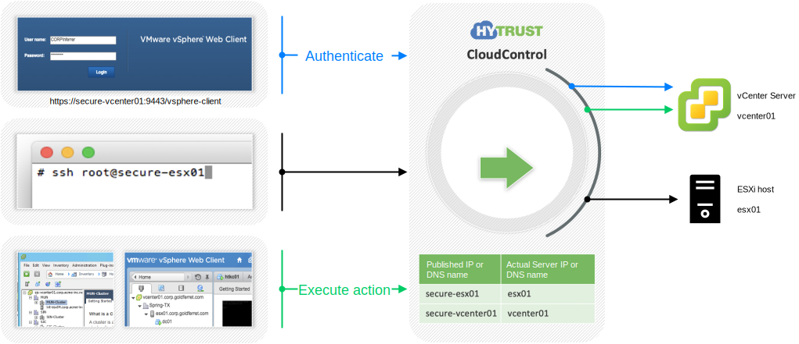
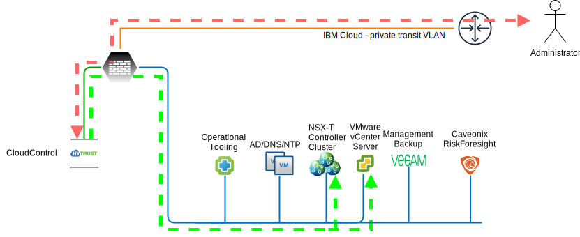

---

copyright:

  years:  2020

lastupdated: "2020-03-30"

subcollection: vmware-solutions

---

{:shortdesc: .shortdesc}
{:tip: .tip}
{:note: .note}
{:important: .important}

# FSS Cloud HyTrust integration
{: #fss-hytrust}

The FSS (Financial Services Sector) Cloud requires HyTrust CloudControl (HTCC) for identity and access management. HTCC enables fine grained role-based access control with capability of full auditing for all actions taken by any user or administrator.

## Management cluster
{: #fss-hytrust-management}

Identity and access management for administrators of the FSS Cloud infrastructure is handled by HTCC and Microsoft Active Directory servers. CloudControl uses the AD to authenticate the administrator but handles the authorization of the administrator internally.

### Hytrust CloudControl
{: #fss-hytrust-management-cloudcontrol}

HTCC is used to unified security policies for access to the management stack and to customer workloads (if desired), unified visibility to security configuration and context as well as visibility to customer workloads, continuous compliance by using templates to enforce segregation of duties and provides a robust audit trail that includes a full record of all actions taken by security, network and compute platform administrators. HTCC also simplifies compliance with administrative controls requirements in HIPAA, PCI, FedRAMP, CJIS and other privacy regulations. When OpenShift is included in the FSS Cloud, HTCC provides full stack protection to secure the underlying virtual and IaaS platform as well as the containers deployed to OpenShift.

{: caption="Figure 1. HyTrust CloudControl transparent proxy" caption-side="bottom"}

#### HyTrust CloudControl architecture
{: #fss-hytrust-management-cloudcontrol-architecture}

HTCC is composed of many internal functional components:
- Transparent Proxy – provides the proxy functionality for requests to vCenter and ESXi. This same mechanism is used for vSphere Client, vSphere Web Client and even SSH to ESXi hosts.
- Policy Engine – enforces security policies created by the security administrators.
- Authentication Engine – uniform authentication policy, integrates with Active Directory or LDAP as well as applying multi-factor authentication policy.
- Inventory Engine – keeps an synchronized inventory of vCenter objects and determines the trust level for ESXi hosts.
- Compliance Engine – performs configuration assessments and remediation.
- Logging – Logs every action, regardless of whether it was performed or denied by policy, and, if configured, forwards to syslog server or SIEM tool.

{: caption="Figure 2. FSS Cloud HyTrust integration" caption-side="bottom"}

## Edge cluster
{: #fss-hytrust-edge}

The ESXi host access is strictly limited. No direct access to an ESXi host is permissible. The gateway appliance uses only local accounts and is configured to forward all logs to vRealize Log Insight inclusive of authentication failure and success events for full visibility in to activities taken that may impact security or compliance status. HyTrust does not play a role in authentication or authorization for the gateway appliance.

## Workload cluster
{: #fss-hytrust-workload}

The ESXi host access is strictly limited. No direct access to an ESXi host is permissible. HTCC provides the same level of access control and auditing for administrators assigned to manage the dedicated workload infrastructure, such as the SDN (NSX-T). The fine-grained RBAC capability of HTCC limits their scope of action to the workload region.

**Next topic**: [FSS Cloud use case 1](/docs/vmwaresolutions?topic=vmware-solutions-fss-use-case-1)

## Related links
{: #fss-hytrust-related}

* [IBM Cloud compliance programs](https://www.ibm.com/cloud/compliance)
* [HyTrust CloudControl](/docs/vmwaresolutions?topic=vmware-solutions-htcc_considerations)
* [HyTrust DataControl](/docs/vmwaresolutions?topic=vmware-solutions-htdc_considerations)
* [IBM Cloud Hyper Protect Crypto Services API](https://cloud.ibm.com/apidocs/hs-crypto)
