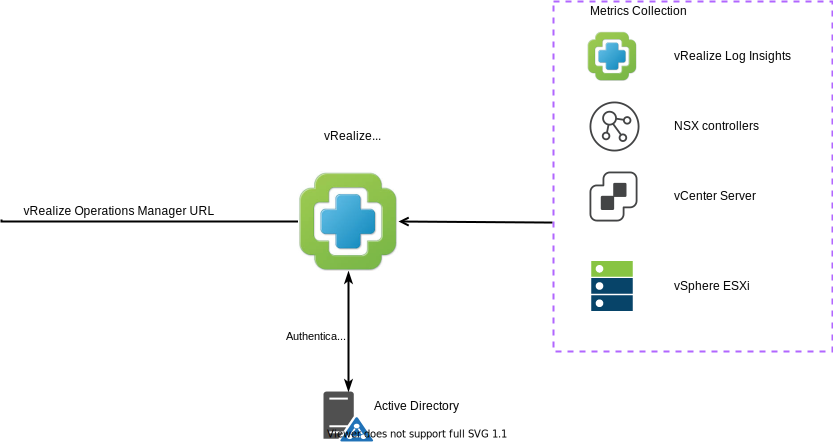
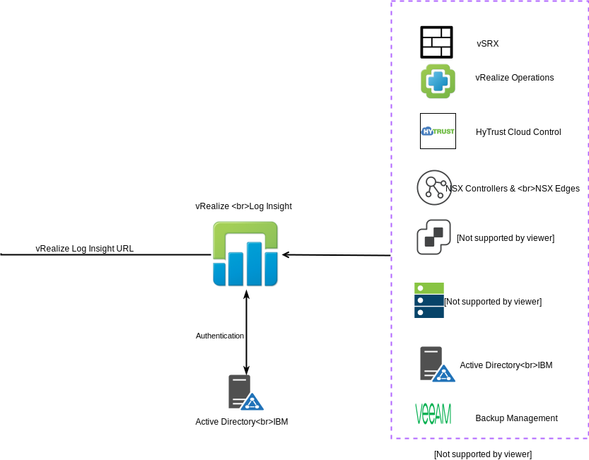

---

copyright:

  years:  2020

lastupdated: "2020-08-21"

subcollection: vmwaresolutions

---

{:shortdesc: .shortdesc}
{:tip: .tip}
{:note: .note}
{:important: .important}

# Operational tooling identity and access management
{: #fss-iam-vrealize}

## Overview
{: #fss-iam-vrealize-overview}

The operational tooling consists of the following components:

- vRealize Operations Manager - Using data collected from objects in the VMware® platform, vRealize Operations Manager (vROps) uses detailed dashboards to show system health, capacity, and performance.
- vRealize Log Insights - Objects in the VMware platform have been configured to send their logging events to vRealize Log Insights (vRLI) to enable a centralized log management function.

The following main principles or requirements for identity and access management to the operational tooling apply:
- The principle of least privilege to be used so that a user account has assigned only the privileges that are essential to perform the intended function.
- SaaS provider operations has full access to the operational tooling.
- Auditor has read-only access to the operational tooling.
- IC4V Active Directory (AD) is used to host accounts and define roles.

## Accounts
{: #fss-iam-vrealize-accounts}

The following terminology is used to define the account types:

- User IDs - These IDs are assigned to people who require access to the system.
- Service IDs - These IDs are used by the IC4V automation or used by software components.
- Local IDs - These IDs are local to the application.
- SSH IDs - These IDs are used to access the Linux® VMs that host the applications

## IBM Cloud for VMware Solutions infrastructure AD domain
{: #fss-iam-vrealize-ad}

The IBM Cloud™ for VMware Solutions infrastructure AD domain holds the resource objects and user accounts for the administration of the VMware platform only.

## vRealize Operations Manager
{: #fss-iam-vrealize-vrops}

By default, the following local users are configured during service instantiation:

| ID | Type |
|---|---|
| `automationAdmin` | LocalID
| `cloudadmin` | LocalID
| `admin` | LocalID
| `maintenanceAdmin` | LocalID
| `migrationAdmin` | LocalID
{: caption="Table 1. vROps user IDs" caption-side="top"}

The following groups are configured during service instantiation:

- Cloud Admin - The `cloudadmin` user ID is a member of this group.
- Everyone - All users are a member of this group.

{: caption="Figure 1. vRealize Operations Manager Logical" caption-side="bottom"}

### Roles
{: #fss-iam-vrealize-vrops-roles}

The following roles are defined in vROps:
- Administrator - System administrator
- AgentManager - Deploy and configure EP Ops Management agents
- ContentAdmin - Manage all the contents in the product
- GeneralUser-1 - Configurable out of the box role
- GeneralUser-2 - Configurable out of the box role
- GeneralUser-3 - Configurable out of the box role
- GeneralUser-4 - Configurable out of the box role
- PowerUser - All the privileges except the ones that are related to User Management and Cluster Management, typically vCenter Administrators would map to it.
- PowerUserMinusRemediation - All the Privileges except the ones that are related to User Management. Cluster Management and Remediation Actions.
- Readonly - Read-only access for the product.

vROps authentication sources are configured to use active directory to connect to the infrastructure AD. Within the infrastructure AD the following groups are assigned roles as follows:

| Group | Role |
|---|---|
| icv4-vCenter | Administrator |
| ic4v-infra  | TBD |
| ic4v-auditor | Readonly |
{: caption="Table 2. vROps groups" caption-side="top"}

## vRealize Log Insight
{: #fss-iam-vrealize-vrli}

By default, the following local users are configured during service instantiation:

| ID | Type | Role |
|---|---|---|
| admin | Local ID | Super Admin |
{: caption="Table 3. vROps default user IDs" caption-side="top"}

This account is not used on a day-to-day basis or for configuration tasks.

{: caption="Figure 2. vRealize Log Insights logical" caption-side="bottom"}

### vRealize Log Insight roles
{: #fss-iam-vrealize-vrli-roles}

The following roles are defined in vRLI:
- Super Admin - Full Admin and User capabilities, including editing shared content
- View Only Admin - Can view Admin information and has full User access, including editing shared content
- User - Can use interactive analytics and dashboards
- Dashboard User - Can use only dashboards

vRLI authentication configuration is configured to use active directory to connect to the infrastructure AD. Within the infrastructure AD the following groups are assigned roles as follows:

| Group | Role |
|---|---|
| icv4-vCenter | Super Admin |
| ic4v-infra  | View Only Admin |
| ic4v-auditor | User |
{: caption="Table 4. vRLI user IDs" caption-side="top"}

**Next topic**: [Use case 1](/docs/vmwaresolutions?topic=vmwaresolutions-fss-use-case-1)

## Related links
{: #fss-iam-vrealize-related}

* [IBM Cloud compliance programs](https://www.ibm.com/cloud/compliance)
* [HyTrust CloudControl](/docs/vmwaresolutions?topic=vmwaresolutions-htcc_considerations)
* [HyTrust DataControl](/docs/vmwaresolutions?topic=vmwaresolutions-htdc_considerations)
* [IBM Cloud Hyper Protect Crypto Services API](https://cloud.ibm.com/apidocs/hs-crypto)
