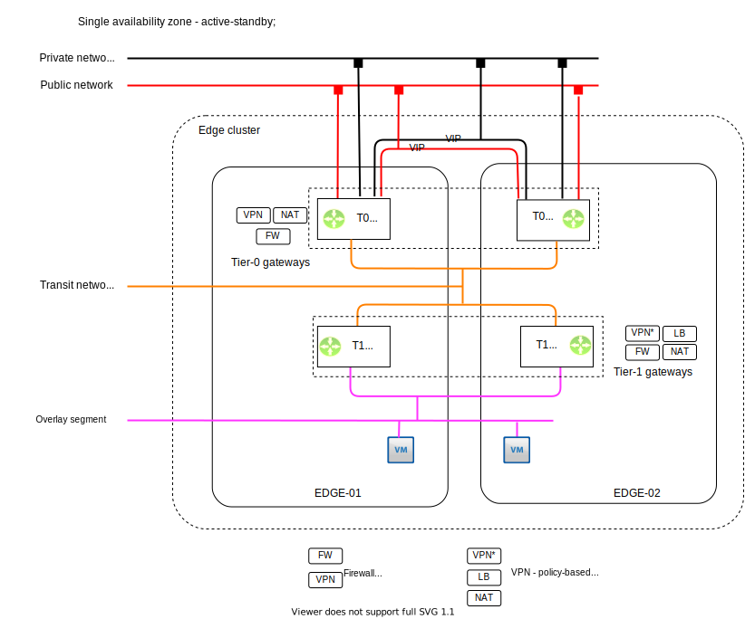
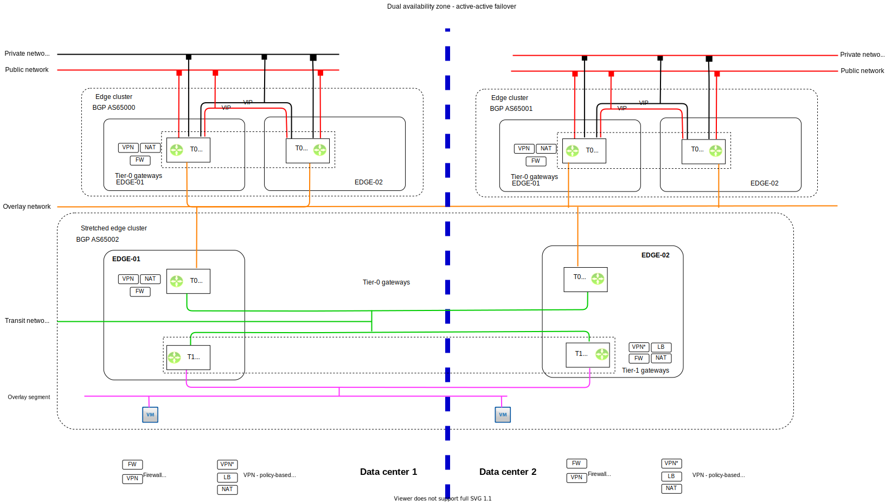

---

copyright:

  years:  2020

lastupdated: "2020-07-28"

subcollection: vmwaresolutions

---

{:shortdesc: .shortdesc}
{:tip: .tip}
{:note: .note}
{:important: .important}

# Supported topologies
{: #fss-nsxt-topologies}

## Single data center base topology
{: #fss-nsxt-topologies-single}

This topology creates a single edge cluster, with active-passive Tier-0 and Tier-1.

Active-passive on the Tier0 provides IPsec capability for access through the HA VIP address. Alternatively, Tier-0 would BGP peer with a vSRX firewall.

{: caption="Figure 1. Single data center" caption-side="bottom"}

## Multi-zone region data center active-active topology
{: #fss-nsx-topologiest-mzraa}

This topology is one of the more complex topologies and requires a large CPU/Memory footprint for all the moving parts.

In combination with a mission critical deployment or a stretched vSAN cluster, there are two levels of Tier-0.

The first level of Tier-0s is located and isolated to a data center, providing the north bound communication to the physical network and IPsec capabilities to the on-premises location.

The second level Tier-0 (active-passive) instances and Tier-1 (active-passive), are connected to the first level Tier-0. The key difference at this level is that the active-passive nodes are stretched to run an instance in each data center and they are connected to both the first-level Tier-0 in each data center. BGP is configured between the Tier-0 instance to provide dynamic routing and failover routing in a dynamic fashion.

From the Tier-1 instances, the overlay network segments are connected, which are available in both data centers as a stretched network. The previous Tier-0 failover and redundancy provides the same SLA availability as NSX-V, providing a seamless active-active topology and failover.

{: caption="Figure 2. Active-active MZR topology" caption-side="bottom"}

**Next topic**: [vSphere components](/docs/vmwaresolutions?topic=vmwaresolutions-fss-vsphere-platform)

## Related links
{: #fss-nsxt-topologies-related}

* [IBM Cloud compliance programs](https://www.ibm.com/cloud/compliance)
