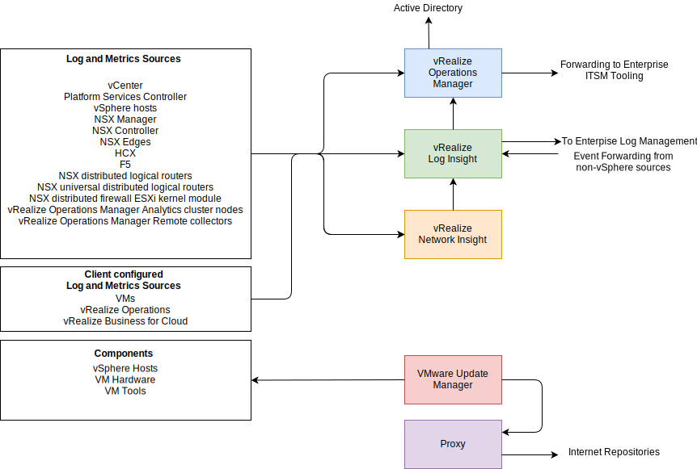

---

copyright:

  years:  2020

lastupdated: "2020-03-04"

subcollection: vmware-solutions

---

{:shortdesc: .shortdesc}
{:tip: .tip}
{:note: .note}
{:important: .important}

# FSS Cloud operations management
{: #fss-operations}

The IBM FSS (Financial Services Sector) Cloud is delivered as a clean and tuned environment. Extensive work was performed to identify and remediate common errors and warnings that are often found in a typical vSphere deployment. IBM and VMware best practices that are combined with standard and customized templates for vRealize Operations ensure that every FSS Cloud is deployed in the cleanest possible condition, ready for onboarding. Caveonix RiskForesight is used to scan the environment for compliance with industry and government standards such as NIST, PCI, and more. RiskForesight is continually monitoring the FSS Cloud for adherence to compliance standards. RiskForesight can provide on-demand compliance posture reporting and at-a-glance compliance status.
The operational tools support the client in compliance with current stands and assists them in rapidly responding to a changing compliance landscape.

{: caption="Figure 1. FSS Cloud operational tools overview" caption-side="bottom"}

## Management Cluster
{: #fss-operations-management}

All operational tools are deployed into the management cluster. The FSS Cloud depends upon multiple layers of tools to deliver comprehensive insight into the operation, security, and compliance of all layers of the platform. Clients consuming the FSS Cloud can elect to extend the use of the operational tools to monitor the VMs supporting their applications.

### Caveonix RiskForesight
{: #fss-operations-management-riskforesight}

[Caveonix RiskForesight](/docs/services/vmwaresolutions?topic=vmware-solutions-fss-caveonix) provides a comprehensive cloud workload protection platform for FSS Cloud that delivers a common Risk Management Control Plane (RMCP) for continuous and proactive protection of management and edge workloads.

### vRealize Operations
{: #fss-operations-management-vrops}

[VMware vRealize Operations](https://www.vmware.com/products/vrealize-operations.html){:external} delivers self-driving IT operations management from apps to infrastructure to optimize, plan, and scale hybrid cloud and HCI deployments while unifying multi-cloud monitoring. Powered by AI/ML, it helps IT run production operations hands-off and hassle-free with a unified operations platform, delivering continuous performance optimization, efficient capacity management, proactive planning, intelligent remediation and integrated compliance.

### vRealize Log Insight
{: #fss-operations-management-vrli}

[vRealize Log Insight](https://www.vmware.com/products/vrealize-log-insight.html){:external} delivers heterogeneous and highly scalable log management with intuitive, actionable dashboards, sophisticated analytics, and broad third-party extensibility. It provides deep operational visibility and faster troubleshooting across physical, virtual, and cloud environments.

All systems that generate logs are configured to send their logs to vRealize Log Insight. Centralized collection of all logging enables a comprehensive view of all aspects of the FSS Cloud operation. Log Insight is also capable of forwarding logs to security scanning services such as IBM SOS.

### vRealize Network Insight
{: #fss-operations-management-vrni}

[VMware vRealize Network Insight](https://www.vmware.com/products/vrealize-network-insight.html){:external} helps you build an optimized, highly available, and secure network infrastructure across hybrid and multi-cloud environments. It provides network visibility and analytics to accelerate micro-segmentation security, minimize risk during application migration, optimize network performance and confidently manage and scale NSX deployments.

vRealize Network Insight monitors network components and management traffic throughout the entire FSS Cloud instance. The monitoring scope includes insight into the operation of the NSX-T overlay network. Network Insight is also used to help optimizing performance by eliminating network bottlenecks.

## Edge Cluster
{: #fss-operations-edge}

No operational tools components are deployed to the edge cluster. All components that are deployed in the edge cluster are configured to deliver their logs to vRealize Log Insight, inclusive of the vSRX syslog facilities.

## Workload Cluster
{: #fss-operations-workload}

No operational tools components are deployed to the edge cluster. All platform components that are deployed in the workload cluster are configured to deliver their logs to vRealize Log Insight.

**Next topic**: [FSS Cloud Caveonix integration](/docs/services/vmwaresolutions?topic=vmware-solutions-fss-caveonix)

## Related links
{: #fss-operations-related}

* [IBM Cloud compliance programs](https://www.ibm.com/cloud/compliance)
* [vRealize Operations and Log Insight](/docs/services/vmwaresolutions?topic=vmware-solutions-vrops_overview)
* [Caveonix RiskForesight](/docs/services/vmwaresolutions?topic=vmware-solutions-caveonix_considerations)
