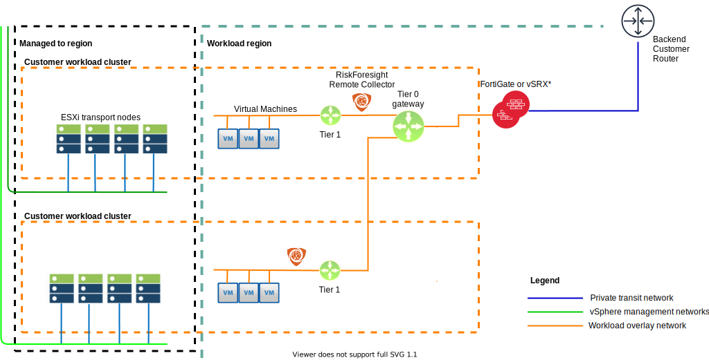

---

copyright:

  years:  2020

lastupdated: "2020-07-20"

subcollection: vmwaresolutions

---

{:shortdesc: .shortdesc}
{:tip: .tip}
{:note: .note}
{:important: .important}

# Overlay networking
{: #fss-overlay-network}

The IBM Cloud for VMware Regulated Workloads uses NSX-T as the software defined network overlay provider.

## Management cluster
{: #fss-overlay-network-management}

The management cluster requires only the use of VLANs to support the requirements of the management services. No overlay networking is enabled on the management cluster.

## Edge cluster
{: #fss-overlay-network-edge}

The optional edge services cluster does not employ any overlay networking and a FortiGate appliance is available to serve as the perimeter gateway in its place.

The vSRX running on the edge cluster connects the management network to the private and public transit networks. The vSRX is configured to allow only traffic in or out of the management region that is necessary for proper operation and monitoring of the environment. The vSRX also isolates all traffic between the clusters' ESXi hosts and the vCenter. ESXi hosts within a cluster can communicate with each other and the vCenter but ESXi hosts in one cluster (workload or management for example) are unable to communicate with the hosts of any other clusters. The limitation of cross cluster traffic is enforced by the vSRX and the configuration of the ESXi hosts' own firewalls.

The edge cluster is the peering point for traffic between the ISV on-premises and the IBM Cloud for VMware Regulated Workloads and it also serves as the demarcation for traffic from the bank. The ISV uses the vSRX as the secure tunnel endpoint for its VPN.

Traffic from the ISV's customer passes through the vSRX in an encrypted tunnel, which ends on the overlay network virtual edge device.

## Workload cluster
{: #fss-overlay-network-workload}

{: caption="Figure 1. Workload cluster overlay network" caption-side="bottom"}

The workload cluster network design requires both the overlay network that is delivered with NSX-T and two or more VLANs to support the infrastructure layer functions.

Traffic from the ISV's customer is peered with the overlay network virtual edge. It is the virtual edge that the customer uses as the secure tunnel end point to establish an encrypted VPN.

**Next topic**: [Multi-zone region](/docs/vmwaresolutions?topic=vmwaresolutions-fss-mzr)

## Related links
{: #fss-overlay-network-related}

* [IBM Cloud compliance programs](https://www.ibm.com/cloud/compliance)
