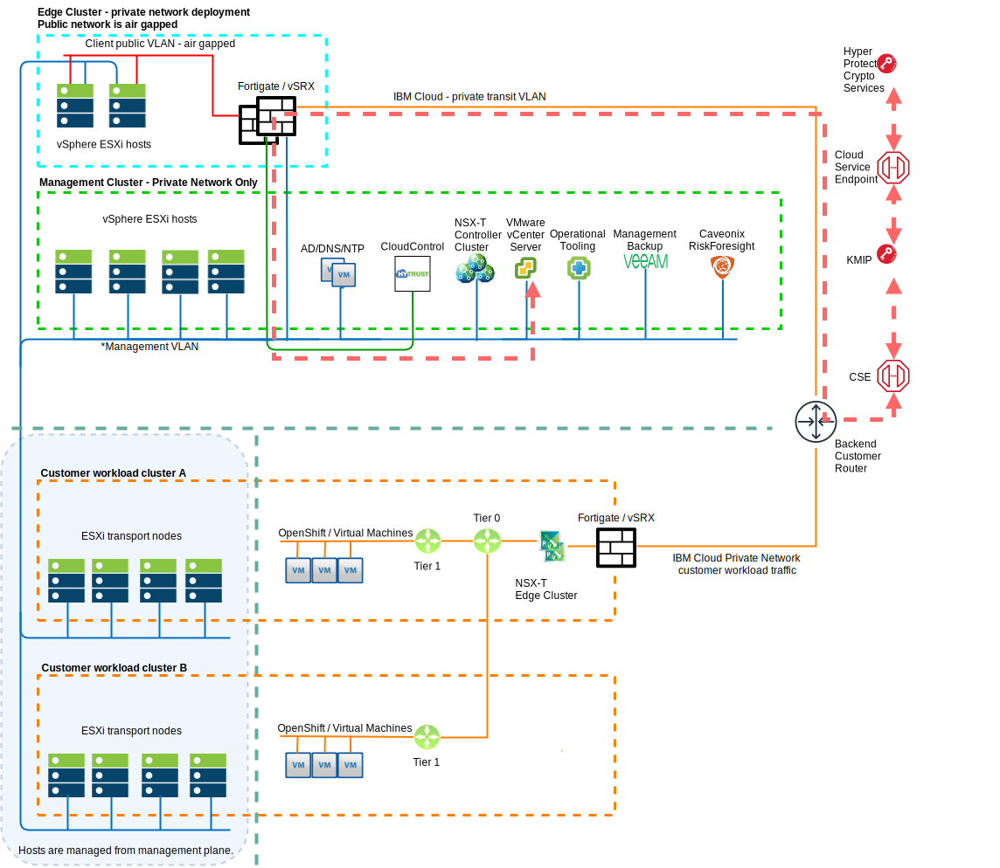

---

copyright:

  years:  2020

lastupdated: "2020-04-10"

subcollection: vmwaresolutions

---

{:shortdesc: .shortdesc}
{:tip: .tip}
{:note: .note}
{:important: .important}

# FSS Cloud reference architecture overview
{: #fss-overview}

The FSS (Financial Services Sector) Cloud architecture is an extension of the VMware vCenter Server offering.

The design extends and enhances the basic vCenter Server architecture to deliver a secure, high-performance platform. Clients are able to run both classic virtualized workloads and containerized applications with the addition of OpenShift.

IBM Cloud for VMware Solutions automation is used to deploy all layers of the platform thus consistently delivering a secure and compliant build for every FSS Cloud instance ordered.

{: caption="Figure 1. FSS Cloud infrastructure overview" caption-side="bottom"}

In the previous figure, the management network is shown as one common network. However, the network traffic is routed through vSRX for improved security.

The minimum viable product consists of at least one workload cluster that includes four or more ESXi hosts, vSAN and NSX-T, a three ESXi host management cluster and a two ESXi host edge services cluster, for a minimum of three total clusters: management, edge services, workload.

{: caption="Figure 2. FSS Cloud context" caption-side="bottom"}

## Management cluster
{: #fss-overview-mamagement}

The management cluster is sized to support only the requirements of the management software stack. Do not run non-management function workloads in the management cluster. Keeping the management functions fully isolated from the workload cluster makes it impossible for a runaway workload VM to consume resources that are dedicated to platform management thus always ensuring that administrators can maintain full control of the environment.

Shared NFS-based storage is used to provide enhanced resilience to the management stack. The use of shared storage provides rapid restoration of management components if an ESXi host is lost. Optionally, vSAN is available if there is a requirement to keep all management stack data in account dedicated storage. Growing the management cluster to four hosts is a requirement to use vSAN.

The management software stack includes:

* vCenter, which manages all hosts in the entire FSS Cloud instance.
* Microsoft AD/DNS servers, which provide DNS and authentication services.
* NSX-T management components to fully isolate the SDN control plane from the workload cluster.
* HTCC (HyTrust CloudControl) is used to unify security policies for access to the management stack and to customer workloads, if wanted. In addition, it's used for unified visibility into security configuration and context, visibility into customer workloads, and continuous compliance by using templates to enforce segregation of duties. HTCC also provides a robust audit trail that includes a full record of all actions that are taken by security, network, and compute platform administrators. HTCC also simplifies compliance with administrative controls requirements in HIPAA, PCI, FedRAMP, CJIS, and other privacy regulations. When OpenShift is included in the FSS Cloud, HTCC provides full stack protection to secure the underlying virtual and IaaS platform and the containers that are deployed to OpenShift. Security is further enhanced when the optional IBM Hyper Protect Crypto Services are included with the FSS Cloud. HPCS uses a FIPS 140-2 Level 4 HSM that gives access to the highest level of security for cloud data and digital assets. HPCS helps meet regulatory compliance requirements by providing complete control of data encryption keys, including the hardware security module (HSM) master key.

{: caption="Figure 3. FSS Cloud HyTrust overview" caption-side="bottom"}

* Caveonix RiskForesight provides a common Risk Management Control Plane (RMCP) for continuous and proactive protection of management and edge workloads that provides a comprehensive cloud workload protection platform for FSS Cloud. The FSS Cloud architecture is designed to enable ease of compliance to NIST and other necessary compliance certifications as required of the client that uses the FSS Cloud offering.
* VMware vRealize Operations Manager (vROps), vRealize LogInsight (vRLI), and vRealize Network Insight (vRNI). These components collectively provide a native console for vSphere operations, the ability to automate management of the cloud platform, centralized log collection, and network visibility, analysis, and optimization.  
* Veeam provides continuous backup of the management stack for protection against disasters and rapid restoration to known good states if corruption of any management stack component were to occur. Veeam is optionally available for use in the workload cluster to provide back up and disaster recovery services for the customer workloads.

## Edge cluster
{: #fss-overview-edge-services}

The edge services cluster uses local storage only (no vSAN, no NFS) with each host that runs a vSRX node (virtual machine instance). Affinity rules are used to pin each vSRX node to its host. The vSRX nodes are configured as a highly available cluster. The vSRX cluster is sized to support 10 Gb networking.

## Workload cluster
{: #fss-overview-workloads}

The sizing of four ESXi servers for the workload cluster is based on the required compute, memory, and storage needs of the customer applications.

vSAN is the storage provider. vSAN is fully contained within the workload environment thus all the customer data is fully isolated from external access and threats.

NSX-T provides a highly secure and flexible software defined network to support the application requirements. NSX-T management is external to the workload cluster thus ensuring that network and security changes are not possible by anyone other than the designated administrators. All north-south network access in the workload cluster is done through private and secure connections by using IPsec or IBM Direct Link. Optionally a fortigate or vSRX is deployed when direct access to the internet from the FSS Cloud is wanted.

## Optional management by IBM
{: #fss-overview-ibm-services}

While the FSS Cloud is available as a customer or independent services vendor-managed solution, a customer might elect to deploy the FSS Cloud as an IBM-Managed offering. If ordered as a managed offering, IBM SOS services are included to continually scan the environment for security and compliance issues and report anomalies for action. Additionally, SOS establishes proof of the security and compliance status to the customer of all layers in the FSS Cloud.

**Next topic**: [FSS Cloud system context](/docs/vmwaresolutions?topic=vmwaresolutions-fss-context)

## Related links
{: #fss-overview-related}

* [IBM Cloud compliance programs](https://www.ibm.com/cloud/compliance){:external}
* [Caveonix RiskForesight](/docs/vmwaresolutions?topic=vmwaresolutions-caveonix_considerations)
* [HyTrust CloudControl](/docs/vmwaresolutions?topic=vmwaresolutions-htcc_considerations)
* [HyTrust DataControl](/docs/vmwaresolutions?topic=vmwaresolutions-htdc_considerations)
* [vRealize Operations and Log Insight](/docs/vmwaresolutions?topic=vmwaresolutions-vrops_overview)
