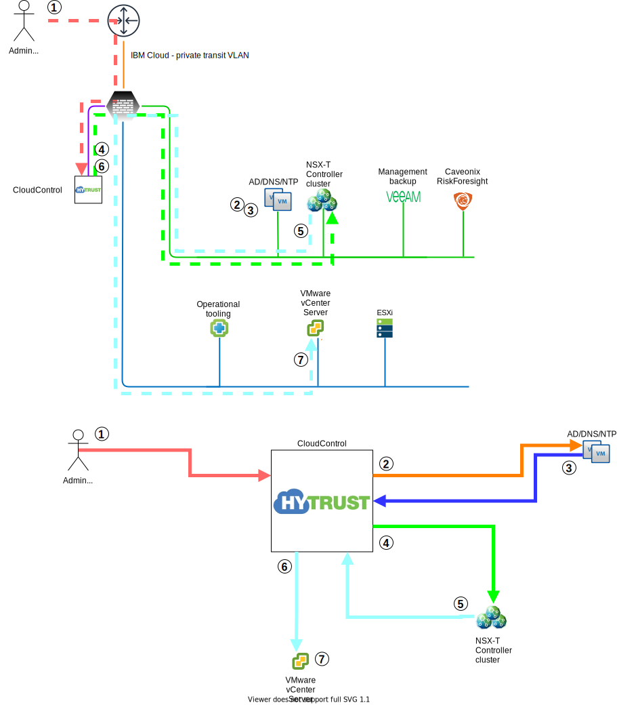

---

copyright:

  years:  2020

lastupdated: "2020-07-20"

subcollection: vmwaresolutions

---

{:shortdesc: .shortdesc}
{:tip: .tip}
{:note: .note}
{:important: .important}

# Zero-trust model
{: #fss-separation-of-duties}

The IBM Cloud for VMware Regulated Workloads is designed following the concept of a zero-trust model. Wherever practical, the scope of action of any one individual administrator is strictly limited to those actions necessary and appropriate to perform their assigned roles. Overlap of duties is minimized or eliminated to prevent the need for privilege escalation that can result in undesired flows of information in or out of any layer of the IBM Cloud for VMware Regulated Workloads.

## HyTrust RBAC

HyTrust CloudControl is used to implement granular role-based access control (RBAC). HyTrust CloudControl is configurable to require confirmation by another administrator before execution of any destructive action, such a deletion request.

Key roles that are implemented at the time of deployment are:

* HyTrust administrator - the HyTrust administrator is tasked with establishing the security and compliance controls that are necessary to protect the data in the IBM Cloud for VMware Regulated Workloads. The scope of responsibility is strictly limited to defining the necessary rules and policies along with appropriate audit and logging requirements such that secure and fully auditable access by any individual administrator is guaranteed. The HyTrust administrator is also responsible for defining the appropriate access controls to limit the scope of action of any administrator to only those privileges essential to carry out their assigned duties.

* vSphere platform administrator - responsible for the initial configuration of the virtual compute and storage resources within the entire IBM Cloud for VMware Regulated Workloads. The vSphere platform administrator role is defined such that it has no visibility into workloads that are successfully deployed to the workload cluster. The vSphere platform administrator can define more limited access administrators that are assigned responsibility for management of resource pools or clusters that are assigned to a specific purpose or business group. These limited scope administrator roles are defined in concert with the HyTrust administrator to ensure they are fully auditable and the correct RBACs are applied.

### Network and security administrator roles

The VCS model has a single network administrator role responsible for management across all network components (such as the underlay network, vSRX, and NSX-T).

The IBM Cloud for VMware Regulated Workloads network administrator role must break out to multiple discrete administrator roles to prevent such a situation.
These limited administrator roles are defined in concert with the HyTrust administrator to ensure they are fully auditable and the correct RBACs are applied.

Suggested network/security admin roles:

* IaaS Security administrator - The IaaS security administrator role is focused on protection of all platform infrastructure components from threats originating on the network. The scope of responsibility includes the security objects necessary to secure and control access to the management and edge layers of the IBM Cloud for VMware Regulated Workloads. These objects include the ESXi hosts that deliver compute and storage resources to the user workloads. The IaaS security administrator is also afforded necessary access to the IBM Cloud portal to deploy and manage network gateway devices. The IaaS security administrator might play a role in managing NSX-T security objects where the context of those objects impacts the security of the management and edge layers of the IBM Cloud for VMware Regulated Workloads. It is recommended that consideration is given to whether enabling the IaaS security administrator access to the NSX-T platform introduces unacceptable risk.

* IaaS Network administrator - The IaaS network administrator scope is limited to the underlay networking necessary for operation of the management plane, edge services layer, and the hardware delivering compute and storage resources to the workloads. The IaaS network administrator is provided necessary access to the IBM Cloud portal to fulfill the assigned duties of the role. The IaaS network administrator has no access to the NSX-T portal.

* NSX-T administrators - The NSX-T administrators' access is limited to the NSX-T portal. The scope of duties of the NSX-T administrator is broad enough to create any necessary global network and security objects that are required to permit all necessary traffic flows to fully support the requirements of the workloads consuming network resources. The NSX-T administrator has no role in the networking or security of the management or edge layers of the IBM Cloud for VMware Regulated Workloads platform. The NSX-T network administrator might define more limited scopes for application or business group network administrators that can create network objects necessary for particular requirements.

  - Splitting the NSX-T administrator role

    - NSX-T network super admin - responsible for deployment and operation of necessary shared network objects, such as T0 routers or edge gateways for the workloads.
    - NSX-T network security admin - dedicated security admin that has responsibility limited to the firewall/security aspects of NSX-T
    - Tenant NSX-T admin - where wanted - scope that is limited to a function/application/business unit as applicable to manage resources with such limited scope. Would include deployment of T1 routers for example.

HyTrust CloudControl transparent proxy with example workflow.

{: caption="Figure 1. Network change workflow" caption-side="bottom"}

The following steps describe the network change workflow:
1. The administrator opens the NSX-T portal through HyTrust.
2. HyTrust requests authentication of the account through an LDAPS request.
3. The AD LDAPS response authenticates the account, then HyTrust verifies the applicable role for access to NSX-T Manager.
4. The administrator is logged in to NSX-T Manager and requests a new virtual router.
5. NSX-T Manager makes an API call to vCenter Server through HyTrust. HyTrust authenticates and authorizes the NSX-T Manager service account.
6. HyTrust permits access to vCenter Server API.
7. vCenter Server creates the virtual router.

## Management cluster
{: #fss-separation-of-duties-management}

The vSphere administrator is responsible for the proper configuration, operation, and maintenance of the entire virtualized compute and storage infrastructure. The platform security administrator and network administrator share responsibility for the protection and operation of the network and security aspects of the management infrastructure. The network administrator role scope includes the configuration, operation, and maintenance of the software defined network (NSX-T) which delivers network and security services to the client workloads.

The use of NSX-T as the software defined networking provider eliminates reliance on the vCenter appliance for control of the SDN, thus it enables a clear separation of duties and responsibilities for the networking and compute/storage between the platform network administrator and the vSphere administrator.

Both the vSphere administrator and network administrator create roles with the necessary and appropriate privilege levels to enable the application administrators to fulfill their required duties. The use of a zero-trust model improves the security of the entire IBM Cloud for VMware Regulated Workloads implementation.

## Edge cluster
{: #fss-separation-of-duties-edge}

While the vSphere administrator holds responsibility for proper operation of the underlying ESXi hosts that form the edge services cluster, the VMware administrator has no access rights to the vSRX appliance nodes running upon them. There is no software defined network applicable to the edge services cluster, so the NSX-T administrator also has no access to the vSRX appliance nodes.
The security administrator is solely responsible for the configuration, operation, and maintenance of the vSRX gateway cluster. Only the security administrator has the right to implement configuration changes that impact the security stance of the IBM Cloud for VMware Regulated Workloads Management layer.
Where a physical appliance such as the fortigate is used in place of the edge services cluster the security administrator retains responsibility for its operation though there is no role for the virtual platform administrator.

## Workload cluster
{: #fss-separation-of-duties-workload}

The vSphere administrator is responsible only for the proper operation of the workload hosts that deliver virtualized compute, storage, and networking services for consumption by the client applications.

The security administrator responsible for the management layer does not retain any responsibility for the security of the client applications beyond the requirement that appropriate policies are in place to protect the infrastructure upon which the client deploys their applications and protection of the network perimeter to which NSX-T passes north-south traffic.

The ISV might designate one or more NSX-T tenant network administrators to provision and manage network services that are delivered through NSX-T to support the requirements of the applications deployed into the workload clusters. Limited access and scope are assigned to the tenant network administrator by the platform network administrator. The scope that is assigned might include the ability to deploy and modify security policies that impact the workload scope but that do not extend beyond the workload context.

**Next topic**: [Bare metal hosts](/docs/vmwaresolutions?topic=vmwaresolutions-fss-baremetal)

## Related links
{: #fss-separation-of-duties-related}

* [IBM Cloud compliance programs](https://www.ibm.com/cloud/compliance)
