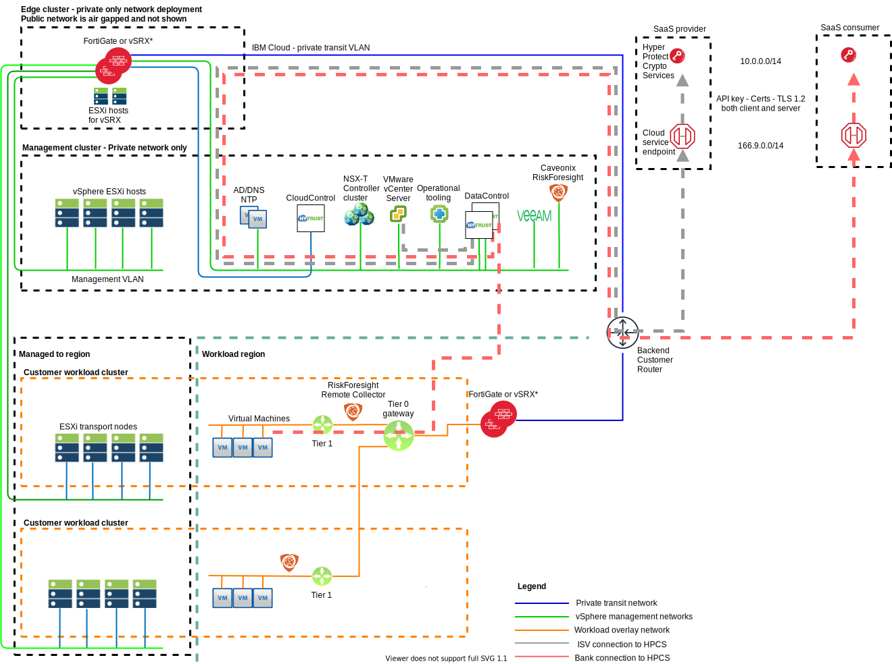

---

copyright:

  years:  2020

lastupdated: "2020-07-10"

subcollection: vmwaresolutions

---

{:shortdesc: .shortdesc}
{:tip: .tip}
{:note: .note}
{:important: .important}

# vSphere components
{: #fss-vsphere-platform}

The IBM Cloud for VMware Regulated Workloads is built with vSphere technology, which includes the ESXi hypervisors and vCenter appliance.

## Management cluster
{: #fss-vsphere-platform-management}

The management software stack consists of vCenter, AD/DNS, and vRealize operations tooling. vCenter manages all hosts in the entire VCS instance. AD/DNS provide Domain Name Services (DNS) and management authentication services, a local NTP source, and role-based access control (RBAC) for access to the vCenter, vRealize operations tooling, and NSX-T administration portal. The vRealize operations tooling includes vRealize Operations Manager (vROps), and vRealize LogInsight (vRLI). These components collectively provide a native console for vSphere operations, ability to automate management of the cloud platform, centralized log collection and analysis, and network visibility and optimization up to the hypervisor, customer workloads are not monitored by default.

Within the Management cluster, shared storage is used to provide enhanced resiliency to the management stack. The use of shared storage provides rapid restoration of management components if an ESXi host is lost. vSAN a requirement to keep all management stack data in account dedicated storage, which grows the management cluster to four hosts.

The vCenter appliance provides the necessary interfaces to the virtualization administrators, which include a robust RESTful API. Resilience of the vCenter appliance is delivered by using vSphere native DRS functions such as vMotion. More management components are deployed to the management cluster but only the vCenter appliance is responsible for direct operation of the platform.

### Active Directory/DNS
{: #fss-vsphere-platform-management-ad}

Active Directory serves to authenticate accesses to manage the VMware instance only and not to house users of the workloads in the deployed instances. The forest root domain name of the Active Directory server equals to the Domain Name Services (DNS) domain name that you specify during initial deployment.

Domain name services (DNS) in this design supports Cloud Management and infrastructure components only. The DNS zone files are also replicated on the Active Directory servers.

### Veeam management backup
{: #fss-vsphere-platform-management-veeam}

Veeam is an optional component that is used to continuously back up the management stack for protection against disasters and rapid restoration to known good states. Veeam is also available for use in the workload cluster to provide back up and disaster recovery services for the customer workloads.

### vCenter
{: #fss-vsphere-platform-management-vcenter}

The vCenter Server with an embedded PSC is installed on a portable subnet on the private VLAN that is associated with management VMs. Its default gateway is set to the IP address assigned on the perimeter gateway.

One vCenter is deployed to manage the management cluster, the edge cluster, and the customer workload clusters.

### NSX-T
{: #fss-vsphere-platform-management-nsxt}

NSX-T provides a highly secure and flexible software defined network to support the application requirements. NSX-T controllers are hosted in the management cluster.

NSX-T is configured with three controllers providing a highly available and redundant configuration. Additionally a virtual IP (VIP) address is used to access the cluster to provide fault tolerance and high availability to NSX Manager nodes. Each controller manager is assigned a VLAN–backed IP address from the private portable address block that is designated for management components.

Hosting the NSX-T controllers in the management cluster ensures that network and security changes are not possible by anyone other than the designated administrators.

### vRealize Operations Manager
{: #fss-vsphere-platform-management-vrops}

The vROps analytics cluster contains the nodes that analyze and store data from the monitored components and in this deployment.

The analytics cluster consists of the following components:
- Primary node – The primary node is the initial node in a vROps cluster. In a large environment, this node manages all the other nodes.
- Primary node replica – This node enables high availability of the primary node.
- Data nodes – The data node enables scale out of vROps in larger environments.

For more information, see [vRealize Operations Manager design](/docs/vmwaresolutions?topic=vmwaresolutions-opsmgmt-vrops)

### vRealize Log Insight
{: #fss-vsphere-platform-management-vrli}

The vRealize Log Insight (vRLI) environment consists of four virtual machines (VMs) with an integrated Load Balancer.

vRealize Log Insight (vRLI) enables real-time logging for components in the IBM Cloud for VMware Regulated Workloads environment. The design deploys a vRLI cluster that consists of four nodes in each instance. This configuration provides continued availability and increased log ingestion rates.

vRLI collects log events from the following virtual infrastructure and Cloud Management components (logging clients):

- vCenter Server
- ESXi hosts
- NSX controllers
- NSX routers
- NSX distributed firewall ESXi kernel module
- vRealize Operations Manager analytics cluster nodes and remote collectors
- vRLI instance in the other instances as a result of event forwarding (MZR configuration)

For more information, see [vRealize log insight design](/docs/vmwaresolutions?topic=vmwaresolutions-opsmgmt-vrli).

### HyTrust CloudControl
{: #fss-vsphere-platform-management-htcc}

HyTrust Solutions, HyTrust CloudControl (HTCC), and the optional HyTrust DataControl (HTDC), are used to unify security policies and the access to the vSphere vCenter and NSX-T management.

HyTrust CloudControl provides unified visibility to security configuration and context, and continuous compliance by using templates to enforce segregation of duties. It also provides a robust audit trail that includes a full record of all actions that are taken by security, network, and compute platform administrators. HTCC simplifies compliance with administrative controls requirements in HIPAA, PCI, FedRAMP, CJIS, and other privacy regulations.

The HTCC appliances are deployed in an active-active configuration, with integrations with Active Directory for authentication services and both the vCenter and NSX-T admin user interfaces.

[HyTrust CloudControl IBM Cloud Document](/docs/vmwaresolutions?topic=vmwaresolutions-htcc_considerations)

### HyTrust DataControl
{: #fss-vsphere-platform-management-htdc}

The optional HyTrust DataControl provides granular encryption within the workload cluster, with strong encryption of virtual machines, along with easy to deploy key management under ISV control. The protection boundary does not stop at the hypervisor or at the data store levels. VMs are individually encrypted. Inside the VM, unique keys can be assigned to encrypt each partition, including the boot (OS) disk and swap partitions. Many regulations, including the GDPR, exempt you from reporting a data breach if data was encrypted. HyTrust Key Control is integral to HyTrust DataControl. HTDC also provides password vaulting services.

{: caption="Figure 1. IBM Cloud for VMware Regulated Workloads infrastructure with HTDC" caption-side="bottom"}

For more information, see [HyTrust DataControl overview](/docs/vmwaresolutions?topic=vmwaresolutions-htdc_considerations).

### Backup server
{: #fss-vsphere-platform-management-backupserver}

This server is a Linux VM that is deployed to provide a location for file-based backups. It is used by the vCenter Server Appliance to perform a file-based backup of the vCenter Server core configuration, inventory, and historical data. Similarly, NSX controller backups can be done through its admin interface.

### Caveonix server
{: #fss-vsphere-platform-management-caveonix}

The Caveonix RiskForesight service manages cyber and compliance risk with proactive monitoring and automated defense controls to protect against threats and to meet industry or government regulations.

## Edge cluster
{: #fss-vsphere-platform-edge}

No vSphere management components are deployed to the edge cluster.

## Workload cluster
{: #fss-vsphere-platform-workload}

NSX-T Edge clusters virtual machines that house the Tier-0 and Tier-1 routers are located on the workload clusters. No vSphere management components are deployed to the workload cluster.

**Next topic**: [Encryption](/docs/vmwaresolutions?topic=vmwaresolutions-fss-encryption)

## Related links
{: #fss-vsphere-platform-related}

* [IBM Cloud compliance programs](https://www.ibm.com/cloud/compliance)
