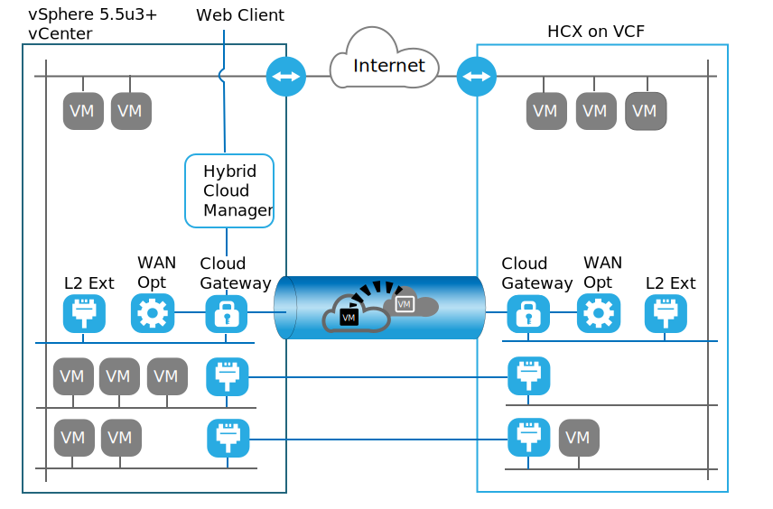

---

copyright:

  years:  2016, 2019

lastupdated: "2019-05-06"

subcollection: vmware-solutions

---
# VMware HCX on IBM Cloud introduction
{: #hcx-archi-intro}

The VMware HCX on IBM Cloud service enables creating a seamless connection between IBM Cloud for VMware Solutions instances and an on-premises VMware virtualized datacenter.

The IBM Cloud for VMware Solutions includes fully automated, rapid deployments of VMware vCenter Server (VCS) in the IBM Cloud. These offerings complement the on-premises infrastructure and allow existing and future workloads to run in the IBM Cloud without conversion by using the same tools, skills, and processes they use on-premises. For more information, see the [Virtualization for extending virtualized private cloud](https://www.ibm.com/cloud/garage/architectures/virtualizationArchitecture).

The VMware HCX on IBM Cloud service takes this hybridity to the next step, blending instances of VCS with existing on-premises virtualized datacenters by enabling the creation of seamless network extensions and bidirectional migration of workloads.

The VMware HCX on IBM Cloud components that are deployed as virtual machines in the IBM Cloud VMware target site enable the establishment of a connection with the VMware HCX on IBM Cloud components installed in the peer on-premises source site.

{: caption="Figure 1. VMware vCenter Server – Hybrid Cloud Services" caption-side="bottom"}

This connection creates a loosely coupled interconnectivity between on-premises and IBM Cloud and enables capabilities such as:
* Simple interconnectivity – logical network connections are established easily over any physical connection such as public internet, private VPN, or direct link.
* Layer 2 extension – on-premises networks are extended into the cloud. These networks include on-premises subnets and IP addressing.
* Encryption – network traffic is securely encrypted between the two sides.
* Optimized network – selects the best connection and efficiently floods the connection so that network traffic is moved as fast as possible.
* Data deduplication – as much as 50% reduction in network traffic can be achieved Intelligent routing – when a workload is moved, proximity routing can change the network path (that is, gateway) so that network traffic uses the target site gateway and does not “hairpin” back to the originating site.
* Zero downtime migration – a running system can be moved to and back from the cloud by using vMotion.
* Scheduled migration – any number of virtual machines can be replicated to the destination site and then activated on that site at a designated time, which replaces the systems that are running on the originating site.
* Migration of security policies – if NSX is used on-premises, any security policies or firewalls are
moved along with the workload.

## Related links
{: #hcx-archi-intro-related}

* [Virtualization for extending virtualized private cloud](https://www.ibm.com/cloud/garage/architectures/virtualizationArchitecture)
