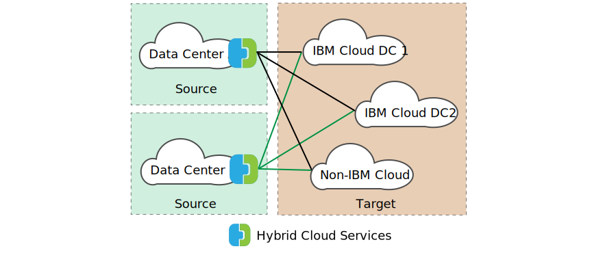

---

copyright:

  years:  2016, 2025

lastupdated: "2025-10-21"

subcollection: vmwaresolutions

---

{{site.data.keyword.attribute-definition-list}}

# VMware HCX overview
{: #hcx-archi-overview}

VMware® HCX™ seamlessly integrates on-premises vSphere® vCenter™ networks into {{site.data.keyword.vmwaresolutions_full}} deployments. Hybrid networking extends on-premises vSphere vCenter networks into the {{site.data.keyword.cloud_notm}}, supporting bidirectional virtual machine (VM) mobility.

HCX owns the source and destination encryption and decryption processes. It ensures consistent security and providing admission for hybrid workflows such as VM migration and network extension.

This offering creates an optimized, software-defined WAN to increase stretched network performance, enabling performance that approaches LAN speed. HCX also enables bidirectional workload migration to {{site.data.keyword.cloud_notm}} Networking services. HCX integrates with vSphere vCenter and is managed from the VMware vSphere® Web Client.

## HCX services
{: #hcx-archi-overview-svcs}

{{site.data.keyword.vmwaresolutions_short}} provides the following HCX services.

### Interconnect
{: #hcx-archi-overview-svcs-ic}

This service creates and secures connections between HCX installations, supporting management, migration, replication, and disaster recovery operations. This service is deployed as a virtual appliance.

### WAN optimization
{: #hcx-archi-overview-svcs-wo}

The WAN Optimization service works with the HCX Interconnect service to improve the network performance through a combination of deduplication, compression, and line conditioning techniques. This service is deployed as a virtual appliance.

### Network extension
{: #hcx-archi-overview-svcs-ne}

This service extends the VM networks from an HCX-enabled source site to an HCX-enabled remote site. VMs that are migrated or created on the extended segment at the remote site are Layer 2 next to VMs placed on the origin network. This service is deployed as a virtual appliance.

### Bulk migration
{: #hcx-archi-overview-svcs-bm}

This service uses the vSphere Replication protocol to move VMs in parallel between HCX enabled sites.

### vMotion migration
{: #hcx-archi-overview-svcs-vmm}

This migration method uses the VMware vMotion protocol to move a single VM between HCX enabled sites with no service interruption.

### Disaster Recovery
{: #hcx-archi-overview-svcs-dr}

The HCX Disaster Recover service replicates and protects VMs to a remote data center.

## Components of HCX
{: #hcx-archi-overview-comp-hcx}

The VMware HCX service deploys four virtual appliance types that are installed and configured on both the on-premises datacenter and the {{site.data.keyword.cloud_notm}} target. Optionally, edge devices might be required depending upon the implementation design.

### Target side and client side
{: #hcx-archi-overview-target-client}

HCX has the concept of cloud side (target - destination) and client side (source):
* Cloud / Destination side - HCX Cloud is pre-deployed in your {{site.data.keyword.vcf-auto}} instance on customer portal request and configured with the network and compute profiles ready for service mesh creation.  
* Client / Source side - Any vSphere instances that meet the prerequisites for installation and operation. The client side of HCX is the primary that controls the cloud side secondary instance through its vCenter web client user interface (UI) snap-in.

The source and destination sites are paired together for HCX operations. An HCX Connector cannot be paired with another HCX Connector.

In both the source and destination environments, HCX is deployed to the management zone, next to each site's VCSA, which provides a single plane (HCX Manager) for administering VMware HCX. This HCX Manager provides a framework for deploying HCX service VMs across both the source and destination sites. VMware HCX administrators are authenticated, and each task authorized through the existing vSphere SSO identity sources. VMware HCX mobility, extension, protection actions can be initiated from the HCX User Interface or from within the VCSA (VMware vCenter® Server Appliance) Navigator screen menus.

### HCX Cloud and HCX Connector
{: #hcxclient-components-manager}

In the HCX site-to-site architecture, an HCX source environment and an HCX destination environment exist. Depending on the environment, a specific HCX installer is used, either HCX Connector (previously HCX Enterprise) or HCX Cloud. HCX Connector is always deployed as the source. HCX Cloud is typically deployed as the destination, but it can be used as the source in cloud-to-cloud deployments. In HCX-enabled public clouds, the cloud provider deploys HCX Cloud. The public cloud tenant deploys HCX Connector on-premises.

The source and destination sites are paired together for HCX operations. An HCX Connector cannot be paired with another HCX Connector.

In both the source and destination environments, HCX is deployed to the management zone, next to each site's VCSA, which provides a single plane (HCX Manager) for administering VMware HCX. This HCX Manager provides a framework for deploying HCX service VMs across both the source and destination sites. VMware HCX administrators are authenticated, and each task authorized through the existing vSphere SSO identity sources. VMware HCX mobility, extension, protection actions can be initiated from the HCX User Interface or from within the VCSA Navigator screen's menus.

### HCX-IX Interconnect Appliance (HCX-IX)
{: #hcx-archi-overview-comp-hcx-ix}

The HCX-IX service appliance provides replication and vMotion-based migration capabilities over the Internet and private lines to the destination site whereas providing strong encryption, traffic engineering, and VM mobility.

### HCX WAN Optimization Appliance (HCX-WO)
{: #hcx-archi-overview-comp-hcx-wo}

The VMware HCX WAN Optimization service improves performance characteristics of the private lines or Internet paths by applying WAN optimization techniques like the data de-duplication and line conditioning. It makes performance closer to a LAN environment. It accelerates onboarding to the destination site by using Internet and VPN. This way, immediate migration is allowed, without the need to wait for Direct Link and related MPLS circuits, which can naturally be used in migration, too.

### HCX Network Extension Virtual Appliance
{: #hcx-archi-overview-comp-hcx-ne}

The HCX Network Extension (HCX-NE) service provides a minimal interaction operation for high performance (4-6 Gbps) Layer 2 Extension from environments that use a vSphere Distributed Switch, or NSX Networking. With HCX Network Extension, you can keep the same IP and MAC addresses during VM migrations. HCX Network Extension with Mobility Optimized Networking eliminates tromboning between migrated VMs on different extended segments, and VMs on native NSX-T™ networks at the destination.

## Deployment architecture
{: #hcx-archi-overview-connect}

The deployment architecture consists of the HCX components within the {{site.data.keyword.cloud_notm}} and with client on-premises. In this design, the architecture specifies a hub-and-spoke model that exists between the source environment and the {{site.data.keyword.cloud_notm}}. The source estate serves as the hub with connections to different {{site.data.keyword.cloud_notm}} environments as shown in the following figure. In this model, site peering is established over the Internet.

{: caption="HCX with single source over Public Network" caption-side="bottom"}

Alternatively, the architecture also allows site peering over the Private Internet.

{: caption="HCX with single source over Private Network" caption-side="bottom"}

The source can be placed within the {{site.data.keyword.cloud_notm}} environment as well; spokes are always cloud deployments within this design as shown in the following figure.

{: caption="HCX with multiple sources" caption-side="bottom"}

## Base design dependencies
{: #hcx-archi-overview-base-design}

The base deployment must follow the minimum requirements:
* The source environment must contain a vSphere implementation that is managed by a vCenter Server. Hybrid Cloud Services requires a supported vCenter Server of 5.5U3 or 6.0U2 and later, with ESXi 5.5 or later.
* If NSX is used, version 6.2.2 or later. NSX is required for policy migration.
* If cross-cloud vMotion is intended, the same affinity restrictions apply across clouds as they do on-premises.
* The source environment must have a method to connect to cloud environments, which includes public internet access or private connections by using {{site.data.keyword.cloud_notm}} Direct link.
* The source environment VM’s and networks to be migrated or stretched must be on portgroups within a Virtual Distributed Switch.
* The {{site.data.keyword.cloud_notm}} must contain at least one instance of {{site.data.keyword.vcf-auto-short}}.
* Sufficient resources for the virtual appliances.
* The networks must allow the appliances to communicate with both local and remote virtual appliances, and other VMs.
* The port access requirements topic lists ports that must be opened so that Hybrid Cloud Services virtual appliances can be installed successfully.
* A vSphere service account exists and the Administrator vCenter system role is assigned to it.
* Enough disk space for installing Hybrid Cloud Services and the associated service appliances.
* Sufficient IP addresses for the on-premises VMs provisioned during the installation.
* If the SSO server is remote, the URL of the vCenter, external SSO Server, or Platform Services Controller (PSC) that runs the external lookup service must be identified. When the HCX service is registered with the vCenter, this URL must be supplied.

## Related links
{: #hcx-archi-overview-related}

* [VMware HCX introduction](/docs/vmwaresolutions?topic=vmwaresolutions-hcx-archi-intro)
