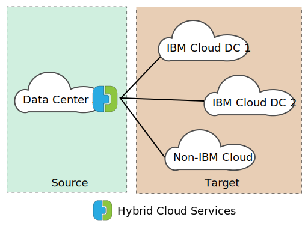
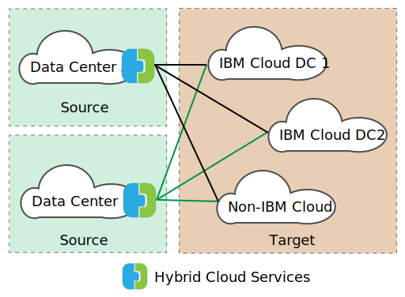

---

copyright:

  years:  2016, 2019

lastupdated: "2019-02-15"

subcollection: vmware-solutions

---
# VMware HCX on IBM Cloud overview
{: #hcx-archi-overview}

VMware HCX on IBM Cloud seamlessly integrates on-premises vSphere® vCenter™ networks into IBM Cloud for VMware Solutions deployments. Hybrid networking extends on-premises vSphere vCenter networks into the IBM Cloud, supporting bidirectional virtual machine (VM) mobility.

HCX owns the source and destination encryption and decryption processes, ensuring consistent security and providing admission for hybrid workflows such as virtual machine migration and network extension.

This offering creates an optimized, software-defined WAN to increase stretched network performance, enabling performance that approaches LAN speed. HCX also enables bidirectional workload and VMware NSX® security policy migration to the IBM Cloud. HCX integrates with vSphere vCenter and is managed from the vSphere Web Client.

## Layer 2 Network Extension
{: #hcx-archi-overview-layer-2-net}

HCX allows an existing on-premises vSphere estate to securely stretch a network from its on-premises vCenter to an IBM Cloud data center that runs VMware Cloud Foundation or vCenter Server. This feature is enabled by the following items:
* HCX provides an appliance that is called a Layer 2 Concentrator (L2C).
* Extended networks link to IBM Cloud NSX edge appliances deployed on VMware Cloud Foundation or vCenter Server.
* One can deploy multiple standard Layer 2 concentrators to achieve scalability and increase throughput from the on-premises vCenter.
* Virtual machines that are migrated through the Cloud Gateway and over stretched Layer 2 can retain their IP and MAC addresses.

## Virtual machine migration
{: #hcx-archi-overview-vm-mig}

HCX provides three methods of virtual machines movement: low downtime migration, vSphere vMotion migration, and cold migration.

### Low downtime migration
{: #hcx-archi-overview-low-downtime-mig}

Low downtime migration relies on vSphere Replication, which is a distributed technology that is implemented in the VMware ESX®/ESXi® hypervisor. The on-premises HCX deployment creates a replica of a live virtual machine in the IBM Cloud, and performs a switchover to power off the source virtual machine and power on the migrated virtual machine.

The migration path is always through the Cloud Gateway. The transport can be the internet, a Layer 2 stretched network, or a Direct Connect line.

A virtual machine can be migrated multiple times in either direction.

### vMotion migration
{: #hcx-archi-overview-vmotion-mig}

Live virtual machines can be transferred by using vMotion Migration across a network that is stretched to the IBM Cloud. vMotion migration is also called zero downtime migration, or cross-cloud vMotion.

### Cold migration
{: #hcx-archi-overview-cold-mig}

With cold migration, you can transfer a powered-off VM to the IBM Cloud over a stretched network that is created by using the Layer 2 Concentrator.

### Common migration features
{: #hcx-archi-overview-cold-mig-features}

Other features available across all three types of migration include software-defined WAN optimization that increases migration throughput and speed. Additionally, migration can be scheduled to occur at a specified time and keep its host name, virtual machine name, or both.

## Networking features
{: #hcx-archi-overview-net-features}

The following networking features are built into the Cloud Gateway and the Layer 2 Concentrators.

### Intelligent Flow Routing
{: #hcx-archi-overview-intel-flow-routing}

This feature automatically selects the best connection based on the internet path, efficiently flooding the entire connection so that workloads are moved as fast as possible. When larger flows, such as backup or replication, cause CPU contention, smaller flows are routed to less busy CPUs, improving performance of interactive traffic.

### Proximity Routing
{: #hcx-archi-overview-prox-routing}

Proximity routing ensures that forwarding between virtual machines that are connected to stretched and routed networks, both on-premises and in the cloud, is symmetrical. This feature requires Advanced Networks Services with Dynamic Routing that is configured between the customer premises and the cloud.

When users extend their networks to the cloud, Layer 2 connectivity is stretched onto IBM Cloud networks. However, without route optimization, Layer 3 communication requests must return to the on-premises network origin to be routed. This return trip is called _tromboning_ or _hairpinning_.

Tromboning is inefficient because packets must travel back and forth between the network origin and the Cloud, even when both source and destination virtual machines reside in the Cloud.

In addition to inefficiency, if the forwarding path includes stateful firewalls, or other inline equipment that must see both sides of the connection, communication might fail. Virtual machine communication (without route optimization) failure occurs when the egress path that exits the cloud can be either the stretched Layer 2 network or the Org Routed Network. The on-premises network does not know about the stretched network "shortcut." This problem is called asymmetric routing. The solution is to enable proximity routing so the on-premises network can learn the routes from the IBM Cloud.

The Cloud Gateway maintains an inventory of virtual machines in the cloud. It also understands the VM state, which can be one of the following states:
* Transferred to the IBM Cloud with vMotion (zero-downtime migration).
* Migrated to the cloud by using host-based replication (low-downtime migration).
* Created in the cloud (on a stretched network).

### Security
{: #hcx-archi-overview-sec}

The Cloud Gateway offers Suite B-compliant AES-GCM with IKEv2, AES-NI offload, and flow-based admission control. HCX also owns the source and destination encryption and decryption process, ensuring consistent security and administration for hybrid workflows such as virtual machine migration and network extension. Security policies that are defined and assigned to a virtual machine on-premises can be migrated with the virtual machine into the IBM Cloud.

Policy migration is only available under the following conditions:
* The on-premises data center must be running NSX 6.2.2 or greater.
* In vSphere, the security policy is a single NSX Section that can contain many rules.
* One can name a Set of IP addresses or MAC addresses to participate in the policy. The name of the MAC Set or IP Set cannot exceed 218 characters.
* Supported rules specify Layer 3 IP addresses or IP Sets, or Layer 2 MAC addresses or MAC Sets as the source or destination.

## Components of HCX
{: #hcx-archi-overview-comp-hcx}

The VMware HCX on IBM Cloud service deploys four virtual appliances that are installed and configured on both the on-premises datacenter and the IBM Cloud target. This section describes each of the four required virtual appliances. Optionally, edge devices might be required depending upon the implementation design.

### HCX Manager
{: #hcx-archi-overview-hcx-man}

The HCX Manager virtual appliance is an extension to the on-premises vCenter. It is deployed as a virtual machine and its file structure contains the other hybrid service virtual appliances. The HCX Manager oversees the deployment and configuration of the Cloud Gateway, the Layer 2 Concentrators, and WAN Optimization virtual appliance both on-premises and within the IBM Cloud.

### Hybrid Cloud Gateway
{: #hcx-archi-overview-hcg}

The Hybrid Cloud Gateway (CGW) maintains a secure channel between the on-premises vSphere estate and the IBM Cloud. HCX uses strong encryption to bootstrap a site-to-site connection to the IBM Cloud.

The secure channel between vSphere and IBM Cloud prevents networking "middle mile" security problems. The Cloud Gateway also incorporates vSphere replication technology to perform bidirectional migration.

### WAN Optimization
{: #hcx-archi-overview-wan-opt}

The WAN Optimization appliance is the component that performs WAN conditioning to reduce effects of latency. It also incorporates Forward Error Correction to negate packet loss scenarios, and deduplication of redundant traffic patterns. Altogether, these reduce bandwidth use and ensure the best use of available network capacity to expedite data transfer to and from the IBM Cloud.

It is important to note that virtual machine migration relies on the combination of Cloud Gateway and WAN Optimization appliance to achieve unparalleled mobility between vSphere on-premises and the IBM Cloud. Additionally, Layer 2 extension benefits from WAN optimization when the data path is routed through the Cloud Gateway.

### Layer 2 Concentrators
{: #hcx-archi-overview-layer-2-conc}

The Layer 2 concentrators (L2C) appliances allow the extension of a Layer 2 network from the on-premises vSphere data center to the IBM Cloud. The Layer 2 Concentrators have two interfaces:
* Internal trunk interface - Handles virtual machine traffic on-premises for the extended networks by using a translational bridge mapping to a corresponding stretched network in IBM Cloud.
* Uplink interface - HCX uses this interface to send encapsulated overlay traffic to and from IBM Cloud. Application data travels through this interface.

## Deployment architecture - Connect to IBM Cloud by using the public internet
{: #hcx-archi-overview-connect-pub-internet}

This section describes the layout of the HCX components within the IBM Cloud and with client on-premises. In this design, the architecture specifies a hub-and-spoke model that exists between the source environment and the IBM Cloud. Thus, the source estate serves as the hub with connections to different IBM Cloud environments as shown in the following figure.

Figure 1. HCX with single source

The source can be placed within the IBM Cloud environment as well; spokes are always cloud deployments within this design as shown in the following figure.

Figure 2. HCX with multiple sources

### Usage overview
{: #hcx-archi-overview-usage-ovw}

The following tasks are completed from the vSphere Web Client:
* Deploy the HCX virtual appliances, and configure software-defined WAN components.
* Extend on-premises VLAN and VXLAN networks from on-premises vCenter to Cloud (IBM Cloud).
* Migrate workloads to the cloud and back.

### Base design dependencies
{: #hcx-archi-overview-base-design}

Before the components are described in more detail, it is imperative to understand the base deployment that is required as part of this design.
* The source environment must contain a vSphere implementation that is managed by a vCenter Server. Supported vCenter of 5.5U3 or vCenter 6.0U2 and higher, with ESXi 5.5 or higher is required for Hybrid Cloud Services.
* If NSX is used, version 6.2.2 or higher. NSX is required for policy migration.
* If cross-cloud vMotion is intended, the same affinity restrictions apply across clouds as they do on-premises.
* The source environment must have a method to connect to cloud environments. This includes public internet access or private connections by using IBM Cloud Direct link. Connections, other than public internet, to other cloud vendors will not be discussed.
* The source environment VM’s and networks to be migrated or stretched must be on portgroups within a Virtual Distributed Switch or Cisco Nexus 1000v Virtual Distributed Switch.
* The IBM Cloud must contain at least one instance of either a VMware Cloud Foundation or vCenter Server deployment.
* Sufficient resources for the virtual appliances.
* The networks must permit the appliances to communicate with both local and remote virtual appliances, and other virtual machines.
* Port Access Requirements (Appendix A) lists ports that must be opened so that Hybrid Cloud Services virtual appliances can install successfully.
* A vSphere service account with the Administrator vCenter Server system role assigned to it.
* Enough disk space for installing Hybrid Cloud Services and the associated service appliances.
* Sufficient IP addresses for the on-premises VMs provisioned during the installation.
* If the SSO server is remote, the URL of the vCenter, external SSO Server, or Platform Services Controller (PSC) that runs the external lookup service must be identified. When the HCX service is registered with the vCenter, this URL must be supplied.

## Related links
{: #hcx-archi-overview-related}

* [VMware HCX on IBM Cloud introduction](/docs/services/vmwaresolutions/archiref/hcx-archi?topic=vmware-solutions-hcx-archi-intro)
