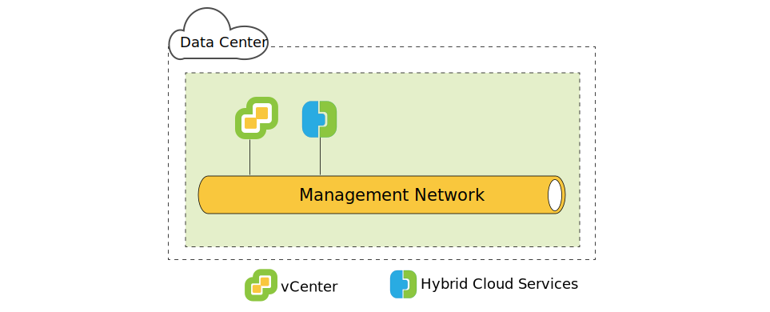
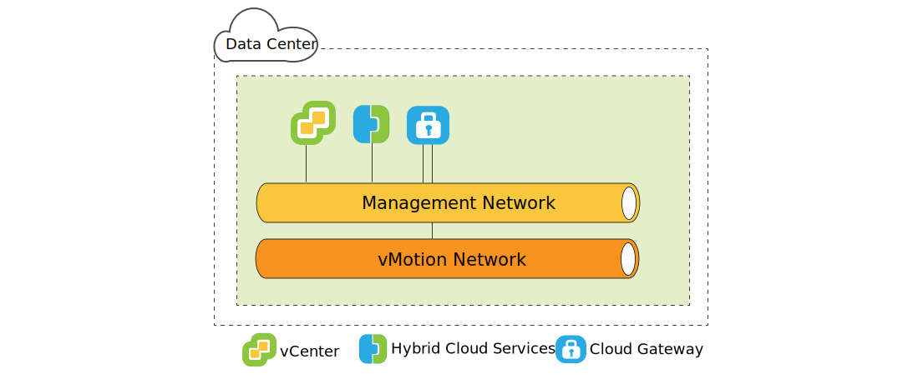
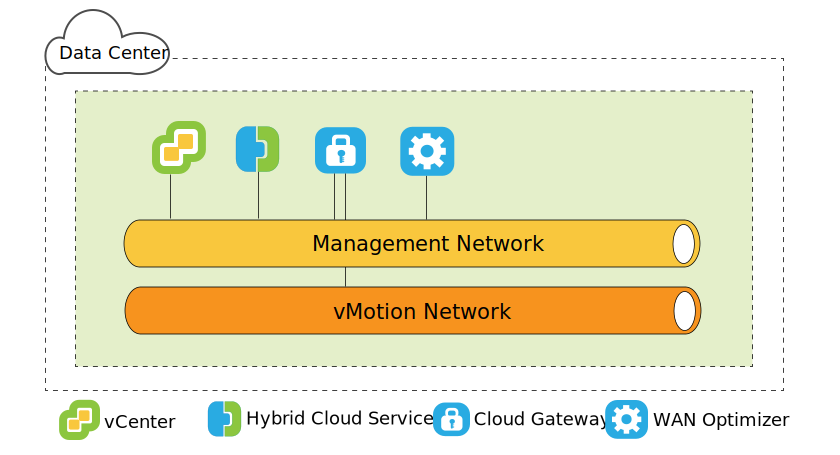
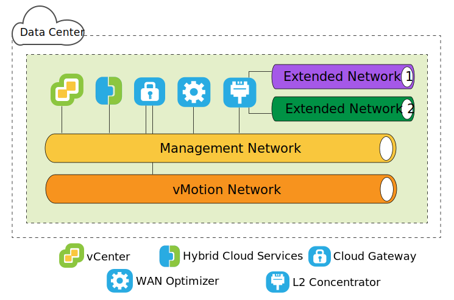
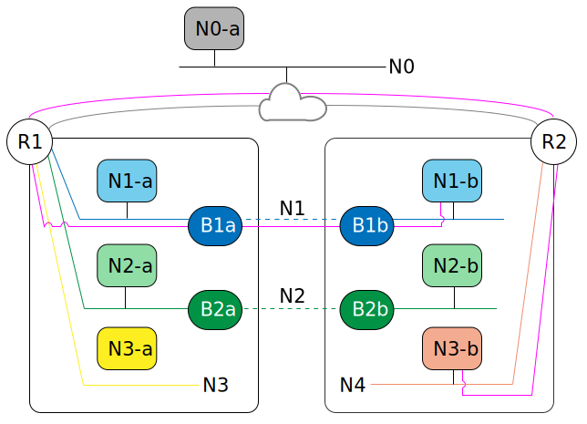

---

copyright:

  years:  2016, 2019

lastupdated: "2019-10-16"

subcollection: vmware-solutions

---

{:tip: .tip}
{:note: .note}
{:important: .important}

# VMware HCX on IBM Cloud source-side architecture
{: #hcx-archi-source}

Review the architecture of each HCX component that is deployed in the source environment.

## Introducing HCX
{: #hcx-archi-source-intro-hcx}

HCX technology seamlessly integrates vSphere vCenter networks into vCenter Server platform. Hybrid networking extends on-premises vSphere vCenter networks into {{site.data.keyword.cloud}}, supporting bidirectional virtual machine (VM) mobility.

This introduction summarizes the tasks that can be accomplished and the features that support and enhance migration and network extension.

* HCX owns the source and destination encryption and decryption processes, ensuring consistent security and providing admission for hybrid workflows such as virtual machine migration and network extension.
* HCX creates an optimized, software-defined WAN to increase stretched network performance, enabling performance that approaches LAN speed.
* HCX also enables bidirectional workload and VMware NSX security policy migration to {{site.data.keyword.cloud_notm}} Networking services.
* HCX integrates with vSphere vCenter and is managed from the vSphere Web Client.

## Layer 2 Network Extension
{: #hcx-archi-source-layer-2-ext}

* Securely stretch a network from a vCenter to {{site.data.keyword.cloud_notm}}.
* HCX provides the High Throughput Layer 2 Concentrator (HT L2C).
* Extended networks link to {{site.data.keyword.cloud_notm}} NSX edge appliances
* Multiple standard Layer 2 concentrators can be deployed to achieve scalability and increase throughput.
* Virtual machines that are migrated through the Cloud Gateway and over stretched Layer 2 can retain their IP and MAC addresses.

## Virtual machine migration methods
{: #hcx-archi-source-vm-mig-methods}

### Low downtime migration
{: #hcx-archi-source-low-downtime-mig}

Low downtime migration relies on vSphere Replication - a distributed technology that is implemented in the VMware ESX/ESXi hypervisor. HCX creates a replica of a live virtual machine, moves it to {{site.data.keyword.cloud_notm}}, and performs a switchover to power off the source virtual machine and power on the migrated virtual machine.
* The migration path is always through the Cloud Gateway. The transport can be the internet, a Layer 2 stretched network, or a Direct Connect line.
* A virtual machine can be migrated multiple times in either direction.

### vMotion migration
{: #hcx-archi-source-vmotion-mig}

vMotion migration uses vMotion to transfer a live virtual machine across a network stretched to {{site.data.keyword.cloud_notm}}. vMotion migration is also called zero downtime migration, or cross-cloud vMotion.

### Cold migration
{: #hcx-archi-source-cold-mig}

Transfer a powered-off virtual machine to {{site.data.keyword.cloud_notm}} over a stretched network.

### Common features
{: #hcx-archi-source-common-feat}

* Optional software-defined WAN optimization, if installed, increases migration, throughput, and speed.
* Migration can be scheduled to occur at a specified time.
* A migrated virtual machine can keep its host name, virtual machine name, or both.

## Networking features
{: #hcx-archi-source-net-feat}

The following networking features are built into the Cloud Gateway and the Layer 2 Concentrators.

* Intelligent flow routing - Automatically selects the best connection based on the internet path, efficiently flooding the entire connection so that workloads are moved as fast as possible. When larger flows, such as backup or replication, cause CPU contention, smaller flows are routed to less busy CPUs, improving performance of interactive traffic.
* Proximity Routing - Ensures that forwarding between virtual machines that are connected to stretched and routed networks both on-premises and in the cloud is symmetrical.
* Security - The Cloud Gateway offers Suite B-compliant AES-GCM with IKEv2, AES-NI offload, and flow-based admission control. HCX owns the source and destination encryption and decryption processes, ensuring consistent security and providing admission for hybrid workflows such as virtual machine migration and network extension.
  A security policy that is defined in the on-premises vCenter and assigned to a virtual machine can be migrated with the virtual machine.

## Understanding HCX
{: #hcx-archi-source-understand-hcx}

HCX supports a many-to-many relationship between on-premises vCenters and {{site.data.keyword.cloud_notm}}. vCenter Server in Linked Mode is supported.

During the installation, the HCX Manager virtual appliance is imported and configured as a plug-in for the on-premises vCenter. This plug-in is then used to configure the software-defined WAN service deployment. The automated configuration provisions each hybrid service appliance as a virtual machine in the on-premises vCenter, and deploys a corresponding virtual machine in {{site.data.keyword.cloud_notm}}.

A successful deployment requires:
* Sufficient resources for the virtual appliances
* The network must permit the appliances to communicate with both local and remote virtual appliances, and other VMs.

## Deployment overview
{: #hcx-archi-source-deployment-ovw}

The HCX Manager virtual machine is installed first, and it manages the installation of any other service virtual machine appliances on premises and in the cloud.

The following steps are basic installation tasks:
1. Obtain Hybrid Cloud Enterprise virtual appliance OVA file.
2. From the vSphere Web Client, install the HCX Manager service virtual appliance in the on-premises vCenter that connects to {{site.data.keyword.cloud_notm}}.
3. From the vSphere Web Client, register an {{site.data.keyword.cloud_notm}} endpoint with the HCX plug-in. Registration establishes the one-to-one relationship between the on-premises HCX and the HCX instance on {{site.data.keyword.cloud_notm}}.
4. Install and configure the service virtual appliances.
5. For each appliance installed on premises, the installer provisions a corresponding service virtual appliance in the target {{site.data.keyword.cloud_notm}}.
6. After the installation, HCX Manager controls both local and remote service virtual appliances. In the {{site.data.keyword.cloud_notm}}, HCX manages the provisioned Software-Defined WAN components as a service.

### Deployment component performance considerations
{: #hcx-archi-source-perf-consid}

Architecture planning includes the VMs to be migrated, the networks that are used for virtual machine traffic, and the networks to be extended.

The maximum and minimum values for the deployment components are:
* vSphere vCenter. The HCX manager appliance must be installed on the vCenter that requires hybrid services. There can be only one HCX deployment per vCenter. This restriction applies to linked mode. The HCX management appliance is only installed in the primary vCenter. HCX supports up to five registered vCenters in linked mode.
* Cloud registrations. The maximum number of cloud endpoints is ten. To find the number of endpoints, Hybrid Cloud Services tracks vCenter connections to the cloud.

### Maximum number of migrations and network extensions
{: #hcx-archi-source-max-mig-net-extension}

* Max concurrent low downtime migration tasks - 15
* Max concurrent L2C stretching tasks - 1
* Max concurrent vMotion migration tasks - 1

### HCX Management Enterprise
{: #hcx-archi-source-hcxme}

The HCX Management Enterprise OVA is deployed on the source environment and registered as a plug-in for the vCenter Server managing the source vSphere infrastructure. This plug-in is then used to configure the migration and network services that are required to enable cross cloud migration and L2 network stretching.

There can be only one HCX deployment per vCenter. This restriction applies to linked mode: the HCX Manager appliance is only installed in the primary vCenter. The HCX Manager supports up to five
registered vCenters in linked mode.
{:note}

{: caption="Figure 1. Source Hybrid Cloud services" caption-side="bottom"}

### HCX Virtual Appliances
{: #hcx-archi-source-hcxva}

The installation package is an OVA file containing the Hybrid Cloud Services plug-in. This Hybrid Cloud
Services management appliance is installed and configured and then used to configure the service appliance virtual machines.
* HCX Manager
* Hybrid Cloud Gateway
* Layer 2 Concentrators
* WAN Optimizers

### HCX Manager
{: #hcx-archi-source-hcxm}

The HCX Manager plug-in is deployed on-premises only. It manages the service virtual appliances for the SD-WAN. The HCX Manager virtual appliance is an extension to the source vCenter and is deployed as a virtual machine. This appliance’s file structure contains all the hybrid service virtual appliances. The HCX Manager oversees the deployment and configuration of the Cloud Gateway, the Layer 2 Concentrators, and WAN Optimization virtual appliance both on-premises and in the cloud.

The virtual appliance can be installed with either thin or thick provisioning for the hard drive. By default, hard drives for the service virtual appliances are thinly provisioned.

After the service, virtual appliance configuration and deployment is done, log in to this virtual machine to use the Hybrid Cloud Services Management Portal.

### HCX Cloud Gateway
{: #hcx-archi-source-hcg}

The HCX Cloud Gateway establishes and maintains a secure channel between vSphere and the {{site.data.keyword.cloud_notm}}.

HCX uses strong encryption to bootstrap a site-to-site connection to {{site.data.keyword.cloud_notm}}. The secure channel between vSphere and {{site.data.keyword.cloud_notm}} achieves multi-tenancy for vSphere protocols that are not tenant aware, and to prevent networking "middle mile" security problems.

The Cloud Gateway also incorporates vSphere replication technology to perform bidirectional migration.

{: caption="Figure 2. Source Cloud Gateway" caption-side="bottom"}

### WAN Optimizer
{: #hcx-archi-source-wan-opt}

HCX also provides software-defined WAN Optimization. The WAN Optimization appliance is a highly recommended component that performs WAN conditioning to reduce effects of latency. It also incorporates Forward Error Correction to negate packet loss scenarios, and deduplication of redundant traffic patterns. Altogether, these reduce bandwidth use and ensure the best use of available network capacity to expedite data transfer to and from {{site.data.keyword.cloud_notm}}.

Virtual machine migration relies on the combination of Cloud Gateway and WAN Optimization appliance to achieve unparalleled mobility between vSphere on-premises and {{site.data.keyword.cloud_notm}}.

{: caption="Figure 3. Source WAN Optimizer" caption-side="bottom"}

### Layer 2 Concentrator
{: #hcx-archi-source-layer-2-conc}

The Network Extension Service is provided by the Layer 2 Concentrator (L2C). It extends a Layer 2 network from the on-premises vSphere data center to {{site.data.keyword.cloud_notm}} and enables seamless migration between the data center and the cloud. The Layer 2 concentrator is required to stretch the on-premises network to IBM.

The Layer 2 Concentrator appliance has two interfaces:
* Internal trunk interface: Handles virtual machine traffic on-premises for the extended networks by using a translational bridge mapping to a corresponding stretched network in {{site.data.keyword.cloud_notm}}.
* Uplink interface: HCX uses this interface to send encapsulated overlay traffic to and from {{site.data.keyword.cloud_notm}}. Application data travels through this interface.

{: caption="Figure 4. Source L2 Concentrator" caption-side="bottom"}

### Migration only
{: #hcx-archi-source-mig-only}

The minimal configuration to perform migration only requires the HCX manager and the Cloud Gateway appliances. It is possible to migrate virtual machines without network extension. In this case, the virtual machine obtains a new IP address by using the Guest Customization service after it is migrated.

To stretch a network and maintain the original IP address, a distributed virtual switch must be configured in the on-premises vSphere vCenter.

WAN Optimization can improve speed in the situations described. Configuring the Cloud Gateway to use a high-speed line (such as a Direct Connect) improves speed by providing a higher bandwidth link for WAN optimized traffic.

Migrating virtual machines on extended networks into {{site.data.keyword.cloud_notm}} is advantageous because it reduces downtime and the configuration does not change on the virtual machine. The virtual machine can retain the IP addresses, MAC addresses, computer names, and virtual machine names. Retaining these properties greatly simplifies the migration to {{site.data.keyword.cloud_notm}} and enables easy return trips to the on-premises data center. The Network Extension feature requires a vSphere Distributed Switch, which is available with vSphere Enterprise Plus Edition.

### IP address requirements
{: #hcx-archi-source-ip-req}

To deploy the HCX, the proper number of IP addresses must be available both on-premises and in the target {{site.data.keyword.cloud_notm}}.

* vMotion address
  Maintaining a separate network for vMotion is a common practice in the on-premises data center. The Cloud Gateway must have access to the vMotion network. If it does not, an extra IP address is needed to communicate with the vMotion network.

* On-premises
  * One IP address for the HCX Manager appliance.
  * One for each Cloud Gateway, add one if there is a separate vMotion network.
  * One for each standard Layer 2 Concentrator

* {{site.data.keyword.cloud_notm}}
  * Two IP addresses per HCX Manager appliance connected to {{site.data.keyword.cloud_notm}}. The addresses can be used to connect to the internet or one or more Direct Connect lines.
  * Add one if there is a separate vMotion network connection.

### Proximity Routing feature
{: #hcx-archi-source-prox-routing-feat}

Proximity Routing is a networking feature, which can be enabled when the Cloud Gateway is configured.

Proximity Routing ensures forwarding between virtual machines that are connected to stretched and routed networks, both on-premises and in the cloud, is symmetrical. This feature requires Dynamic Routing to be configured between the customer premises and the cloud.

When users extend their networks to the cloud, Layer 2 connectivity is stretched onto {{site.data.keyword.cloud_notm}}. However, without route optimization, Layer 3 communication requests must return to the on-premises network origin to be routed. This return trip is called "tromboning" or "hairpinning."

Tromboning is inefficient because packets must travel back and forth between the network origin and the Cloud, even when both source and destination virtual machines reside in the Cloud. In addition to inefficiency, if the forwarding path includes stateful firewalls, or other inline equipment that must see both sides of the connection, communication might fail. Virtual machine communication (without route optimization) failure occurs when the egress path exiting the cloud can be either the stretched Layer 2 network or through the VCS NSX Edge Gateway. The on-premises network does not know about the stretched network "shortcut." This problem is called asymmetric routing. The solution is to enable proximity routing so the on-premises network can learn the routes from {{site.data.keyword.cloud_notm}}.

To prevent tromboning, HCX uses intelligent route management to choose routes appropriate to the virtual machine state. The Cloud Gateway maintains an inventory of virtual machines in the cloud. It also understands the virtual machine state, which can be:
* Transferred to the cloud with vMotion (zero-downtime migration).
* Migrated to the cloud by using host-based replication (low-downtime migration).
* Created in the cloud (on a stretched network).

### Asymmetric Routing with Proximity Routing Solution
{: #hcx-archi-source-asymm-routing}

In the diagram, the `N*a` components on the left reside in the on-premises data center, and the `N*b`
component on the right reside in the cloud.

R1 is the default gateway for N1-b. Therefore, N1-b must return to R1 to route traffic through R2. To prevent asymmetric routing, HCX injects host routes into within the NSX overlay of the vCenter Server deployment. If the virtual machine was newly created in the cloud, or it was moved with low downtime migration, the host route is injected immediately.

If the virtual machine was transferred by using vMotion, the route is not injected until the virtual machine restarts. Waiting until after the restart ensures that the on-premises stateful devices continue to service the existing session until the virtual machine restarts. After the restart, the routing information is consistent both on-premises and in the cloud.

That is, R1 can use routing to reach a specific virtual machine through R2, rather than using the locally connected extended Network. R2 fully owns the path for other networks to reach virtual machines with Proximity Routing enabled.

{: caption="Figure 5. Asymmetric Routing with Proximity Routing solution" caption-side="bottom"}

### MAC address retention
{: #hcx-archi-source-mac-addr-ret}

* The option to retain the MAC address is a check box in the migration wizard. It is only visible for replication-based migration.
* By default, **Retain MAC** is enabled if the source virtual machine is in a stretched network, and disabled when the network is not stretched. If the MAC address is not retained the virtual machine obtains a new address when the migration is done. The decision to retain a MAC address or acquire a new one can impact the migration process and the post-migration network traffic flow.
* Retaining the MAC address is required for the following reasons:
  * Licenses based on the MAC address: Some software pairs the license to the MAC address of the VM. Changing the MAC address of a virtual machine invalidates the license.
  * Linux NIC order: On Linux, if the MAC address is changed on a virtual machine, the NIC Ethernet device number might change after a restart. A device number change can alter the NIC presentation order within the operating system, breaking applications or scripts that depend on NIC order.
  * Less downtime if the network is stretched: If the virtual machine is migrated over a stretched network, enabling **Retain MAC** minimizes downtime because the network does not have to learn a new MAC address.
  * The check box is on the **Select destination network** page during migration operation.

### Security Policy Migration
{: #hcx-archi-source-sec-policy-mig}

The Policy Migration feature enables NSX distributed firewall rules to be moved from an on-premises vCenter to a VCS HCX enabled Cloud. Policy Migration is possible when using low downtime migration or vMotion to move a virtual machine over a network stretched with the High Throughput Layer 2 Concentrator.
* The on-premises data center must be running NSX 6.2.2 or greater.
* In vSphere, the security policy is a single NSX Section, which can contain many rules. There can be only one Section (policy) per Org vDC.
* A Set of IP addresses or MAC addresses can be identified to participate in the policy. The name of the MAC Set or IP Set cannot exceed 218 characters.
* All rules in a Section must have a unique name. Do not leave a rule name blank.
Supported rules specify Layer 3 IP addresses or IP Sets, or Layer 2 MAC addresses or MAC Sets as the source or destination.

Rules that specify security groups or application groups for the source or destination are not migrated.
{:note}

Any change to the migrated policy is propagated to all VMs that use the policy.

**Next topic:** [VMware HCX on IBM Cloud component-level target architecture](/docs/services/vmwaresolutions?topic=vmware-solutions-hcx-archi-target)

## Related links
{: #hcx-archi-source-related}

* [Installing and configuring on the source](/docs/services/vmwaresolutions/archiref/hcx-archi?topic=vmware-solutions-hcx-archi-install-cfg-src)
