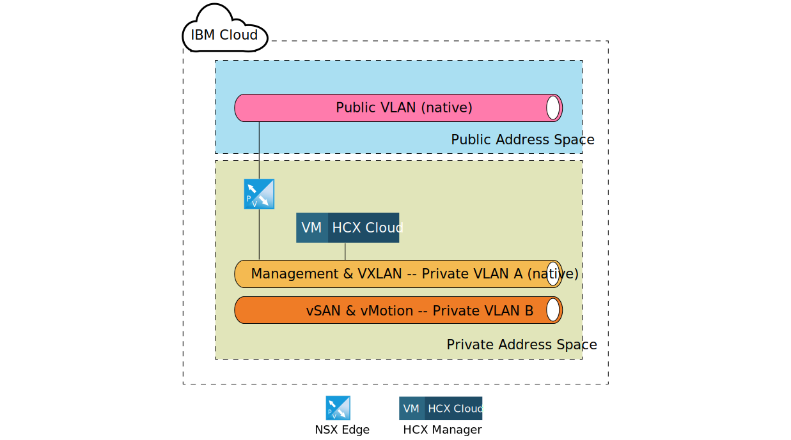
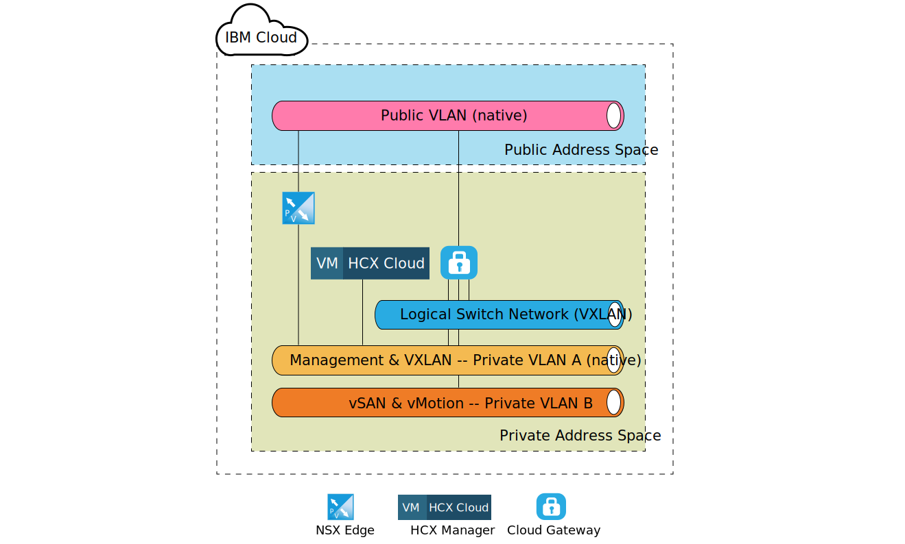
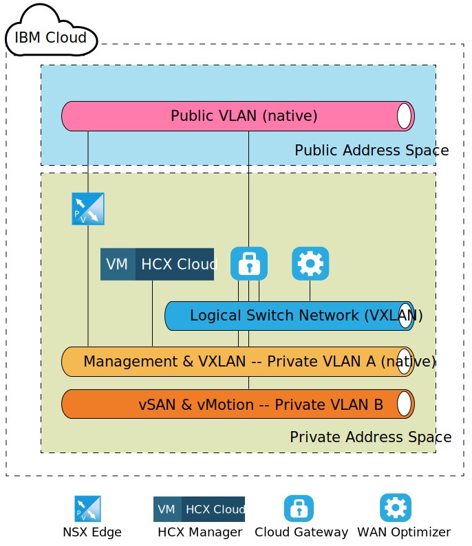
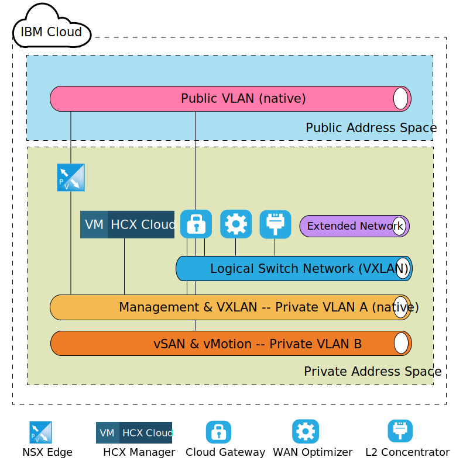

---

copyright:

  years:  2016, 2020

lastupdated: "2020-03-30"

subcollection: vmware-solutions

---
# VMware HCX component-level target architecture
{: #hcx-archi-target}

This section describes the architecture of each HCX component that is deployed within the {{site.data.keyword.cloud}} environment. The spoke (target) deployment model within the {{site.data.keyword.cloud_notm}} is discussed.

## NSX Edge
{: #hcx-archi-target-nsx-edge}

The first component that is configured within the {{site.data.keyword.cloud_notm}} is a pair of NSX Edge virtual machines. It is important to note that all {{site.data.keyword.vmwaresolutions_short}} deployments install and configure an edge device for IBM CloudDriver outbound communication. However, while this ESG could be reused for Hybrid Cloud Services communications, it is advised that a new pair is deployed.

The NSX Edge virtual machines are configured as an Active/Passive pair of X-Large NSX Edge devices. These devices are used to connect into the {{site.data.keyword.cloud_notm}} VMware environment by using a public internet connection. The X-Large NSX Edge was chosen for the internal environment since it is suited for environments that have load balancer with millions of concurrent sessions that do not necessarily require high-throughput. As part of the configuration process, the NSX Edge is connected to the {{site.data.keyword.cloud_notm}} public VLAN and the {{site.data.keyword.cloud_notm}} Private VLAN designated for management infrastructure.

| Component | Configuration |
|-----------|---------------|
| CPU       | 6 vCPU        |
| RAM       | 8 GB          |
| Disk      | 4.5 GB VMDK resident on shared storage with 4 GB swap |
{: caption="Table 1. NSX Edge deployment" caption-side="bottom"}

Since the NSX Edges are configured as active/passive in either the internal or dedicated deployment, vSphere Distributed Resource Scheduler (DRS) anti-affinity rules must be created by the user to ensure that NSX Edges do not run on the same host as their respective peer appliance.

| Field     | Value         |
|-----------|---------------|
| Name      | NSX Edge External Gateway |
| Type      | Separate virtual machines |
| Members   | NSX Edge 1 |
|           | NSX Edge 2 |
{: caption="Table 2. NSX Edge anti-affinity rules" caption-side="bottom"}

In addition to the NSX Edge appliances deployed within the {{site.data.keyword.cloud_notm}}, the HCX Manager virtual appliance is deployed if the VMware HCX service is ordered. After the deployment of this appliance, the NSX Edge is enabled to use load balancing and is configured with application profiles that use a certificate for inbound connection from the source. The NSX Edge is also configured with load-balancing pools to point to the HCX Manager, vCenter, and PSC appliances. Additionally, a virtual server is created with a virtual IP address (VIP) on the public interface with rules that connect the pools with VIP. A sample of the virtual server configuration and pool configuration on the NSX Edge is shown in the following tables.

| Field     | Value         |
|-----------|---------------|
| Virtual Server ID | virtualServer-1 |
| Name | HCX-VIP |
| Description | LB-VIP |
| Default Pool | pool-1 |
| IP Address | 254 |
| Protocol | https |
| Port | 443 |
{: caption="Table 3. VIP configuration for NSX Edge - virtual servers" caption-side="bottom"}
{: class="simple-tab-table"}
{: #simpletabtable1}
{: tab-title="Virtual servers summary"}
{: tab-group="A sample of virtual server config and pool config on NSX Edge"}

| Field     | Value         |
|-----------|---------------|
| Description | LB-VIP |
| Connection Limit | 0 |
| Service Insertion Status | Disabled |
| Application Profile | applicationProfile-1 |
| Connection Rate Limit | 0 |
| Acceleration Status | Disabled |
| Service Profile Status |  |
{: caption="Table 4. VIP configuration for NSX Edge - virtual server details" caption-side="bottom"}
{: #simpletabtable2}
{: tab-title="Virtual servers details"}
{: tab-group="A sample of virtual server config and pool config on NSX Edge"}
{: class="simple-tab-table"}

| Field     | Value         |
|-----------|---------------|
| Rule Id | applicationRule-1 |
| Name | appRule1 |
| Script | acl isHibridity url_beg /hibridity     acl isWebSso url_beg /websso     acl isVCenter url_beg /vsphere-client     use_backend nspPool001 if isHybridity     use_backend vcPool001 if isVCenter     use_backend ssoPool001 if isWebSso |
{: caption="Table 5. VIP configuration for NSX Edge - rule" caption-side="bottom"}
{: #simpletabtable3}
{: tab-title="Rule information"}
{: tab-group="A sample of virtual server config and pool config on NSX Edge"}
{: class="simple-tab-table"}

| Pool ID | Name       | Algorithm   | Monitor ID |
|---------|------------|-------------|------------|
| pool-1  | nspPool001 | ROUND-ROBIN |            |
| pool-3  | ssoPool001 | ROUND-ROBIN |            |
| pool-2  | vcPool001  | ROUND-ROBIN |            |
{: caption="Table 6. Pool configuration for NSX Edge - pool summary" caption-side="bottom"}
{: #simpletabtable4}
{: tab-title="Pool summary"}
{: tab-group="A sample of virtual server config and pool config on NSX Edge"}
{: class="simple-tab-table"}

| Field           | Value     |
|-----------------|-----------|
| Description     |           |
| Transparent     | Disabled  |
| Name            | HCX-CLOUD |
| Weight          | 1         |
| Monitor Port    | 8443      |
| Max Connections | 0         |
| Min Connections | 0         |
{: caption="Table 7. Pool configuration for NSX Edge - pool details" caption-side="bottom"}
{: #simpletabtable5}
{: tab-title="Pool details"}
{: tab-group="A sample of virtual server config and pool config on NSX Edge"}
{: class="simple-tab-table"}

## HCX Manager
{: #hcx-archi-target-hcxm}

The HCX Manager component is the first appliance that is deployed after the NSX Edge appliances are configured on the target. This appliance is used as the main interface into the cloud environment for the source components, and provides an abstracted networking user interface that can be used to add, edit, and delete networks as well as design and configure routing without direct use of NSX. As a result of the vCenter and NSX integration, the HCX Manager appliance is assigned a private portable IP address on the management VLAN.

Additionally, it is configured to access vCenter and NSX with a specific user. It is important to note that the HCX Manager’s IP address is the same IP address that is used in the NSX edge for load balancing.

After the HCX Manager cloud component is deployed and configured, the source components create a connection to the HCX Manager via the VIP addresses configured in the NSX ESG. Once this connection is made, the cloud gateway and WAN optimizer appliances are deployed within the {{site.data.keyword.cloud_notm}}.

{: caption="Figure 1. Target - Hybrid Cloud services appliance" caption-side="bottom"}

## Cloud Gateway
{: #hcx-archi-target-cloud-gateway}

A virtual appliance is deployed after a connection is established from the source to the target cloud. This appliance is the Cloud Gateway (CGW) and is used to maintain a secure channel between vSphere environment that is designated as the source and the {{site.data.keyword.cloud_notm}}. The following table shows the sizing specification of the CGW appliance that is deployed within the {{site.data.keyword.cloud_notm}}.

| Component | Configuration |
|-----------|---------------|
| CPU       | 8 vCPU        |
| RAM       | 3 GB          |
| Disk      | 2.0 GB VMDK resident on shared storage |
{: caption="Table 8. Cloud Gateway deployment" caption-side="bottom"}

This Cloud Gateway is deployed configured to reside on the management VLAN (Private Portable Subnet) as well as the vMotion VLAN (Private Portable Subnet) of the {{site.data.keyword.vmwaresolutions_short}} deployment. Additionally, another interface is configured on the Public VLAN (Public Portable) for connections that are made over the public internet. Public access is not required if there is a direct connection (private connection in place). The last connection that is associated with the Cloud Gateway is a logical switch that is created and configured upon site pairing.

This logical switch is a private, non-routable network that is used as a communication channel between the Cloud Gateway and WAN Optimizer that is discussed in 4.1.4 WAN (TBD).

The following figure depicts a high-level component diagram of the cloud gateway appliance and assigned connections.

{: caption="Figure 2. Cloud Gateway deployment" caption-side="bottom"}

## WAN Optimizer
{: #hcx-archi-target-wan-opt}

The second component that is deployed is the WAN Optimization appliance. While the WAN Optimization appliance is optional, it performs WAN conditioning to reduce effects of latency. It also incorporates Forward Error Correction to negate packet loss scenarios, and deduplication of redundant traffic patterns.

Altogether, these reduce bandwidth use and ensure the best use of available network capacity to expedite data transfer to and from the {{site.data.keyword.cloud_notm}}. The WAN Optimizer is disk intensive and requires sufficient amount of IOPS to function properly. As a result, the WAN optimizer resides on vSAN storage if present, or on Endurance storage
with 2,000 IOPS. The following table shows the sizing specification for the WAN Optimization appliance.

| Component | Configuration |
|-----------|---------------|
| CPU       | 8 vCPU        |
| RAM       | 14 GB          |
| Disk      | 30 GB VMDK + 70 GB VMDK resident on shared storage |
{: caption="Table 9. WAN Optimizer appliance sizing" caption-side="bottom"}

Unlike the Cloud Gateway, the WAN Optimization appliance is only attached to a logical switch to enable communication between itself and the Cloud Gateway. This appliance is required if WAN optimization is in use within the source environment. See the following figure for a view of the network layout.

{: caption="Figure 3. WAN Optimizer deployment" caption-side="bottom"}

## Layer 2 Concentrator
{: #hcx-archi-target-layer-2-conc}

The third component is known as the Layer 2 Concentrator (L2C) and is part of the Network Extension Services. The L2C is the virtual machine that allows the extension of on-premises datacenter networks to the {{site.data.keyword.cloud_notm}}. The L2C stretches on-premises VLANs and/or VXLANs. Each L2C can stretch up to 4096 VLANs. Each L2C, when paired with its on-premises partner can provide up to 1 Gbps per “flow” and up to an aggregate of 4 Gbps per VLAN (or VXLAN). Deployment of more L2C appliances is supported if more network throughputs are required.

As part of this design, the L2C appliance is deployed such that a customer can stretch multiple VLANs and VLXANs into the {{site.data.keyword.cloud_notm}} over the public internet or via the private network via Direct Link. The sizing specification of the L2C appliance on the {{site.data.keyword.cloud_notm}} is listed in the following table.

| Component | Configuration |
|-----------|---------------|
| CPU       | 8 vCPU        |
| RAM       | 38 GB          |
| Disk      | 2 GB VMDK on shared storage |
{: caption="Table 10. HT L2C appliance sizing" caption-side="bottom"}

The L2C appliance is deployed on the management VLAN as well as the public VLAN. The public interface is used for application traffic that bound for the source of the extended network. More connections such as the extended networks, are created and attached to the L2C appliance after the source administrator initiates the network extension into the {{site.data.keyword.cloud_notm}}. Examples of these networks and connections are depicted in the following figure.

{: caption="Figure 4. L2 Concentrator deployment" caption-side="bottom"}

**Next topic:** [Port access requirements for VMware HCX](/docs/vmwaresolutions?topic=vmware-solutions-hcx-archi-port-req)

## Related links
{: #hcx-archi-target-related}

* [Installing and configuring on the source](/docs/vmwaresolutions?topic=vmware-solutions-hcx-archi-source)
