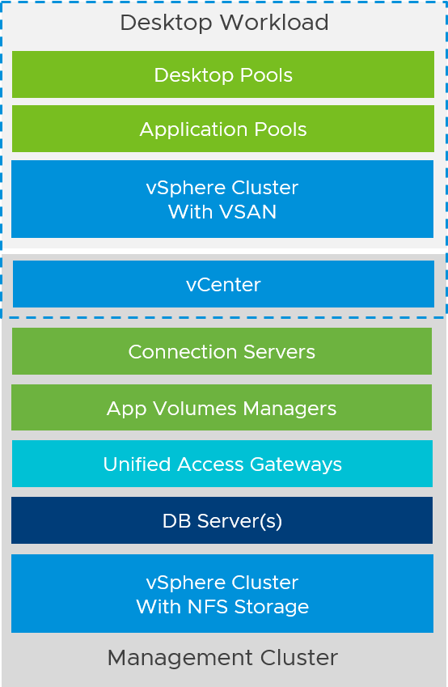
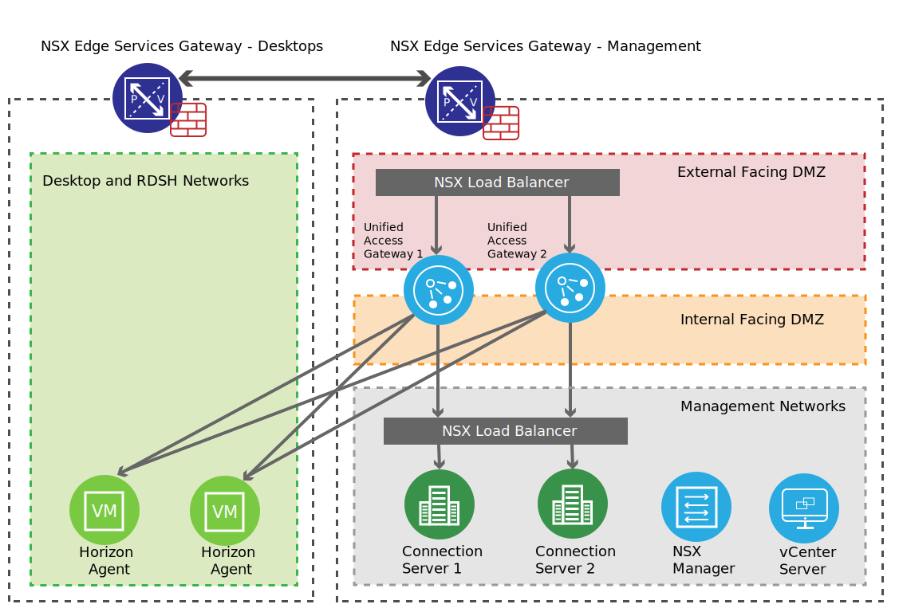
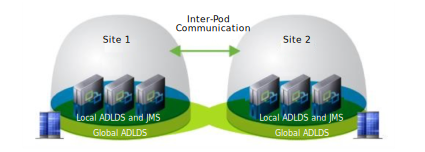

---

copyright:

  years: 2016, 2022

lastupdated: "2022-01-11"

subcollection: vmwaresolutions

---

{{site.data.keyword.attribute-definition-list}}

# Deployment architecture for Horizon 7
{: #horizon-deploy-arch}

## Horizon 7 pod and building block architecture
{: #horizon-deploy-arch-build-block}

A typical VMware® Horizon 7 architecture design uses a pod strategy. A pod is a unit of organization that is determined by Horizon 7 scalability limits. Each pod has a separate management UI and the typical design is to minimize the number of pods.

Customers usually include multiple building blocks in a Horizon 7 pod on-premises. A building block is a logical construct that is sized for the maximum number of desktops tested. For more information, see [VMware Horizon 7 sizing limits and recommendations](https://kb.vmware.com/s/article/2150348){: external}.

A building block consists of the following components:
* Physical servers
* One vCenter Server and vSphere infrastructure
* Horizon 7 Connection Servers
* Shared storage
* Virtual desktops or RDS hosts for users

{: caption="Figure 1. Building block architecture" caption-side="bottom"}

When you deploy Horizon 7, a two-cluster approach is recommended. This approach provides a small management cluster for running the server workloads that are used to support the Horizon environment and a larger workload cluster for the VDI or Published Apps workload. The management cluster is a three-node cluster that uses NFS storage. The workload cluster is a four-nodes cluster (minimum) and uses VMware vSAN™.

## Sizing Horizon 7
{: #horizon-deploy-arch-sizing}

Planning a deployment of Horizon 7 is like planning an on-premises deployment. To determine the number of hosts that you need, size your Horizon 7 deployment based on your requirements. Hosts are needed for the following purposes:
* Your Virtual Desktop or RDS workloads.
* Your Horizon 7 infrastructure components such as connection servers, Unified Access Gateways, and App Volumes managers.
* SDDC infrastructure components on {{site.data.keyword.cloud_notm}}. These components are deployed and managed automatically for you by {{site.data.keyword.cloud_notm}}, but you need capacity in your SDDC for running them.

The method for sizing Horizon 7 is the same as on-premises. You can customize the hosts that are deployed through vCenter Server®, including various processor and RAM options. {{site.data.keyword.cloud_notm}} also provides multiple storage options, including vSAN and NFS-based IP storage.

### Minimum SDDC size
{: #horizon-deploy-arch-min-sddc}

The minimum number of hosts for the workload cluster is four nodes, which is required to use vSAN in {{site.data.keyword.cloud_notm}}. The management cluster needs at least three nodes.

### Host sizing and storage recommendations
{: #horizon-deploy-arch-host-sizing}

{{site.data.keyword.cloud_notm}} provides multiple host options based on the Intel® Skylake processor architecture with the vCenter Server service. VMware recommends that you use the Skylake-enabled hosts. Currently, Skylake-enabled hosts on {{site.data.keyword.cloud_notm}} offer three processor options.

The following three options are available:
* Dual Intel Xeon® Silver 4110 processor / 16 cores total, 2.1 GHz per core
* Dual Intel Xeon Gold 5120 processor / 28 cores total, 2.2 GHz per core
* Dual Intel Xeon Gold 6140 processor / 36 cores total, 2.3 GHz per core

The Dual Intel Xeon Gold 6140 option is recommended for VMware Horizon desktop workloads as it provides the most cores and the highest clock rate. This option offers a greater density of desktops per host. The management cluster does not require the Xeon Gold 6140 option, and this workload can use the Dual Intel Xeon Silver 4110 processors.

{{site.data.keyword.cloud_notm}} provides multiple options for host RAM. These options range from 64 GB to 1.5 TB per host. The total amount of RAM for the management cluster is determined by the memory that is required to run the vSphere, NSX, and Horizon management components.

To support 1,000 users in {{site.data.keyword.cloud_notm}}, 102 GB of RAM is required for the management components.  

The following values are the RAM requirements for the management components for the Horizon environment:
* vCenter Server with embedded PSC - 24 GB
* NSX Manager - 16 GB
* NSX Controllers (x3) - 4 GB
* NSX Edges (x4) - 0.5 GB per Edge
* Horizon Connection Servers (x3) - 10 GB per server
* App Volumes Managers (x3) - 4 GB per server
* Unified Access Gateways (x3 per 1000 users) - 2 GB per UAG

Expanding the environment beyond 1,000 users requires more Unified Access Gateways. Therefore, the RAM required for management components must be increased. Extra RAM might be required for SQL Server, Active Directory domain controllers, or other servers that are needed to support the environment, such as file servers.

The amount of RAM required for the workload cluster is the number of desktops multiplied by the amount of RAM per desktop. This amount, when added to the management server requirements, is the total RAM needed to run the environment.

The vCenter Server offering has two storage types – one based on an All-Flash vSAN and one based on NFS storage. VMware vSAN is preferred for all VDI workloads to provide the best performance. vSAN provides several options during configuration, including the number and size of the capacity tier drives and the ability to use Intel Optane for the vSAN cache tier. The management cluster must use NFS storage for the management VMs. Each datastore must be configured by using the NFS storage option and have 1 TB of capacity with at least 2 IOPS per GB. Environments that are planning to place large file servers might require more IOPS to provide a good user experience in the environment.

For assistance with sizing the cluster environment, use the [vSAN ReadyNode™ Sizer](https://vsansizer.vmware.com/){: external}.

## Network configuration for Horizon 7 deployment on IBM Cloud
{: #horizon-deploy-arch-net-config}

When you configure a new {{site.data.keyword.cloud_notm}} SDDC, multiple networking options are presented. You can choose VMware NSX-T™ or NSX-V when you select the type of SDDC that they would like to deploy. You can also select the type of networks during deployment, such as public and private VLANs or private VLANs only. They can provision new VLANs or use existing VLANs created in their cloud.

VMware recommends the usage of the public and private network option. If the private network only option is selected, the NSX Edge Services Gateways is not configured, and access to some {{site.data.keyword.cloud_notm}} networking services will not be available.

The recommended network architecture consists of a double DMZ and a separation between Horizon management components and the RDSH and VDI virtual machines (VMs).

{: caption="Figure 2. Network diagram. Subnets are for illustrative purposes" caption-side="bottom"}

Because the Horizon Connection Server must communicate with the vCenter Server, traffic must be allowed between these VMs.

When direct external access is required, configure a public IP address with Network Address Translation toward the Unified Access Gateway virtual IP of the load balancer.

For external management or access to external or on-premises resources, a VPN connection, Direct-Link Cloud Connect, or Direct-Link Cloud Exchange must be created to the {{site.data.keyword.cloud_notm}} environment.

### Active Directory and DNS services
{: #horizon-deploy-arch-ad-dns}

{{site.data.keyword.cloud_notm}} deploys an Active Directory and DNS Service that is used by the deployed infrastructure. When you deploy the environment, the infrastructure has the following options:
* Single Windows® Server VSI – A single Windows Server running as a domain controller and DNS server. This server runs as a virtual server instance in {{site.data.keyword.cloud_notm}} and includes licensing.
* Highly Available dedicated Windows Server VMs – Two Windows Server VMs are deployed into the new SDDC during deployment. The two VMs do not include licensing, and they need to bring their own server licensing.

These options enable customers to stand up an entire environment without having to have connectivity to the datacenter in place. After the connectivity is in place, the {{site.data.keyword.cloud_notm}} environment can be connected to the enterprise Active Directory through a trust.

When you deploy Horizon 7, the highly available option is recommended over the single Windows Server VSI. Horizon 7 relies heavily on Active Directory, and this option ensures that the service is available. Since the VMs are running in the management infrastructure, they can also be connected back to on-premises Active Directory environments through trust relationships more easily.

## Architecting Horizon 7 Cloud Pod Architecture (CPA) for IBM Cloud
{: #horizon-deploy-arch-cpa}

Cloud Pod Architecture (CPA) is a standard Horizon 7 feature that you can use to connect your Horizon 7 deployment across multiple pods and sites for federated management. It can be used to scale up your deployment to build hybrid cloud and to provide redundancy for Business Continuity and Disaster Recovery. CPA introduces the concept of a global entitlement (GE) that spans the federation of multiple Horizon pods and sites. Any users or user groups that belong to the global entitlement are entitled to access virtual desktops and RDS published apps on multiple Horizon 7 pods that are part of the CPA.

CPA is not a stretched deployment. Each Horizon 7 pod is distinct and all connection servers that belong to each of the individual pods must be in a single location and run on the same broadcast domain from a network perspective.
{: important}

{: caption="Figure 3. Overview of a two sites - two pods CPA implementation" caption-side="bottom"}

For more information about how to set up and configure CPA, see [VMware Horizon 7 documentation](https://docs.vmware.com/en/VMware-Horizon-7/index.html){: external} and [VMware workspace ONE and VMware Horizon reference architecture](https://techzone.vmware.com/resource/workspace-one-and-horizon-reference-architecture){: external}.

### Using CPA to build Hybrid Cloud and scale for Horizon 7
{: #horizon-deploy-arch-cpa-hybrid}

You can deploy Horizon 7 in a hybrid cloud environment when you use CPA to interconnect Horizon 7 on-premises and Horizon 7 pods on {{site.data.keyword.cloud_notm}}. You can easily entitle your users to Virtual Desktop and RDS published apps on-premises or on {{site.data.keyword.cloud_notm}}. You can configure it such that they can connect to whichever site is closest to them geographically as they roam.

You can also stretch CPA across Horizon 7 pods in two or more {{site.data.keyword.cloud_notm}} data centers with the same flexibility to entitle your users to one or multiple pods as wanted.

The use of CPA is optional. You can choose to deploy Horizon 7 exclusively in a single {{site.data.keyword.cloud_notm}} data center without linking it to any other data center.

**Next topic:** [Configuring IBM Cloud for Horizon 7 deployment](/docs/vmwaresolutions?topic=vmwaresolutions-horizon-deploy-config)
