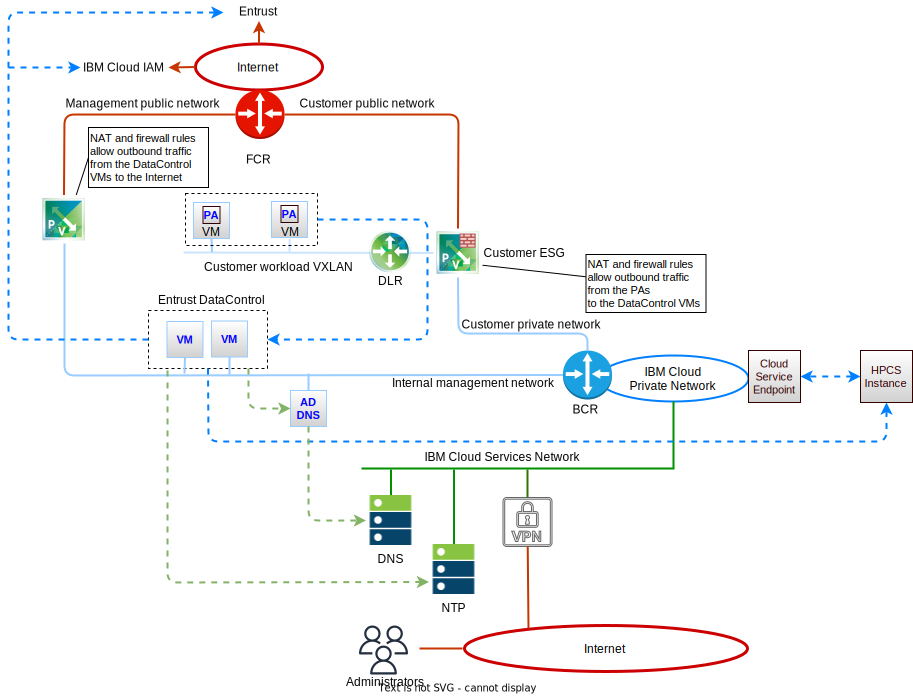
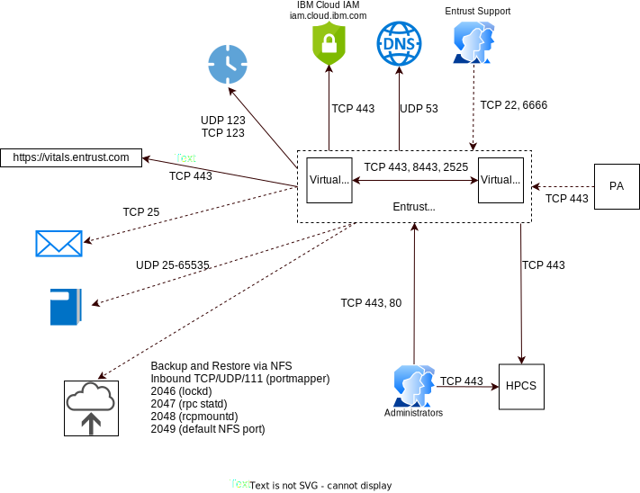

---

copyright:

  years:  2019

lastupdated: "2019-12-19"

subcollection: vmware-solutions

---

{:external: target="_blank" .external}
{:tip: .tip}
{:note: .note}
{:important: .important}

# HyTrust DataControl on IBM Cloud with IBM Hyper Protect Crypto Services
{: #htdc-hpcs-detail}

The DataControl VM is a HyTrust-hardened version of FreeBSD, a light-weight, locked-down operating system that has no runtime login/SSH access to the system. This system prevents tampering or attempts to access clear-text data and encryption keys. Two virtual machines are deployed onto the internal management subnet. Examples of the hostnames are as follows:

* Primary Host Name: htdc01-A68ED99E.ibmcloud.local
* Secondary Host Name: htdc02-A68ED99E.ibmcloud.local

In the previous examples, A68ED99E is the instance ID and `ibmcloud.local` is your vCenter Server instance domain name.

During the deployment, the following users are configured. All service information is available in the IBM Cloud console.

* Web UI Security Admin User
* Web UI Cloud User
* Console User

## Firewall rules
{: #htdc-hpcs-detail-fw-rules}

The following figure describes the deployment of the HTDC virtual machines into the vCenter Server instance.

{: caption="Figure 1. Network address translation and firewall" caption-side="bottom"}

The following firewall rules are configured on the management ESG when the HTDC on IBM Cloud service is deployed. This configuration allows outbound connectivity to the internet for the HyTrust virtual machines so that the license that is applied to the HTDC installation will not expire after a year.

* Name: HytrustDC VM Outbound Traffic for DC1, source: <HTDC VM 1 UP>, destination:  any, service:  HTTPS/HTTP, action: Accept.
* Name: HytrustDC VM Outbound Traffic for DC2, source: <HTDC VM 2 UP>, destination:  any, service:  HTTPS/HTTP, action: Accept.

These rules will also allow automatic vitals reporting, if you enable it, as HDKC must be able to send the encrypted vitals bundle outbound to `https://vitals.hytrust.com` via TCP/443.

These rules will also allow access to IBM Cloud IAM outbound to `https://iam.cloud.ibm.com` via TCP/443. This access is required to validate the API key. If this access is not configured, you will receive the following error; Cannot retrieve HPCS access token. HTTPSConnectionPool(host-iam.cloud.ibm.com port=443)

The following figure shows the following communication flows that are required between the HTDC components and external services.

{: caption="Figure 2. Network ports" caption-side="bottom"}

In the vCenter Server instance deployment these flows are allowed, but would need to be explicitly allowed if the default firewalls were changed

* The HTKC servers need to communicate to the following infrastructure services:
  * DNS - Outbound UDP/53.
  * SMTP - Outbound mail server, typically TCP/25 (optional).
  * SYSLOG - An outbound UDP in the range 25 - 65535 if you want to use a remote syslog server (optional). KeyControl does not currently support TCP for syslog.
  * Backup and Restore via NFS (optional) - Inbound TCP and UDP/111 (portmapper), 2046 (lockd), 2047 (rpc statd), 2048 (rcpmountd), and 2049 (default NFS port).
  * NTP - Outbound NTP servers, typically UDP/123 or TCP/123.
  * IBM Cloud IAM - Outbound TCP/443. Required for HPCS.

* The HTKC servers need to communicate to each other:
  * TCP/443 (HTTPS).
  * TCP/8443 and 2525.

Note, HTKC uses the IP address 169.254.119.1 for internal communication. This IP address must be reserved for HTKC.

* For external access the following traffic flows are required:
 * KeyControl webGUI – Inbound TCP/443 and TCP/80 to the HTKC virtual machines. All requests made to TCP/80 are redirected to TCP/443 so that they use HTTPS.
* For HyTrust support-level access:
 * Inbound TCP/22 (for full support) and TCP/6666 (for restricted support) to the HTKC virtual machines

The HTDC PAs are installed in the VMs hosted on the NSX VXLAN network segments in the overlay. These VMs have Bring Your Own IP (BYOIP) addressing. Therefore, NAT or routing changes need to be implemented on the customer-ESG so that the following communication flow is allowed

* Policy Agent to KeyControl - Inbound TCP/443 from the Policy Agent to each of the KeyControl VMs.

## NAT
{: #htdc-hpcs-detail-nat}

The following Network Address Translation (NAT) rules are configured on the customer ESG when the HTDC on IBM Cloud service is deployed. These rules allow outbound connectivity to the internet to enable licensing of HTDC.

* Type: SNAT, Applied On: public uplink, Original Source IP: <HTDC VM 1 UP>, Translated IP Address: <Secondary IP>, Port Range: any.
* Type: SNAT, Applied On: public uplink, Original Source IP: <HTDC VM 2 UP>, Translated IP address: <Secondary IP>, Port Range: any.

## HyTrust Policy Agent
The HyTrust DataControl Policy Agent is a software module that that provides encryption of virtual disks and individual files. It runs inside Windows and Linux operating systems. All VMs that have the Policy Agent installed can also securely share encrypted files and disks. When a user attempts to access an encrypted disk, the Policy Agent queries KeyControl to validate the request, and returns the information to the user if KeyControl authorizes the request. You must install a copy of the Policy Agent in each VM, and on each disk, you want to encrypt with DataControl.

Policy Agent has the following features:
* Full encrypted path from the VM, through the hypervisor to the storage.
* Support for cloning and replication.
* Dynamic rekey on Windows and Linux, allowing initial encryption or rekey without taking the VM or applications offline.
* Linux file-level and folder-level encryption.
* Migration of encrypted disks between VMs in the same Cloud VM Set.
* Support for Windows failover clusters.
* Root and swap encryption for Linux and boot drive (C:) encryption for Windows.

HyTrust provides several administrative interfaces to configure and maintain KeyControl and the encrypted VMs registered with KeyControl.
* KeyControl webGUI - A browser-based HTTPS interface to KeyControl to perform KeyControl configuration and VM management. You can log in to the webGUI on any KeyControl node in the cluster. Any changes that you make on that node are automatically disseminated to all other KeyControl nodes in the cluster.
* KeyControl System Console menu - The System Console menu is available on each KeyControl in the cluster. You can set local configuration options for the node and perform basic functions such as joining the node to an existing KeyControl cluster and managing support access to the node.
* hicli - CLI (command-line interface) commands to configure and maintain both KeyControl and the VMs registered with KeyControl.
* HyTrust Policy Agent GUI - A Windows-only GUI installed with the HyTrust DataControl Policy Agent. With this GUI, you can register and authenticate the VM on which it is installed and you can encrypt and decrypt the disks on that VM. Unlike the other interfaces, the HyTrust Policy Agent GUI is limited to the VM on which it is installed. You cannot use the HyTrust Policy Agent GUI on one VM to manage the disks on a different VM, even if both VMs are registered with KeyControl.
* REST or Python APIs - KeyControl can be configured and maintained through REST-based or Python-based API calls.

## HyTrust DataControl processes
{: #htdc-hpcs-detail-processes}

With HTDC, a virtual machine must be part of a Cloud VM Set before it can be encrypted. The set controls global options for the VMs it contains and tracks KeyIDs and FSIDs. It also allows the BoundaryControl feature to be enabled that uses Policy Rules and constraints in HyTrust CloudControl (HTCC) to authenticate and authorize delivery of encryption keys for the data encrypted by the HTDC PA and managed by HTKC.

A KEK provides an extra layer of security by encrypting the individual DEKs on the VMs associated with the Cloud VM Set. It also controls the expiration and revocation of the DEKs. To protect the KEK, HTKC requires that the KEK is stored in the IBM HPCS instance. The following KEK flows are described:

1. Cloud VM Set KEK setup - this process is used when a new Cloud VM Set is configured.
2. Wrapping DEK with KEK request flow - HTDC PA requests the HTKC server to create a new DEK when encrypting disk or rekeying a disk.
3. Unwrapping DEK with KEK request flow - HTDC PA requests the HTKC server for a DEK when attaching an encrypted disk.

### Cloud VM Set KEK setup flow
{: #htdc-hpcs-detail-processes-kek}

1. In the IBM HCPCS instance, an HCPS service user creates or imports a Root Key. This Root Key will be used by HTDC to wrap the KEK of a Cloud VM Set. The Root Key is non-extractable/exportable and never leaves the IBM HPCS instance.
2. In HTDC, the HTDC Cloud administrator configures a KEK for a Cloud VM Set with the following characteristics:
   * IBM HPCS REST API endpoint.
   * CA Certificate to verify the IBM HPCS instance.
   * API Key to generate a token.
   * IBM HPCS Instance ID.
   * IBM HPCS Root Key ID.
3. Using the Create & Wrap Key Request REST API (TLS), HTKC requests IBM HPCS to create a 256-bits symmetric key and wrap it with the Root Key.
4. IBM HPCS generates the requested symmetric KEK, wraps the generated key with the Root Key and returns the wrapped key.
5. HTKC stores the KEK configuration; IBM HPCS Config, Root Key ID, wrapped KEK.

### Wrapping DEK with KEK request flow
{: #htdc-hpcs-detail-processes-dek-wrap}

HyTrust DataControl Policy Agent (HTDC PA) requests the HTKC server to create a new Data Encryption Key (DEK) when encrypting disk or rekeying a disk.

1. The HTDC PA requests the HTKC server to create a new Data Encryption Key (DEK).
2. HTKC validates the status of the KEK to ensure it is not expired or revoked. If the KEK is expired or revoked, HTKC will fail the DEK creation request.
3. Using the Unwrap Key Rest API (TLS), HTKC requests the IBM HPCS instance to unwrap KEK.
4. After validating status of Root Key (not revoked), IBM HPCS unwraps the key with the Rook Key and returns the unwrapped Key. If the Root Key is revoked, IBM HPCS will fail the `unwrap key` request.
5. HTKC generates a DEK, wraps it with the KEK and stores the wrapped DEK in the Object Store.
6. HTKC securely erases the KEK from memory.
7. HTKC returns the newly created DEK to the HTDC PA.

### Unwrapping DEK with KEK request flow
{: #htdc-hpcs-detail-processes-dek-unwrap}
HTDC PA requests the HTKC server for a DEK when attaching an encrypted disk.

1. HTDC PA requests the HTKC server to create a new DEK.
2. HTKC validates the status of the KEK to ensure it is not expired or revoked. If the KEK is expired or revoked, HTKC will fail the key request.
3. HTKC requests IBM HPCS to unwrap the KEK.
4. After validating status of Root Key (not revoked), IBM HPCS unwraps the key with the Rook Key. If Root Key is revoked, HPCS will fail the `unwrap key` request.
5. HTDC retrieves the wrapped DEK from the Object Store and unwraps it with the KEK.
6. HTDC securely erases the KEK from memory.
7. HTDC returns the unwrapped DEK to the HTDC PA.

**Next topic:** [Deployment](/docs/services/vmwaresolutions?topic=vmware-solutions-htdc-hpcs-deployment)

## Related links
{: #htdc-hpcs-detail-related}

* [Creating and working with service IDs](https://cloud.ibm.com/docs/iam?topic=iam-serviceids)
