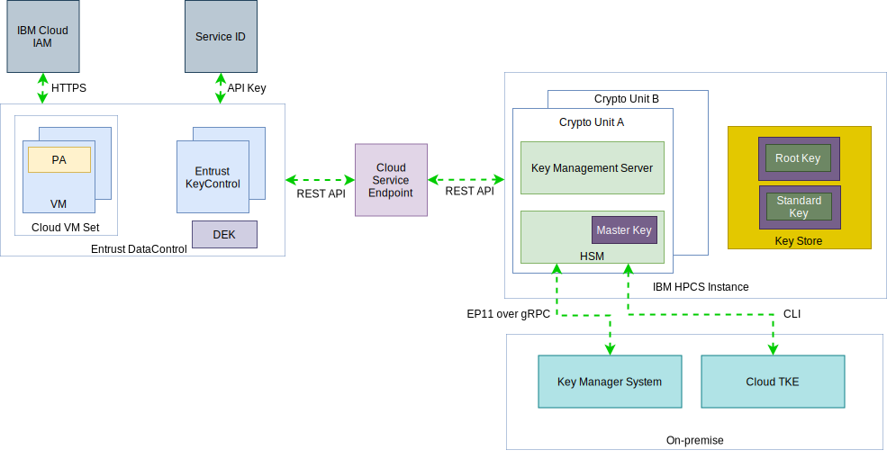

---

copyright:

  years:  2019, 2020

lastupdated: "2020-04-17"

subcollection: vmwaresolutions

---

{:external: target="_blank" .external}
{:tip: .tip}
{:note: .note}
{:important: .important}

# Reference architecture
{: #htdc-hpcs-reference-architecture}

The following figure describes the reference architecture for a vCenter Server instance with HyTrust DataControl and IBM Hyper Protect Crypto Services:

{: caption="Figure 1. Reference architecture" caption-side="bottom"}

The main solution components are as follows:

* HyTrust DataControl (HTDC) consists of four main components:
  * HyTrust KeyControl - HTKC stores encryption keys, policies, and configuration for VMs with the HyTrust DataControl Policy Agent installed. HTKC delivers encryption keys as a Key Management Interoperability Protocol (KMIP) server to the requesting VMware KMIP client. HTKC is a security hardened software appliance, automatically deployed in your vCenter Server instance when the HTDC on IBM Cloud service is ordered. Two appliances are deployed and use the built-in active-active clustering for high availability. HTKC is configured directly through the browser-based webGUI by using HTTPS, or remotely through the hicli command-line interface or a set of REST-based APIs.
  * HyTrust DataControl Policy Agent (PA) - A software module that runs inside Windows and most Linux operating systems and that provides encryption of virtual disks, file systems, and individual files. All VMs that have the Policy Agent installed can also securely share encrypted files and disks if those VMs are registered with the same Cloud VM Set. A Policy Agent must be installed on each VM to be encrypted with HTDC. The Policy Agent sets up mutual authentication with a unique private key/certificate per VM with the HTKC. One DEK per data volume is generated by HTKC and issued to the VM through mutually authenticated TLS.
  * Cloud VM Set - A VM must be part of a Cloud VM Set before it can be encrypted. The Cloud VM Set controls global options for the VMs it contains. The IBM HPCS instance information is used when you create the Cloud VM Set. A Key Encryption Key (KEK) provides an extra layer of security by encrypting the individual data encryption keys on the VMs associated with a Cloud VM Set. Both the KEK and the individual data encryption key must be available before the information on the VM can be accessed.
  * Data encryption keys - Data encryption keys (DEKs) are cryptographic keys that are used for data encryption. These keys are used to encrypt data. Root keys are used to wrap keys to protect DEKs. These root keys are also known as Key Encryption Keys (KEK).

* IBM Hyper Protect Crypto Services - IBM HPCS consists of the following components:
  * Signature keys - An administrator must sign any commands that are issued to the crypto unit with a signature key. The private part of the signature key file is used to create signatures. The public part is placed in a certificate that is installed in a target crypto unit to define a crypto unit administrator.
  * Master keys - Master keys are used to encrypt the IBM HPCS service instances for key storage. The master key is used to encrypt the entire chain of keys, which includes root keys and standard keys. A master key is composed of several master key parts, and typically, each key part can be owned by a different person. The key part owner should be the only person who knows the password that is associated with the key part file. Administrators configure the master key first before root keys and standard keys are managed. If the master key is deleted, all data that was encrypted with the keys that are managed in the service will be crypto-shredded.
  * Root keys - Root keys are symmetric key-wrapping keys that are used as roots of trust for wrapping (encrypting) and unwrapping (decrypting) other keys. A root key can never leave IBM HPCS. IBM HPCS, creates, stores, and manages the lifecycle of root keys to control the other keys stored in the cloud.
  * Standard keys - Standard keys directly encrypt and decrypt data. Standard Keys are not used in this reference architecture.
  * Hardware security module - The Hardware security module (HSM) is a physical device that safeguards and manages digital keys for strong authentication and provides crypto-processing. At the FIPS 140-2 Level 4 certification, the physical security mechanisms provide a complete envelope of protection around the cryptographic module with the intent of detecting and responding to all unauthorized attempts at physical access.
  * Crypto unit - A crypto unit is a single unit that represents an HSM and the corresponding software stack that is dedicated to the HSM. Each crypto unit can manage up to 5000 digital keys. Two crypto units are located in different availability zones within the multi-zone region that is selected when creating the service instance.
  * Trusted Key Entry plug-in - Trusted Key Entry (TKE) plug-in is IBM Cloud CLI plug-in that provides functions for managing assigned crypto units. The TKE plug-in is used to set up administrators and load the master key.
  * PKCS #11 - Public-Key Cryptography Standards (PKCS) #11 API defines a platform-independent API to cryptographic tokens, such as HSM and smart cards. Existing applications that use PKCS #11 can benefit from enhanced security by using secure key cryptography and stateless interface, which makes the cryptographic operations much more efficient.
  * Enterprise PKCS #11 - Enterprise PKCS #11 (EP11) is designed for customers who need support for open standards and enhanced security. The EP11 library provides a stateless interface, which is similar to the industry-standard PKCS #11 API. The HSM that crypto units run on supports EP11 library, so users can call EP11 API through gRPC for their own key management and data encryption.
  * gRPC - gRPC is a modern open source high-performance remote procedure call (RPC) framework that can connect services in and across data centers for load balancing, tracing, health checking, and authentication. Applications access the IBM HPCS EP11 library by calling the EP11 API remotely through gRPC.
  * Enterprise PKCS #11 over gRPC - IBM HPCS provides a set of Enterprise PKCS #11 (EP11) APIs over gRPC calls, also referred to as GREP11, with which all the crypto functions are run in a cloud HSM. EP11 over gRPC is a stateless interface for cryptographic operations on cloud.

Crypto units that are initially assigned are in a cleared state, which is known as imprint mode, which is not yet secure. When exiting imprint mode, the command must be signed by one of the administrators by using the signature key.

**Next topic:** [HyTrust DataControl on IBM Cloud with IBM Hyper Protect Crypto Services](/docs/vmwaresolutions?topic=vmwaresolutions-htdc-hpcs-detail)

## Related links
{: #htdc-hpcs-reference-architecture-related}

*  [Getting started with IBM Cloud Hyper Protect Crypto Services](/docs/hs-crypto?topic=hs-crypto-get-started)
*  [HyTrust DataControl overview](/docs/vmwaresolutions?topic=vmwaresolutions-htdc_considerations)
