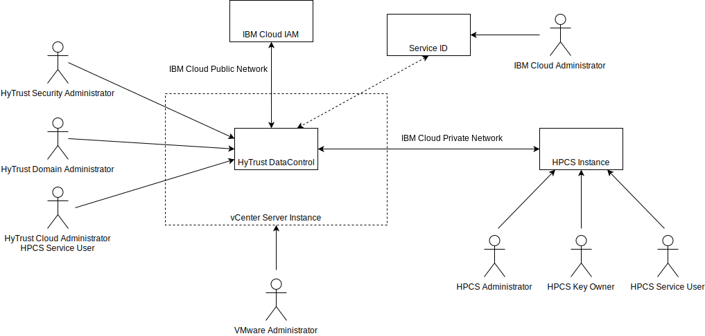

---

copyright:

  years:  2019

lastupdated: "2019-12-19"

subcollection: vmware-solutions

---

{:external: target="_blank" .external}
{:tip: .tip}
{:note: .note}
{:important: .important}

# System Context
{: #htdc-hpcs-system-context}

The following diagram shows the system context for vCenter Server instance with HyTrust DataControl and IBM Hyper Protect Crypto Services. A system context diagram is a high-level diagram that provides an initial view of the system. It defines the key elements of a system, the boundary of the system, and the entities that interact with it, along with the interaction.

{: caption="Figure 1. System context" caption-side="bottom"}

## Actors
{: #htdc-hpcs-system-context-actors}

The system context diagram identifies the following actors:

* IBM Cloud administrator - The IBM Cloud administrator is responsible for assign access to the IBM Cloud account, and is required to configure the Service ID to enable access to Hyper Protect Crypto Services from HyTrust DataControl.
* VMware administrator - The VMware administrator is responsible for the ongoing configuration and maintenance of the VMware environment.
* IBM HPCS administrators - The following are the roles that Hyper Protect Crypto Services supports.
    * Crypto unit administrator - Issue commands to the crypto units. Multiple administrators can be added to one crypto unit to increase security. Each administrator owns one private signature key for identity authentication.
    * Key owner - Provides master key parts for initializing a service instance.
    * Service user - Stores, retrieves, and generates root keys and standard keys through user interface and APIs. Note, the HTDC Cloud administrator is an HPCS service user
* HyTrust DataControl administrators - There are three distinct administrative roles in HTDC. These roles can be combined and there are no limits to the number of administrators. Administrators can be placed in administrative groups to provide peer oversight. All objects in the system are owned by one or more administrative groups, not by individual administrators.
  * Security administrator:
    * Manage users and groups.
    * Master Key management.
    * Views all audit records.
  * Domain administrator:
    * Manages KeyControl nodes.
    * KeyControl backup / restore.
    * Limited audit view.
  * Cloud administrator:
    * Manages Cloud VM Sets.
    * Encryption of disks, files, and file systems.
    * Control VM key access.
    * Limited audit view.

## Systems
{: #htdc-hpcs-system-context-systems}

The system context diagram identifies the following systems:

* vCenter Server instance - The vCenter Server instance hosts the workloads that require encryption and the HyTrust virtual machines.
* HyTrust DataControl - The virtual machines that host the HyTrust DataControl software.
* IBM Hyper Protect Crypto Service - IBM Cloud Hyper Protect Crypto Services is a key management and cloud hardware security module.
* IBM Cloud private network - Provides communication between the HyTrust DataControl virtual machines and the IBM Hyper Protect Crypto Service.
* IBM Cloud public network - Provides communication between the HyTrust DataControl virtual machines and the IBM Cloud Identity and Access Management service to validate the API key.
* Service ID - A service ID identifies a service or application similar to how a user ID identifies a user. Service IDs are created to enable access to IBM Cloud services by applications hosted both inside and outside of IBM Cloud. The API Key is configured in the Service ID and used in the configuration of the Cloud VM Set.
* IBM Cloud Identity and Access Management (IAM) - The IBM Cloud service that validates access to IBM Cloud services, including IBM HPCS.

**Next topic:** [Reference architecture](/docs/services/vmwaresolutions?topic=vmware-solutions-htdc-hpcs-reference-architecture)

## Related links
{: #htdc-hpcs-system-context-related}

*  [Getting started with IBM Cloud Hyper Protect Crypto Services](/docs/services/hs-crypto?topic=hs-crypto-get-started)
*  [HyTrust DataControl overview](/docs/services/vmwaresolutions?topic=vmware-solutions-htdc_considerations)
