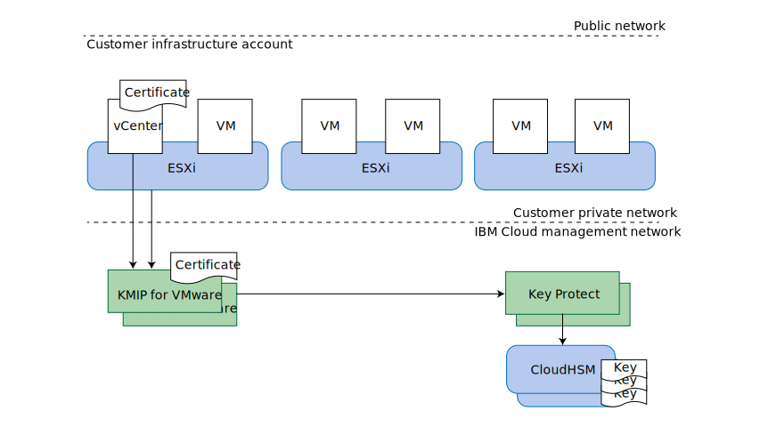

---

copyright:

  years:  2016, 2019

lastupdated: "2019-11-07"

subcollection: vmware-solutions

---

{:external: target="_blank" .external}
{:tip: .tip}
{:note: .note}
{:important: .important}
{:deprecated: .deprecated}

# KMIP for VMware design
{: #kmip-design}

KMIP for VMware provides a key management service compatible with VMware vSAN encryption and VMware vSphere encryption, by using [IBM Key Protect](/docs/services/key-protect?topic=key-protect-getting-started-tutorial) or [IBM Cloud Hyper Protect Crypto Services](/docs/services/hs-crypto?topic=hs-crypto-get-started#get-started) to provide root key and data key storage. Key Protect and Hyper Protect Crypto Services function as the key management service in this solution.

## Storage encryption options
{: #kmip-design-storage-options}

KMIP for VMware is compatible with both VMware vSAN encryption and vSphere encryption. Both of these solutions are implemented in the hypervisor layer but provide slightly different functions. Evaluate their functions according to your requirements.

### VMware vSAN encryption
{: #kmip-design-vsan-encrypt}

VMware vSAN encryption is only applicable to vSAN datastores. With this solution, VMware vCenter and your VMware ESXi hosts connect to a key management server such as KMIP for VMware to get encryption keys. These keys are used to protect individual disk drives used for your vSAN datastore, including both cache and capacity disks. vSAN encryption is implemented in a way that preserves the benefits of vSAN compression and deduplication.

Because vSAN encryption operates at the datastore level, its primary goal is to prevent data exposure if loss of physical disk drives occurs. Also, vSAN encryption is fully compatible with all virtual machine backup and replication technologies, such as vSphere replication, cross-vCenter vMotion, VMware HCX, Zerto, Veeam, and IBM Spectrum Protect Plus.

**Notes**:
* vSAN encryption does not encrypt the host to host vSAN replication communications within your cluster.
* vSAN encryption is not applicable to other storage solutions such as {{site.data.keyword.cloud_notm}} Endurance file and block storage.
* vSAN encryption requires the vSAN Enterprise license.
* The vSAN health check might issue periodic warnings that it is unable to connect to the KMS cluster from one or more of your vSphere hosts. These warnings occur because the vSAN health check connection times out too quickly. You can ignore these warnings. For more information, see [vSAN KMS Health Check intermittently fails with SSL Handshake Timeout error](https://kb.vmware.com/s/article/67115){:external}.

### vSphere encryption
{: #kmip-design-vsphere-encrypt}

VMware vSphere encryption applies to all types of VMware storage, including vSAN storage and {{site.data.keyword.cloud_notm}} Endurance file and block storage.

With this solution, vCenter Server and your ESXi hosts connect to a key management server such as KMIP for VMware to get encryption keys. These keys are used to protect individual virtual machine (VM) disks, according to your VM storage policies.

vSphere encryption operates at the virtual machine disk level, and so it can prevent data exposure if loss of physical disk drives or loss of VM disks occurs. Many backup and replication technologies cannot back up or replicate effectively because the provided data is encrypted.

Therefore vSphere encryption is not compatible with vSphere replication, cross-vCenter vMotion, VMware HCX, Zerto, or IBM Spectrum Protect Plus. However, when properly configured, Veeam Backup and Replication is compatible with vSphere encryption.

### More considerations
{: #kmip-design-considerations}

When either type of encryption is enabled in your vSphere cluster, VMware creates an extra key to encrypt your ESXi core dumps, since these dumps might contain sensitive data such as key management credentials, encryption keys, or decrypted data. You should familiarize yourself with [vSphere Virtual Machine Encryption and Core Dumps](https://docs.vmware.com/en/VMware-vSphere/6.5/com.vmware.vsphere.security.doc/GUID-63728E8B-810D-418B-B1AA-6A0A2F92AABE.html).

When KMIP for VMware is used together with vSAN encryption or vSphere encryption, several layers of key protection exist.

If you plan to rotate keys, review the following information about the levels at which the keys can be rotated:
* Your customer root key (CRK) protects all VMware keys. The keys can be rotated in the IBM Key Protect or Hyper Protect Crypto Services instance that is associated with your KMIP for VMware instance.
* KMIP for VMware uses your CRK to protect the keys it generates and distributes to VMware. VMware considers these to be _key encrypting keys (KEKs)_.
  * If you are using vSphere encryption, you can rotate the keys by using the **Set-VMEncryptionKey** PowerShell command.
  * If you are using vSAN encryption, you can rotate the keys on the vSAN user interface.
* VMware uses these KEKs to protect the actual keys it uses to encrypt disk drives and VM disks. You can rotate these keys by using what VMware calls a "deep" rekey. This operation reencrypts all your encrypted data so it might take a long time.
  * If you are using vSphere encryption, you can perform a deep rekey by using the **Set-VMEncryptionKey** PowerShell command.
  * If you are using vSAN encryption, you can perform a deep rekey by using the vSAN user interface.

## KMIP for VMware
{: #kmip-design-kmip-for-vmware}

VMware vSAN encryption and vSphere encryption are compatible with many key management servers. KMIP for VMware provides an IBM-managed key management service that uses IBM Key Protect or Hyper Protect Crypto Services to give you full control over your keys. Other {{site.data.keyword.cloud_notm}} services such as Cloud Object Storage also integrate with Key Protect and Hyper Protect Crypto Services, making them your central point of control for key management in the {{site.data.keyword.cloud_notm}}.

### Keys within keys
{: #kmip-design-keys}

Key management systems commonly use a technique that is known as *envelope encryption* to wrap or protect keys with other keys. These keys are called _root keys_ or _key encrypting keys (KEKs)_. To access a key, you need to decrypt or unwrap the key by using its corresponding root key. Destroying the root key is an effective way of invalidating all of the keys it has protected. These keys need not be stored close to the root key. Controlling access to the root key is important.

{{site.data.keyword.cloud_notm}} Key Protect and Hyper Protect Crypto Services provide this service by using a *customer root key* (CRK). Key Protect stores CRKs exclusively in {{site.data.keyword.cloud_notm}} CloudHSM hardware from which they cannot be extracted; Hyper Protect Crypto Services stores keys in IBM zSeries HSMs. These CRKs are then used to wrap more encryption keys such as the ones generated by KMIP for VMware for your VMware instance.

VMware implements this same concept for its keys. KMIP for VMware provides a key to VMware upon request, and VMware in turn uses this key as a KEK to wrap or encrypt the final keys that are used to encrypt your vSAN disk drives or virtual machine disks. These final keys are called data encrypting keys (DEKs).

So we end up with the following chain of encryption:
* Customer root key (CRK) stored permanently in IBM Key Protect or Hyper Protect Crypto Services.
* Key encrypting key (KEK) generated by KMIP for VMware and provided to vCenter Server and to the ESXi hosts in your instance.
* Data encrypting key (DEK) generated by VMware and stored alongside the vSAN disk or virtual machine disk.

KMIP for VMware stores the wrapped form of the KEKs within IBM Key Protect or Hyper Protect Crypto Services. Although the KEKs are cryptographically secured by the CRK and are not required to be stored within an HSM, if you store them in the key management service, their presence is visible to you and you can delete them if you need to revoke individual keys.

### Authentication and authorization
{: #kmip-design-authentication}

Three components make up your storage encryption solution: your VMware cluster, your KMIP for VMware instance, and your Key Protect or Hyper Protect Crypto Services instance.

VMware vCenter and ESXi authenticate with your KMIP for VMware instance by using certificates that you install or generate in VMware vCenter when you create a key management server (KMS) connection. You install the public certificate into KMIP for VMware to identify the vCenter client or clients that are allowed to connect. Each client is authorized to all keys stored in that KMIP for VMware instance.

Your KMIP for VMware instance is authorized to your Key Protect or Hyper Protect Crypto Services instance by using an {{site.data.keyword.cloud_notm}} Identity and Access Management (IAM) service ID that has been granted access to the instance. The service ID must have a minimum of platform Viewer access and service Manager access to your key manager instance. KMIP for VMware uses the customer root key (CRK) of your choice in the key manager instance, and stores all KEKs generated on behalf of VMware, in wrapped form, in the key manager instance.

### Topology
{: #kmip-design-topology}

KMIP for VMware is available in a number of {{site.data.keyword.cloud_notm}} multi-zone regions (MZRs). For the complete list, see the [Ordering KMIP for VMware](/docs/services/vmwaresolutions?topic=vmware-solutions-kmip_standalone_ordering).

Within each MZR, KMIP for VMware provides two network service endpoints on the {{site.data.keyword.cloud_notm}} private network for high availability. Configure both of these endpoints in your vCenter key management server (KMS) configuration as a KMS cluster. For a list of the endpoints in each MZR and the KMIP server certificate signatures, see the [KMIP for VMware service documentation](/docs/services/vmwaresolutions?topic=vmware-solutions-kmip_standalone_ordering).

To access KMIP for VMware over the private network, your {{site.data.keyword.cloud_notm}} infrastructure account must be enabled for virtual routing and forwarding (VRF) and the {{site.data.keyword.cloud_notm}} network service endpoint routes must be added to the VRF routes of your account. For more information, see [Enabling service endpoints](/docs/account?topic=account-vrf-service-endpoint#service-endpoint).

KMIP for VMware also connects to {{site.data.keyword.cloud_notm}} Key Protect by using the {{site.data.keyword.cloud_notm}} private network rather than the public internet.

{: caption="Figure 1. Components of KMIP for VMware when using IBM Key Protect" caption-side="bottom"}

When using IBM Cloud Hyper Protect Crypto Services, your keys are stored in an IBM zSeries HSM instead of CloudHSM. Additionally, the connection between KMIP for VMware and {{site.data.keyword.cloud_notm}} Hyper Protect Crypto Services flows over the public network but is protected by TLS encryption and authentication.

**Next topic:** [KMIP for VMware implementation and management](/docs/services/vmwaresolutions?topic=vmware-solutions-kmip-implementation)

## Related links
{: #kmip-design-related}

* [Solution overview](/docs/services/vmwaresolutions?topic=vmware-solutions-kmip-overview)
* [Implementation and management](/docs/services/vmwaresolutions?topic=vmware-solutions-kmip-implementation)
* [IBM Key Protect](/docs/services/key-protect?topic=key-protect-getting-started-tutorial)
