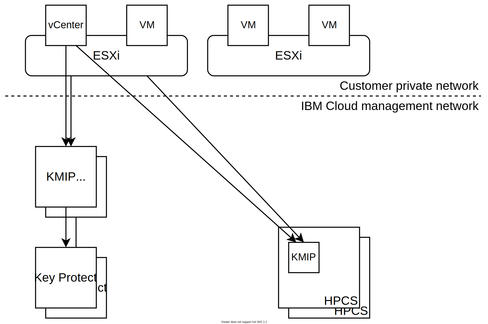

---

copyright:

  years:  2016, 2021

lastupdated: "2021-10-21"

subcollection: vmwaresolutions

---

{{site.data.keyword.attribute-definition-list}}

# KMIP for VMware design
{: #kmip-design}

KMIP™ for VMware® provides a key management service compatible with VMware vSAN encryption and VMware vSphere® encryption, by using [IBM Key Protect](/docs/key-protect?topic=key-protect-getting-started-tutorial) or [IBM Cloud Hyper Protect Crypto Services](/docs/hs-crypto?topic=hs-crypto-get-started#get-started) to provide root key and data key storage. Key Protect and Hyper Protect Crypto Services function as the key management service in this solution.

## Storage encryption options
{: #kmip-design-storage-options}

KMIP for VMware is compatible with both VMware vSAN encryption and vSphere encryption. Both of these solutions are implemented in the hypervisor layer but provide slightly different functions. Evaluate their functions according to your requirements.

### VMware vSAN encryption
{: #kmip-design-vsan-encrypt}

VMware vSAN encryption is only applicable to vSAN datastores. With this solution, VMware vCenter and your VMware ESXi hosts connect to a key management server such as KMIP for VMware to get encryption keys. These keys are used to protect individual disk drives used for your vSAN datastore, including both cache and capacity disks. vSAN encryption is implemented in a way that preserves the benefits of vSAN deduplication and compression, if you choose this option when you order a new instance or add a cluster.

Because vSAN encryption operates at the datastore level, its primary goal is to prevent data exposure if loss of physical disk drives occurs. Also, vSAN encryption is fully compatible with all virtual machine (VM) backup and replication technologies, such as vSphere replication, cross-vCenter vMotion, VMware HCX, Zerto, Veeam, and IBM Spectrum Protect Plus.

#### VMware vSAN encryption notes
{: #kmip-design-vsan-encrypt-notes}

* For vSphere versions older than 7.0u1a, vSAN encryption cannot encrypt the host to host vSAN replication communications within your cluster. Beginning with vSphere 7.0u1a, you can optionally enable data-in-transit encryption for each vSAN cluster.
* vSAN encryption is not applicable to other storage solutions such as {{site.data.keyword.cloud_notm}} Endurance file and block storage.
* vSAN encryption requires the vSAN Enterprise license.
* The vSAN health check might send periodic warnings that it is unable to connect to the Key Management Service (KMS) cluster from one or more of your vSphere hosts. These warnings occur because the vSAN health check connection times out too quickly. You can ignore these warnings. For more information, see [vSAN KMS health check intermittently fails with SSL handshake timeout error](https://kb.vmware.com/s/article/67115){: external}.

### vSphere encryption
{: #kmip-design-vsphere-encrypt}

VMware vSphere encryption applies to all types of VMware storage, including vSAN storage and {{site.data.keyword.cloud_notm}} Endurance file and block storage.

With this solution, vCenter Server and your ESXi hosts connect to a key management server such as KMIP for VMware to get encryption keys. These keys are used to protect individual VM disks, according to your VM storage policies.

vSphere encryption operates at the VM disk level, and so it can prevent data exposure if loss of physical disk drives or loss of VM disks occurs. Some backup and replication technologies cannot back up or replicate effectively because the provided data is encrypted.

vSphere encryption is not compatible with VMware HCX or Zerto. vSphere encryption is compatible with cross-vCenter vMotion when you use vSphere 7.0 or later. vSphere encryption is compatible with vSphere replication when you use vSphere 6.7u1 or later. When properly configured, IBM Spectrum Protect Plus and Veeam Backup and Replication are also compatible with vSphere encryption.

### More considerations
{: #kmip-design-considerations}

When either type of encryption is enabled in your vSphere cluster, VMware creates an extra key to encrypt your ESXi core dumps. These core dumps might contain sensitive data such as key management credentials, encryption keys, or decrypted data. For more information, see [vSphere VM encryption and core dumps](https://docs.vmware.com/en/VMware-vSphere/7.0/com.vmware.vsphere.security.doc/GUID-63728E8B-810D-418B-B1AA-6A0A2F92AABE.html){: external}.

When KMIP for VMware is used together with vSAN encryption or vSphere encryption, several layers of key protection exist.

If you plan to rotate keys, review the following information about the levels at which the keys can be rotated:
* Level 1 - Your customer root key (CRK) protects all VMware keys. These keys can be rotated in the IBM Key Protect or Hyper Protect Crypto Services instance that is associated with your KMIP for VMware instance. When these keys are rotated in the IBM Key Protect instance, KMIP for VMware handles the new CRK automatically and no operation is needed in VMware or vCenter Server.
* Level 2 - KMIP for VMware uses your CRK to protect the keys that it generates and distributes to VMware. VMware considers these keys to be key encrypting keys (KEKs). KEK rotation is relatively fast. VMware reaches out to KMIP for a new key, takes the DEKs encrypted by the original key and wraps them in this new key, and then stores the updated encrypted DEKs.
   * If you are using vSphere encryption, you can rotate the KEKs by using the **Set-VMEncryptionKey** PowerShell command.
   * If you are using vSAN encryption, you can rotate the KEKs by using the vSAN user interface.
* Level 3 - VMware uses these KEKs to protect the actual keys that it uses to encrypt disk drives and VM disks. You can rotate these keys by using what VMware calls a "deep" rekey. This operation reencrypts all your encrypted data so it might take a long time.
   * If you are using vSphere encryption, you can perform a deep rekey by using the **Set-VMEncryptionKey** PowerShell command.
   * If you are using vSAN encryption, you can perform a deep rekey by using the vSAN user interface.

## KMIP for VMware
{: #kmip-design-kmip-for-vmware}

VMware vSAN encryption and vSphere encryption are compatible with many key management servers. KMIP for VMware provides an IBM-managed key management service that uses IBM Key Protect or Hyper Protect Crypto Services to give you full control over your keys. Other {{site.data.keyword.cloud_notm}} services such as Cloud Object Storage also integrate with Key Protect and Hyper Protect Crypto Services, making them your central point of control for key management in the {{site.data.keyword.cloud_notm}}.

### Keys within keys
{: #kmip-design-keys}

Key management systems commonly use a technique that is known as *envelope encryption* to wrap or protect keys with other keys. These keys are called _root keys_ or _key encrypting keys (KEKs)_. To access a key, you need to decrypt or unwrap the key by using its corresponding root key. Destroying the root key is an effective way of invalidating all the keys that were previously protected. These keys need not be stored close to the root key. Controlling access to the root key is important.

{{site.data.keyword.cloud_notm}} Key Protect and Hyper Protect Crypto Services provide this service by using a *customer root key* (CRK). Key Protect stores CRKs exclusively in {{site.data.keyword.cloud_notm}} CloudHSM hardware from which they cannot be extracted; Hyper Protect Crypto Services stores keys in IBM zSeries HSMs. These CRKs are then used to wrap more encryption keys such as the ones generated by KMIP for VMware for your VMware instance.

VMware implements this same concept for its keys. KMIP for VMware provides a key to VMware upon request. In turn, VMware uses this key as a KEK to wrap or encrypt the final keys that are used to encrypt your vSAN disk drives or VM disks. These final keys are called data encryption keys (DEKs).

So you end up with the following chain of encryption:
* Customer root key (CRK) stored permanently in IBM Key Protect or Hyper Protect Crypto Services.
* Key encrypting key (KEK) generated by KMIP for VMware and provided to vCenter Server and to the ESXi hosts in your instance.
* Data encrypting key (DEK) generated by VMware and stored alongside the vSAN disk or VM disk.

KMIP for VMware stores the wrapped form of the KEKs within IBM Key Protect or Hyper Protect Crypto Services. The KEKs are cryptographically secured by the CRK and are not required to be stored within an HSM. However, because they are stored in the key management service, they are visible to you and you can delete them if you need to revoke individual keys.

### Authentication and authorization
{: #kmip-design-authentication}

Three components make up your storage encryption solution: your VMware cluster, your KMIP for VMware instance, and your Key Protect or Hyper Protect Crypto Services instance.

VMware vCenter and ESXi authenticate with your KMIP for VMware instance by using certificates that you install or generate in VMware vCenter when you create a key management server (KMS) connection. You install the public certificate into KMIP for VMware to identify the vCenter client or clients that are allowed to connect. Each client is authorized to all keys stored in that KMIP for VMware instance.

Your KMIP for VMware instance is authorized to your Key Protect or Hyper Protect Crypto Services instance by using {{site.data.keyword.cloud_notm}} Identity and Access Management (IAM).

When KMIP for VMware is associated with a Key Protect instance, this authorization takes place by using a service ID that has access to the instance. The service ID must have a minimum of platform **Viewer** access and service **Manager** access to your key manager instance. KMIP for VMware uses the customer root key (CRK) of your choice in the key manager instance. It also stores all KEKs generated on behalf of VMware, in wrapped form, in the key manager instance.

When KMIP for VMware is associated with a Hyper Protect Crypto Services (HPCS) instance, it uses a service authorization that you grant within your account's IAM authorization. You must grant the KMIP for VMware instance both the platform **Viewer** role and the service **VMware KMIP Manager** role for your HPCS instance.

### Architecture and topology
{: #kmip-design-topology}

In all cases, your VMware vCenter server access KMIP for VMware over the {{site.data.keyword.cloud_notm}} private network. To access KMIP for VMware over the private network, your {{site.data.keyword.cloud_notm}} infrastructure account must be enabled for virtual routing and forwarding (VRF). Also, the {{site.data.keyword.cloud_notm}} network service endpoint routes must be added to the VRF routes of your account. For more information, see [Enabling service endpoints](/docs/account?topic=account-vrf-service-endpoint#service-endpoint).

The architecture and topology differs depending on whether KMIP for VMware is using Key Protect or Hyper Protect Crypto Services for key management.

{: caption="Figure 1. Topology of KMIP for VMware" caption-side="bottom"}

#### KMIP for VMware and Key Protect
{: #kmip-design-topology-kp}

When your KMIP for VMware instance is connected to Key Protect, your VMware vCenter Server® is connecting to a multi-tenant KMIP service that is deployed on two private network endpoints in the same {{site.data.keyword.cloud_notm}} MZR as your Key Protect instance. The two endpoints are distributed across separate availability zones for high availability, and you must configure both endpoints as a key provider cluster in your vCenter configuration. For more information about the endpoints in each MZR and the KMIP server certificate signatures, see [Ordering KMIP for VMware instances](/docs/vmwaresolutions?topic=vmwaresolutions-kmip_standalone_ordering).

KMIP for VMware also connects to {{site.data.keyword.cloud_notm}} Key Protect by using the {{site.data.keyword.cloud_notm}} private network rather than the public internet, and is additionally protected by TLS encryption and authentication.

When integrated with {{site.data.keyword.cloud_notm}} Key Protect, KMIP for VMware periodically validates that your service ID has sufficient permission to your Key Protect instance and Customer Root Key. In Activity Tracker, you might occasionally see *wrap* events from Key Protect for these checks. The checks are started by the service ID and are not paired with corresponding key creation events from KMIP for VMware.

#### KMIP for VMware and Hyper Protect Crypto Services
{: #kmip-design-topology-hpcs}

When you use {{site.data.keyword.cloud_notm}} Hyper Protect Crypto Services (HPCS), your vCenter Server is connecting to a single-tenant KMIP service that is hosted within HPCS by using IBM Secure Service Containers running on IBM LinuxOne servers, and your keys are stored in an IBM Z HSM. The KMIP endpoint is exposed by using a single DNS name and port. If you have multiple HPCS crypto units, this DNS name is load balanced to separate availability zones.

**Next topic:** [KMIP for VMware implementation and management](/docs/vmwaresolutions?topic=vmwaresolutions-kmip-implementation)

## Related links
{: #kmip-design-related}

* [Solution overview](/docs/vmwaresolutions?topic=vmwaresolutions-kmip-overview)
* [Implementation and management](/docs/vmwaresolutions?topic=vmwaresolutions-kmip-implementation)
* [IBM Key Protect](/docs/key-protect?topic=key-protect-getting-started-tutorial)
