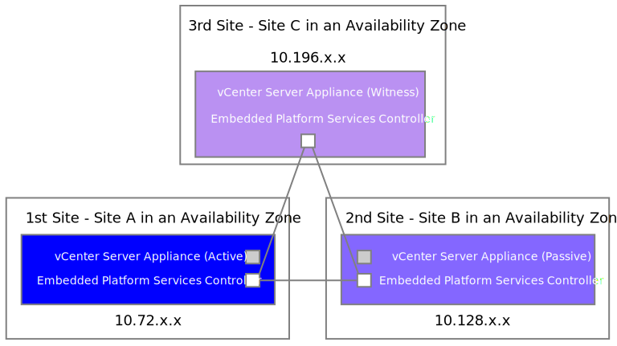

---

copyright:

  years:  2019, 2020

lastupdated: "2020-08-18"

subcollection: vmwaresolutions

---

{:external: target="_blank" .external}
{:tip: .tip}
{:note: .note}
{:important: .important}
{:deprecated: .deprecated}

# Component and feature details
{: #mcv-archi-comp}

## VMware vSphere configuration
{: #mcv-archi-comp-vsphere}

The following information describes the configuration design for enabling {{site.data.keyword.cloud}} for VMware Mission Critical Workloads.

1. High Availability and host monitoring is enabled.
  * Host failure response: Restart VMs
  * Host isolation: Power off and restart VMs
  * Default VM Restart Priority: Highest
2. Distributed Resource Scheduler: Fully automated.
3. Resource Cluster (vSAN Stretched Cluster) Admission Control
  * Reserved CPU capacity: 50%
  * Reserved Memory capacity: 50%
  * Performance degradation VMs tolerate: 100%
4. Resource Cluster (vSAN Stretched Cluster) Host Groups and VM Groups
  * Create a Host Group for Site A and a host group for Site B. Add the correct hosts into each group.
  * Create a VM Group for Site A and a VM Group for Site B. Add the correct VMs into each group.
  * With a ‘Should’ Rule, pin a VM Group to a Host Group to avoid VMs moving between sites under normal circumstances.
5. Isolation address for vSAN Stretched Cluster
  * das.usedefaultisolationaddress – set to false
  * das.isolationaddress0 - IP address on vSAN network on Site A.
    Use another IP on the same subnet as the vSAN VMK; preferably the vSAN VMK default gateway in Site A.
  * das.isolationaddress1 - IP address on vSAN network on Site B.
    Use another IP on the same subnet as the vSAN VMK; preferably the vSAN VMK default gateway in Site B.
   * das.isolationaddress[2–5] – HSRP IP addresses on vSAN network on Site A and Site B
6. Network I/O Control
  * Management traffic: 20 shares
  * Virtual machine traffic: 30 shares
  * vMotion traffic: 50 shares
  * vSAN traffic: 100 shares
  * All other unused services must be set to *Low* or *0 shares*
7. Performance Profile for the system hardware is set to Max Performance.

## vCenter High Availability
{: #mcv-archi-comp-HA}

The Mission Critical Workloads instance is configured with vCenter High Availability (HA) enabled during provisioning. Automated failover is managed and performed by vCenter.

Investigation is underway for automation of the reassignment of the vCenter IP address in DNS. Otherwise, you must manually reassign the IP address upon vCenter failover or contact IBM Global Technology Services (GTS) for assistance.

### Network design
{: #mcv-archi-comp-HA-network}

New private subnets are provisioned for the VCHA network traffic when you provision the instance. This range is a /29 (8 IP address range) on each portable private VLAN provisioned for the hosts.

A new Distributed Virtual Switch (DVS) is created for the VCHA with a new port group for each site.

The following figure shows vmk1 added for VCHA network traffic with IP from the new subnet range.

{: caption="Figure 1. Network design" caption-side="bottom"}

vCenter access is done through a fully qualified domain name (FQDN) that has an A record to the IP address of the vCenter in Site A. During a Site A failure, that DNS A record is modified by using automation running in the witness site.

## Stretched vSAN cluster
{: #mcv-archi-comp-vsan}

All of the hosts in the resource layer contribute all of their disks to the stretched vSAN cluster. The following flow describes the cluster configuration:

1. Hosts that are part of the Resource Cluster (vSAN Stretched Cluster) are part of a single Management Port Group.
2. For the Resource Cluster (vSAN Stretched Cluster) there is a separate Port Group per site for vSAN and vMotion.
  * vSAN Site A Port Group
  * vSAN Site B Port Group
  * vMotion Site A Port Group
  * vMotion Site B Port Group
3. For the Witness Appliance there are two interfaces, one for management and one for vSAN traffic.
  * Management (vmk0)
  * vSAN/Witness (vmk1)
4. All ESXi hosts require static routes for the vSAN VMK to all other ESXi hosts vSAN VMK and the Witness.
  * esxcli network IP route ipv4 add -n <target IP> -g <vSAN gateway>
5. Witness appliance requires static routes to all ESXi hosts vSAN VMKs.
  * esxcli network IP route ipv4 add -n <target IP> -g <vSAN gateway>
6. Specify vMotion Gateway per site in vMotion TCP/IP Stack on an individual ESXi host basis.
  * Site A vMotion Gateway
  * Site B vMotion Gateway
7. vSAN Storage Policy with the following:
  * Primary Failures to Tolerate (PFTT) = 1
  * Secondary Failures to Tolerate (SFTT) = 1 (minimum)
  * Failure Tolerance Method (FTM) = RAID 5/6
  * FTT and RAID settings are set based on number of hosts ordered. You can change this setting.
8. When you configure a vSAN Stretched Cluster specify the following to create two failure domains:
  * Hosts that are in Site A are part of the Primary Site
  * Host that are in Site B are part of the Secondary Site

### Known issue with the default storage policy
{: #mcv-archi-comp-storage}

For a vCenter Server instance with stretched vSAN cluster and a cluster size of only six hosts, the default storage policy is not usable. This problem occurs because the default vSAN storage policy is configured with the setting **Failures to tolerate 1 failure - RAID-5 (Erasure Coding)**, which cannot be achieved with the minimum stretched vSAN cluster size of six hosts.

During installation, a new storage policy that is named `IC4v Minimal vsan policy` is created. This storage policy can be used for deployments into the vSAN stretched cluster.

### Network design
{: #mcv-archi-comp-vsan-network}

1. esxi–vmk is the management interface (vmk0) of the ESXi hosts
  *	Route based on physical NIC Load (LBT)
  * Uses both Uplink 1 and Uplink 2
2. vMotion–A is the vMotion interface (vmk1) for Site A and vMotion–B is the vMotion interface (vmk1) for Site B
  * Explicit Failover
  * Uplink 2 is Active and Uplink 1 is Passive
3. vSAN–A is the vSAN interface (vmk2) for Site A and vSAN–B is the vMotion interface (vmk2) for Site B
  * Explicit Failover
  * Uplink 1 is Active and Uplink 2 is Passive
4. VTEP is the NSX interface (vmk3 and vmk4)
  * Route based on Originating Virtual Port ID (SCRID)
  * Uses both Uplink 1 and Uplink 2
5. MGMT–VMs is the management port group for Management virtual machines
  * Route based on physical NIC Load (LBT)
  * Uses both Uplink 1 and Uplink 2

## NSX
{: #mcv-archi-comp-nsx}

### NSX–V Management Edge
{: #mcv-archi-comp-nsx-nsxv}

The management edge is preconfigured to allow outbound access to the public internet.

### NSX Manager and NSX Controller
{: #mcv-archi-comp-nsx-mgr-controller}

The active side contains the NSX Manager.

There is no automated failover of the NSX Manager during recovery of a failed site. It is the operator’s responsibility to recover the NSX Manager from backup and activate it during recovery from a fail–over scenario.
{:note}

### NSX Edge configuration
{: #mcv-archi-comp-nsx-config}

No additional NSX configuration is performed other than allowing outbound traffic for the management cluster as previously described. It is your responsibility to provide and manage any other needed NSX configurations.

## Support
{: #mcv-archi-comp-support}

As with vCenter Server instance orders, IBM Support provides provisioning support for stretched cluster orders.

It is your responsibility to perform patching and ongoing maintenance of the stretched cluster or to contact IBM GTS for assistance.

## Related links
{: #mcv-archi-comps-related}

* [{{site.data.keyword.cloud_notm}} for VMware Mission Critical Workloads architecture overview](/docs/vmwaresolutions?topic=vmwaresolutions-mcv-archi-overview)
* [{{site.data.keyword.cloud_notm}} for VMware Mission Critical Workloads architecture](/docs/vmwaresolutions?topic=vmwaresolutions-mcv-archi-design)
* [Bill of Materials](/docs/vmwaresolutions?topic=vmwaresolutions-mcv-archi-bom)
