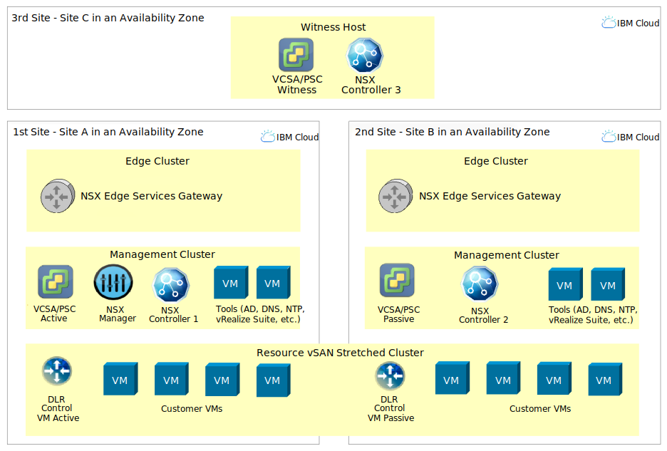

---

copyright:

  years:  2019, 2020

lastupdated: "2020-02-14"

subcollection: vmware-solutions

---

{:external: target="_blank" .external}
{:tip: .tip}
{:note: .note}
{:important: .important}
{:deprecated: .deprecated}

# IBM Cloud for VMware Mission Critical Workloads architecture
{: #mcv-archi-design}

## Topology
{: #mcv-archi-design-topology}

The {{site.data.keyword.cloud}} for VMware Mission Critical Workloads architecture relies on a highly available storage, compute and networking solution in {{site.data.keyword.cloud_notm}}. In addition, there is a number of VMware and IBM components required in order to provide management and tooling capabilities.

## IBM Cloud multi-zone regions
{: #mcv-archi-design-mzr}

The Mission Critical Workloads architecture is dependent on {{site.data.keyword.cloud_notm}} Multi-Zone Regions (MZRs). An MZR is an {{site.data.keyword.CloudDataCents_notm}} designation consisting of triplets of geographically close sites with high bandwidth and low latency between them. These are the only supported site configurations for the Mission Critical Workloads offering, enforced at order time.

| Region        | IBM Cloud Data Centers       |
|:------------- |:------------- |
| Dallas (US South) | DAL10, DAL12, DAL13 |
| Washington (US East) | WDC04, WDC06, WDC07 |
| London | LON04, LON05, LON06 |
| Frankfurt | FRA02, FRA04, FRA05 |
| Tokyo | TOK02, TOK04, TOK05 |
| Sydney | SYD01, SYD04, SYD05 |
{: caption="Table 1. Available MZRs in {{site.data.keyword.cloud_notm}}" caption-side="top"}

## Distribution across multi-zone regions
{: #mcv-archi-design-distibution}

When you order an Mission Critical Workloads architecture, you select one of the three {{site.data.keyword.CloudDataCents_notm}} in the MZR as the witness site. This site hosts all components that require representatives to maintain quorum for high availability. The other two {{site.data.keyword.CloudDataCents_notm}} in the MZR host the management and resource components of the Mission Critical Workloads instance.

The designation of witness and management and resource data centers in the MZR is fixed for each Mission Critical Workloads instance. You can select any data center to use as either a witness or for management and resources. There is nothing unique about a data center that makes it suitable or preferable for either purpose.

Separate instances may also be deployed in the same or different MZR with their own independent choice of witness and management workload sites.

### Witness site
{: #mcv-archi-design-distibution-witness}

The witness site selected for the first cluster contains the witness component for vCenter HA, NSX controllers, and vSAN stretched cluster.

You select the witness site during the deployment process. The witness site can be either vSAN or NFS Endurance based. This choice cannot be modified after deployment. If the witness is vSAN based it remains separate from and does not participate in the stretched cluster configuration deployed onto the management and resource sites.

It is not recommended for you to deploy your customer workloads in the witness site.
{:note}

### Management and resource sites
{: #mcv-archi-design-distibution-mgmt}

The two remaining sites in the MZR that were not selected as the witness site are assigned as the management and resource sites. Two management clusters are deployed, one into each of these sites for management components such as vCenter Server. A single stretch cluster for customer workload is deployed spanning the two sites.

The management clusters can be either vSAN or NFS Endurance based. This choice cannot be modified after deployment. If the management clusters are vSAN based they remain separate from and do not participate in the stretched cluster configuration.

For both the management clusters and the single stretch cluster, the two sites are intended to serve as identical replicas of each other and are provisioned and maintained in a homogenous configuration. The following configurations across the two sites are identical:

* Number of hosts
* Processor type
* RAM
* Disk configuration
* Network configuration
* VMware software stack

Day 2 scale-up and scale-down operations for adding and removing hosts to the management clusters and the stretch cluster are automatically selected to take place simultaneously in each of the two resource sites. This automatic maintenance of consistency across the management and stretch clusters is enforced and cannot be overridden.

The following configuration with separate management and edge clusters is an IBM Global Technology Services (GTS) Large style Mission Critical Workloads configuration. The edge clusters must be deployed separately as day 2 operations in the user experience described below.

{: caption="Figure 1. A typical large Mission Critical Workloads deployment" caption-side="bottom"}

### Differences between management and resource usage of the two sites
{: #mcv-archi-design-distibution-mgmt-diff}

The two sites containing the management and resource layers of the Mission Critical Workloads instance are designated Site A and Site B.
vCenter functions in an active-passive availability model with a witness appliance. The NSX control plane functions in an active–active availability model with a quorum of controllers.

Your workloads are deployed onto active–active storage mirrored between the workload sites. You must plan for sufficient host capacity to run the entire workload in one site. VMware admission control should be used to ensure that neither side is over-committed and that complete loss of a site can be accommodated by moving all workloads to the remaining site. Additional planning is also required to design a workload network topology, such as that used by the IBM GTS Mission Critical Workloads architecture, that is highly available.

#### Site A

Management and resource Site A contains the following:

*	Management cluster
  * vCenter server active appliance
  * NSX manager
  * NSX controller
  * Active Directory server

*	Half of a stretch cluster
  * Customer workload

#### Site B

Management and resource Site B contains the following:

*	Management cluster
  * vCenter server passive appliance
  * NSX controller
  * Active Directory server

*	Remaining half of stretch cluster
  * Customer workload

## Related links
{: #mcv-archi-design-related}

* [{{site.data.keyword.cloud_notm}} for VMware Mission Critical Workloads architecture overview](/docs/services/vmwaresolutions?topic=vmware-solutions-mcv-archi-overview)
* [Bill of Materials](/docs/services/vmwaresolutions?topic=vmware-solutions-mcv-archi-bom)
* [Component and feature details](/docs/services/vmwaresolutions?topic=vmware-solutions-mcv-archi-comp)
