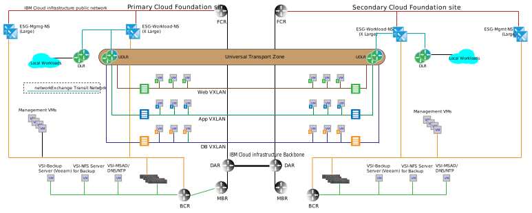

---

copyright:

  years:  2016, 2019

lastupdated: "2019-11-04"

subcollection: vmware-solutions

---

# Multi-site architecture
{: #nsx-multi_site}

One key differentiator between {{site.data.keyword.cloud}} and other cloud offerings is the ability to provision dedicated compute capability across the globe and automatically to connect on-demand infrastructure with the network within your private {{site.data.keyword.cloud_notm}} account. The software defined network capabilities of VMware vCenter Server together with {{site.data.keyword.cloud_notm}} provide a granular global infrastructure that can be built within days. The following sections describe a multi-site architecture example of what can be achieved with the out of the box capability of vCenter Server.

## Cross-vCenter NSX environment
{: #nsx-multi_site-cross-env}

The cross-vCenter NSX capability allows for linking in a primary, secondary relationship of up to nine NSX managers: one primary and eight secondary. While it isn't required to have vCenter servers in an Enhanced Linked Mode (ELM) relationship for cross-vCenter NSX to function, it provides the following benefits:

* Simplified primary, secondary relationship creation by using Single sign-on (SSO) credentials
* vCenter Server automation configuration for DNS name resolution for all the sites that are linked together
* Single pane of glass management across all sites for both NSX and normal vCenter functions

## Multi-site example
{: #nsx-multi_site-example}

The following example adds an NSX universal transport zone to the basic management and workload topologies that are discussed in the previous sections, and also includes the following characteristics:

* The universal transport zone spans two {{site.data.keyword.CloudDataCents_notm}} or PODs within an {{site.data.keyword.CloudDataCent_notm}}.
* After the transport zone is added, multiple VXLANs are added along with a Universal Distributed Router that spans the new VXLANs.
* You must configure uplinks to the workload ESGs in both sites. This configuration allows virtual machines (VMs) in the local site to traverse to its local ESG.
* For inbound traffic, a global load balancer is required. See the {{site.data.keyword.cloud_notm}} global load balancing offerings to meet this requirement.
* This example requires VMware NSX Enterprise edition.

{: caption="Figure 1. Multi-site topology" caption-side="bottom"}

## Related links
{: #nsx-multi_site-related}

* [Networking services on {{site.data.keyword.cloud_notm}}](/docs/services/vmwaresolutions?topic=vmware-solutions-nsx-networking_services)
