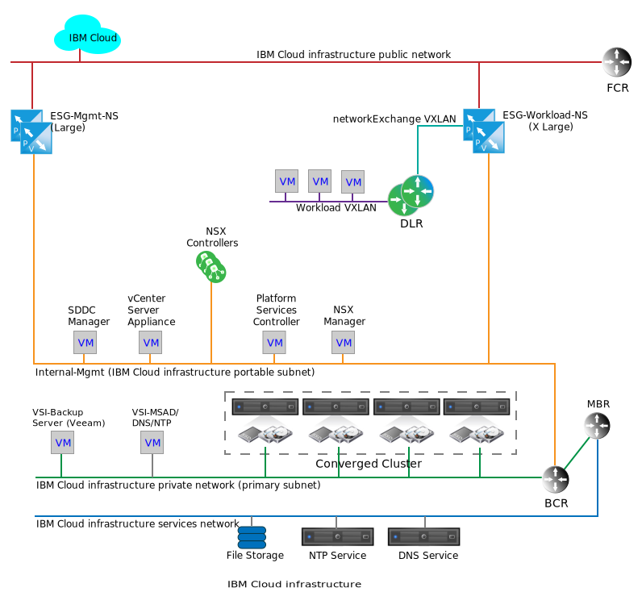
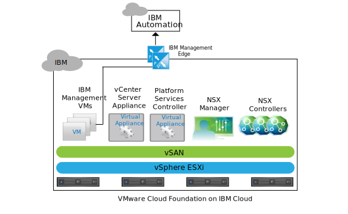

---

copyright:

  years:  2016, 2021

lastupdated: "2021-10-21"

subcollection: vmwaresolutions

---

{{site.data.keyword.attribute-definition-list}}

# Networking services on IBM Cloud
{: #nsx-networking_services}

Networking services on {{site.data.keyword.cloud}} consists of two pairs of VMware NSX® Edge Services Gateways (ESGs) for communication between the {{site.data.keyword.cloud_notm}} and either the public internet or customer on-premises network through a Virtual Private Network (VPN). These ESGs are segregated to support internal {{site.data.keyword.cloud_notm}} management function and egress traffic, ingress of customer-related network traffic.

The following graphic is a simplified network diagram, which depicts the pair of management and the pair of workload ESGs. It also shows an NSX Distributed Logical Router (DLR) and workload VXLAN. These components are intended to be an initial landing point for customer workloads without requiring the specific knowledge to set them up within NSX. A DLR is typically employed to route traffic between VMware vCenter Server® and East-West traffic, between separate layer 2 networks within the instance. This behavior is in contrast to an ESG, which functions to facilitate North-South network traffic that traverses in and out of the vCenter Server instance.

{: caption="Figure 1. Cloud networking services on vCenter Server" caption-side="bottom"}

While a single ESG might suffice for both management and customer workload traffic, the separation of management and customer traffic is a design decision made to prevent accidental misconfiguration of the management ESG.

Misconfiguration or disabling of the management ESG doesn't keep the vCenter Server instance from functioning, but disables all portal management functions.
{: note}

## IBM management services NSX Edge
{: #nsx-networking_services-mgmt-serv-nsx-edge}

The IBM management ESG is a dedicated NSX edge services cluster for {{site.data.keyword.cloud_notm}} management network traffic only. It isn't intended for traffic traversal of any component that is not deployed and managed by vCenter Server automation.

The management ESG provides a communication path between services virtual machines (VMs) residing within vCenter Server instances and the IBM Automation infrastructure in the {{site.data.keyword.cloud_notm}}. The graphic illustrates this for vCenter Server.

{: caption="Figure 2. Management edge communications on vCenter Server" caption-side="bottom"}

As a result of the light communication between certain services VMs and their corresponding licensing and metering systems, the NSX ESGs are sized in a large configuration in an active-passive high availability (HA) pair and deployed on the management resource pool of the vCenter Server cluster. The following table provides a summary of the IBM management NSX ESG deployment.

| IBM management NSX Edge | vCPU | Memory | Disk size | Storage location |
|:----------------------- |:---- |:------ |:--------- |:---------------- |
| IBM Management NSX ESG 1 | 2 | 1 GB | 1 GB | vSAN data store or shared attached storage for management |
| IBM Management NSX ESG 2 | 2 | 1 GB | 1 GB | vSAN data store or shared attached storage for management |
{: caption="Table 1. IBM management NSX ESG specifications" caption-side="top"}

### Management services
{: #nsx-networking_services-mgmt-services}

Outbound access is required to the following services:

* Zerto Virtual Manager. If installed, Zerto requires outbound access to the internet for licensing activation and usage reporting.
* Veeam backup and replication. If installed, Veeam requires outbound access to the internet for downloading product and license updates.
* FortiGate Virtual Appliance requires outbound access to the internet for licensing activation and licensing monitoring.
* F5 BIG-IP requires outbound access to the internet for licensing activation.

### Edge interfaces
{: #nsx-networking_services-edge-interfaces}

The configuration of ESG interfaces defines what L2 networks the ESG has access to. For vCenter Server lifecycle management, it's required that specific VMs placed on the management VLAN are allowed to traverse to the public VLAN. The following interfaces are defined on deployment:

| Interface | Interface type | Connected to | Description |
|:--------- |:-------------- |:------------ |:----------- |
| Public Uplink | Uplink | **SDDC-DportGroup-External** | Public internet-facing interface |
| Private Uplink | Uplink | **SDDC-DportGroup-Mgmt** | Internal private network facing interface |
| Internal | Internal | Workload HA VXLAN | Internal interface used for ESG HA pair heartbeat; portgroup on **SDDC-Dswitch-Private** |
{: caption="Table 2. NSX ESG interface configuration" caption-side="top"}

### Subnets
{: #nsx-networking_services-subnets}

The following subnets are used for the purposes of the Management ESG:

| Interface | Interface type | IPv4 subnet type | Range | Description |
|:--------- |:-------------- |:---------------- |:----- |:----------- |
| Public Uplink | Uplink | {{site.data.keyword.cloud_notm}} portable public | /28 – renders 13 assignable IP addresses | Public internet facing interface |
| Private Uplink | Uplink | {{site.data.keyword.cloud_notm}} portable private (existing management) | /26 – renders 61 assignable IP addresses | Internal private network facing interface |
| Internal | Internal | Link local | 169.254.0.0/16 | Internal interface used for ESG HA pair communication |
{: caption="Table 3. NSX ESX IP configuration" caption-side="top"}

### Network Address Translation definitions
{: #nsx-networking_services-nat-definitions}

Network Address Translation (NAT) is employed on the Management ESG for the means of allowing network traffic to traverse between one IP address space and another. This is typically done to conserve internet routable IP addresses or to conceal internal IP addresses from public ones for security reasons. NAT is also used to allow for Transmission Control Protocol (TCP) and User Datagram Protocol (UDP) port redirection. Management traffic is always initiated from inside the vCenter Server instance, requiring that only a source NAT (SNAT) is defined on the Management ESG. An individual SNAT isn't created for each internal VM hosting a service that needs to egress from the instance.

| Applied on interface | Source IP range | Translated source IP |
|:-------------------- |:--------------- |:-------------------- |
| Public uplink | Individual IP addresses on the management portable /26 | {{site.data.keyword.cloud_notm}} portable public |
{: caption="Table 4. NSX ESG NAT configuration" caption-side="top"}

### Routing
{: #nsx-networking_services-routing}

Since services within VMs required to traverse through the Management ESG might also need to get to {{site.data.keyword.cloud_notm}} services within the customer {{site.data.keyword.cloud_notm}} private network, the following configuration is required to achieve this communication.

While it's difficult to predict which destination IP range is needed as a destination for internet facing connections, any service that is deployed by and managed by {{site.data.keyword.cloud_notm}} points to the Management ESG as its default gateway. A static route is required to force traffic across the {{site.data.keyword.cloud_notm}} BCR for the services that require external network connections.

The following configurations are recommended for any service that is using the management ESG to traverse out of a vCenter Server instance:
* The default gateway is a management ESG.
* A static route is required for internal {{site.data.keyword.cloud_notm}} destinations.

If there's a need for the service or VM to access the customer ESG, static routes must be maintained within the individual service or VM and pointed to the customer ESG.

No automatic routing protocols are configured for the Management ESG currently.

### VXLAN definitions
{: #nsx-networking_services-vlan-definitions}

The Management HA pair requires a network for the connection of the internal interfaces, which can use an existing vSwitch, port group, or VXLAN. For this design, a dedicated VXLAN is created for the HA heartbeat communication of the Management ESG HA pair.

| NSX ESG VXLAN definitions | Transport zone | Type |
|:------------------------- |:-------------- |:---- |
| Mgmt HA | transport-1 | global |
{: caption="Table 5. NSX ESG VXLAN definitions" caption-side="top"}

### Firewall rules
{: #nsx-networking_services-firewall-rules}

By default, the Management ESG is configured to deny all traffic.

**Deny:** To drop all traffic with no response when that traffic isn't allowed to traverse the firewall by any previous (higher in the order) rule or rule set. Automatic rule generation is selected to allow for control traffic to the ESG pair.

The following firewall rules are set, in addition to the automatically generated rules:

| Service | Source | Destination | Protocol | Action |
|:------- |:------ |:----------- |:-------- |:------ |
| Zerto  | Zerto Management VM | Any | Port 443 | Allow |
| Veeam  | Veeam Backup and Replication VM | Any | Port 443 | Allow |
| FortiGate Virtual Appliance | Service VMs | Any | Port 443 | Allow |
| F5 BIG-IP | Service VMs | Any | Port 443 | Allow |
| Any | Any | Any | Any | Deny |
{: caption="Table 6. NSX ESG firewall configuration" caption-side="top"}

## IBM workload NSX edge
{: #nsx-networking_services-wkld-nsx-edge}

The IBM workload ESG is part of a simple topology that is intended for workload network communication. The following section describes the design intent of where to attach workloads to a network within a vCenter Server instance. This is a starting point for attaching on-premises networks and IP spaces to a particular vCenter Center instance and is the basis for a true Hybrid Cloud architecture.

A customer network that is attached to both the public and private {{site.data.keyword.cloud_notm}} networks allows for workload access to and from internet facing traffic. The network also allows for a site-to-site VPN to be created from either public or private {{site.data.keyword.cloud_notm}} networks. This allows for drastically decreased time to value regarding connecting to on-premises networks since it can take months to bring up a dedicated wide area network (WAN) due to customer security requirements. However, after a dedicated link is in place, you can flip the VPN over to traverse that link. This action doesn't affect the overlay network inside the VPN tunnel or within the vCenter Server instance. After this is done, the public interface for the workload ESG can be removed if needed from a security perspective.

The topology in the following figure consists of the following NSX components:
* NSX Edge appliance (ESG)
* Distributed Logical Router (DLR)
* VXLAN (L2 over L3)

{: caption="Figure 3. Example network flow diagram" caption-side="bottom"}

### Edge interfaces for the IBM workload NSX edge
{: #nsx-networking_services-edge-interfaces-workload}

As with the management ESG, the configuration of ESG interfaces defines what L2 networks the ESG has access to. Part of the design intent of the workload topology is to achieve a software-defined networking (SDN) overlay to isolate workloads from the underlying {{site.data.keyword.cloud_notm}} address space. This design is the basis for achieving BYOIP design. Therefore, the following interfaces are defined on deployment.

| Interface | Interface type | Connected to | Description |
|:--------- |:-------------- |:------------ |:----------- |
| Public uplink | Uplink | SDDC-DportGroup-External | Public internet-facing interface |
| Private uplink | Uplink | SDDC-DportGroup-Mgmt | Internal private network-facing interface |
| Transit uplink | Uplink | Workload-Trasit | Transit VXLAN between the workload ESG and the workload DLR |
| Internal | Internal | Workload HA VXLAN | Internal interface used for ESG HA pair heartbeat |
{: caption="Table 7. Workload Edge interface configuration" caption-side="top"}

In this design, a DLR is employed to allow for potential East-West routing between local workload connected L2 networks. As this topology is intended to be a simple example, only one L2 network that is intended for workloads is described. Adding more security zones can be achieved by adding more VXLANs attached to new interfaces on the DLR. The following table shows the DLR interfaces to configure:

| Interface | Interface type | Connected to | Description |
|:--------- |:-------------- |:------------ |:----------- |
| Transit uplink | Uplink | Workload-Transit | Transit VXLAN between the workload ESG and the workload DLR |
| Workload uplink | Uplink | Workload | VXLAN for Workload connections |
| Internal | Internal | Workload HA VXLAN | Internal interface used for ESG HA pair heartbeat |
{: caption="Table 8. DLR interfaces" caption-side="top"}

### Subnets for the IBM workload NSX edge
{: #nsx-networking_services-subnets-workload}

The following subnets are used for the purposes of the Workload ESG:

| Interface | Interface type | IPv4 subnet type | Range | Description |
|:--------- |:-------------- |:----------------- |:----- |:----------- |
| Public uplink (ESG) | Uplink | {{site.data.keyword.cloud_notm}} portable public | /28 – renders 13 assignable IP addresses | Public internet-facing interface (customer can order more IP addresses separately) |
| Private uplink (ESG) | Uplink | {{site.data.keyword.cloud_notm}} portable private (existing management) | /26 – renders 61 assignable IP addresses | Internal private network-facing interface |
| Internal (ESG and DLR) | Internal | Link local | 169.254.0.0/16 | Internal interface used for ESG HA pair communication |
| Transit uplink (ESG and DLR) | Uplink | Assigned by customer | TBD | Transit network connection for ESG to DLR |
| Workload (DLR) | Uplink | Assigned by customer | TBD | Workload subnet |
{: caption="Table 9. DLR and Workload ESG IP configuration" caption-side="top"}

### NAT definitions for the IBM workload NSX edge
{: #nsx-networking_services-nat-definitions-nsx-edge}

NAT is employed on the Workload ESG for the means of allowing network traffic to traverse between one IP address space and another. For the workload ESG, NAT is required not only to allow for communication to internet destinations, but also to communicate to any {{site.data.keyword.cloud_notm}} sourced IP ranges. For this design, workload traffic is allowed to exit to the internet, but not to the management or any {{site.data.keyword.cloud_notm}} networks. As such, only a SNAT need be defined on the Workload ESG. The entire workload portable subnet is configured to traverse through the SNAT.

While it is possible to use NAT to allow for workload communication across multiple instances of vCenter Server, doing this becomes impractical when many workloads need to be connected across instances. For examples of using advanced NSX capabilities to create an L2 overly transit network across vCeter Server instances, see [Multi-site architecture](/docs/vmwaresolutions?topic=vmwaresolutions-nsx-multi_site).

| Applied on interface | Source IP range | Translated source IP | NAT Enabled or Disabled |
|:-------------------- |:--------------- |:-------------------- |:----------------------- |
| Public uplink (Workload ESG) | Customer defined | {{site.data.keyword.cloud_notm}} portable public IP | Customer defined (default disabled) |
{: caption="Table 10. Workload ESG NAT rules" caption-side="top"}

### Routing for the IBM workload NSX edge
{: #nsx-networking_services-routing-wkld}

Within this design, the only requirement for workloads that traverse the DLR to the workload ESG is to access the internet. The Workload ESG needs to understand the path to the workload VXLAN and any future workload VXLAN/subnets created behind the DLR. While this can be achieved through static routes on the ESG, the intent of the workload topology is that of a demonstrated best practice design. Therefore, Open Shortest Path First (OSPF) is configured between the Workload ESG and the downstream DLR.

For more information about the configuration, see [Configure OSPF Protocol](https://docs.vmware.com/en/vCloud-Director/9.7/com.vmware.vcloud.tenantportal.doc/GUID-238A6AFB-9004-4AED-8015-FEB2B274C367.html).

| Area | OSPF type | OSPF interface IP | OSPF authentication |
|:---- |:--------- |:----------------- |:------------------- |
| 51 | stub | Assign an IP for each the DLR and ESG on the transit RFC1918 network | None |
{: caption="Table 11. Dynamic routing" caption-side="top"}

### Firewall rules for the IBM workload NSX edge
{: #nsx-networking_services-firewall-wkld}

By default, the Workload ESG is configured to deny all traffic.

**Deny:** To drop all traffic with no response when that traffic isn't allowed to traverse the firewall by any previous (higher in the order) rule or rule set. Automatic rule generation is selected to allow for control traffic to the ESG pair.

The following firewall rules are set, in addition to the automatically generated rules.

| Service | Source | Destination | Protocol | Action |
|:------- |:------ |:----------- |:-------- |:------ |
| Workloads | Workload subnet | Any | Any | Allow |
| Any | Any | Any | Any | Deny |
{: caption="Table 12. Workload ESG firewall rules" caption-side="top"}

### VXLAN definitions for the IBM workload NSX edge
{: #nsx-networking_services-vxlan-definitions}

The Workload topology ESG and DLR HA pairs require L2 segments (VXLAN) for the connection of the internal interfaces, data transit between the two, and for workloads.

| VXLAN name | vCenter Server transport zone | Type |
|:---------- |:----------------------------- |:---- |
| Workload HA | transit-1 | Global |
| Workload transit | transit-1 | Global |
| Workload | transit-1 | Global |
{: caption="Table 13. Workload ESG internal interfaces" caption-side="top"}

### ESG DLR settings for the IBM workload NSX edge
{: #nsx-networking_services-esg-dlr-sett}

By default, logging is enabled on all new NSX Edge appliances. The default logging level is NOTICE.

**Next topic:** [Multi-site architecture](/docs/vmwaresolutions?topic=vmwaresolutions-nsx-multi_site)

## Related links
{: #nsx-networking_services-related}

* [NSX Edge Services Gateway design](/docs/vmwaresolutions?topic=vmwaresolutions-nsx_design)
