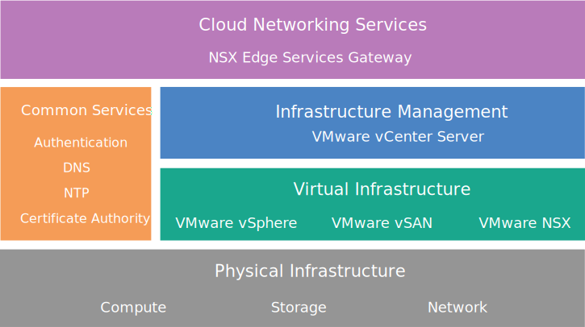

---

copyright:

  years:  2016, 2018

lastupdated: "2018-10-01"

---

# NSX Edge Services Gateway design

The NSX Edge Services Gateway on {{site.data.keyword.cloud}} solution provides VMware technology that is deployed within {{site.data.keyword.CloudDataCents_notm}} across the globe. {{site.data.keyword.vmwaresolutions_short}} provides two solution architectures that are related to the NSX Edge Services Gateway.

## Internal architecture design

The internal architecture specifies the deployment of the necessary NSX Edge components in a resource pool in either a VMware Cloud Foundation converged cluster or a VMware vCenter Server cluster.

**Note:** VMware vSAN is optional in the following figure.

Figure 1. Cloud Networking Services on {{site.data.keyword.cloud_notm}}

## Dedicated architecture design

The dedicated architecture deploys the necessary NSX Edge components in a separate two-node vSphere cluster that is dedicated for the use of the NSX Edge, providing critical interaction with the physical network infrastructure. The dedicated architecture has the following characteristics and functions:

* Provides on-ramp and off-ramp connectivity to physical networks. For example, North-South L3 routing on NSX Edge virtual appliances.
* Allows for communication with physical devices that are connected to VLANs in the physical networks through NSX L2 bridging and hosts the control virtual machine (VM) for Distributed Logical Router (DLR) routing.
* Can have centralized logical or physical services. For example, a firewall, load balancers, Virtual Private Network (VPN) monitoring components, log insight VMs.
* NSX Controllers can be hosted in an Edge cluster when a dedicated vCenter is used to manage the compute and edge resources.
* Edge cluster resources have an anti-affinity requirement to protect the active standby configuration or to maintain the bandwidth availability during failure.

## IBM Cloud Private IP address ranges and Bring Your Own IP address ranges

The RFC1918 private IP address range specifically reserves the use of network ranges for organization internal use, never for the internet. The {{site.data.keyword.cloud_notm}} physical network infrastructure uses a specific RFC1918 private address space, 10.x.x.x/8, across all worldwide locations. These IP address ranges do not overlap across customer accounts or within an {{site.data.keyword.cloud_notm}} customer account. Within a customer account, any {{site.data.keyword.cloud_notm}} allocated private IP address space can, with VLAN Spanning enabled, route to any other {{site.data.keyword.cloud_notm}} private IP address range in any {{site.data.keyword.CloudDataCents_notm}}.

While this makes it simple to set up a worldwide connected infrastructure within your account, the fixed IP address space can be problematic when you want to extend your data center into {{site.data.keyword.cloud_notm}} through routing when using the same private address space as {{site.data.keyword.cloud_notm}}. The solution is to use NSX to create an overlay topology on the Cloud Foundation or vCenter Server infrastructure, isolating your Bring Your Own IP (BYOIP) address space from interacting with {{site.data.keyword.cloud_notm}} assigned private IP address space. NSX is capable of providing an L2 VPN to span internal BYOIP address space within the tunnel across external, possibly overlapping, IP address spaces.

### Related links

* [Solution overview](../solution/solution_overview.html)
