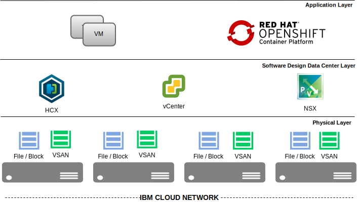

---

copyright:

  years:  2016, 2022

lastupdated: "2022-02-22"

subcollection: vmwaresolutions

---

{{site.data.keyword.attribute-definition-list}}

# VMware Solutions and Red Hat OpenShift overview
{: #openshift-runbook-runbook-intro}

{{site.data.keyword.vmwaresolutions_full}} includes fully automated, rapid deployments of VMware vCenter Server® in the {{site.data.keyword.cloud_notm}}. These offerings complement the on-premises infrastructure and allow existing and future workloads to run in the {{site.data.keyword.cloud_notm}} without conversion by using the same tools, skills, and processes they use on-premises. For more information, see [Virtualization for extending virtualized private cloud](https://www.ibm.com/cloud/architecture/architectures/virtualizationArchitecture){: external}.

Red Hat OpenShift for VMware Solutions is a reference architecture and a manual build process to deploy a Red Hat OpenShift cluster 4.7 on to an existing vCenter Server instance. The components of Red Hat OpenShift cluster are deployed as virtual machines (VMs) and appliances by using NSX software-defined networking.

* Reference architecture - [vCenter Server and Red Hat OpenShift architecture overview](/docs/vmwaresolutions?topic=vmwaresolutions-vcs-openshift-intro)
* Build process - This document. The process and steps that are needed to install Red Hat OpenShift 4.7 on to an existing vCenter Server instance.

{: caption="Figure 1. VMware Solutions and OpenShift" caption-side="bottom"}

## Red Hat OpenShift overview
{: #openshift-runbook-runbook-intro-rhos-overview}

The Red Hat OpenShift platform is a platform that is designed to orchestrate containerized workloads across a cluster of nodes. The platform uses Kubernetes as the core container orchestration engine, which manages the Docker container images and their lifecycle.

The operating system of the nodes is Red Hat Enterprise Linux® CoreOS, which is the container host version of Red Hat Enterprise Linux (RHEL) and features an RHEL kernel with SELinux enabled by default. RHEL CoreOS includes kubelet, which is the Kubernetes node agent, and the CRI-O container runtime, which is optimized for Kubernetes. In Red Hat OpenShift 4.7, you must use RHEL CoreOS for all control plane machines, but you can use Red Hat Enterprise Linux (RHEL) as the operating system for compute, or worker machines. If you choose to use RHEL workers, you must perform more system maintenance than if you use RHEL CoreOS for all of the cluster machines.

The reference architecture and this build process use RHEL CoreOS. The nodes must have direct Internet access to:
* Access the OpenShift Infrastructure Providers page to download the installation program.
* Access quay.io to obtain the packages that are required to install the cluster.
* Obtain the packages that are required to perform cluster updates.
* Access Red Hat’s software as a service page to perform subscription management.

In the reference architecture, the following components are installed and configured in the build process:
* Bastion node - This RHEL VM acts as a "jump-server" on the overlay network to enable the build process. It is accessed by using SSH through the private network. It also hosts a webserver to help the build process of the cluster.
* Bootstrap node - As each node in the cluster requires information about the cluster when it is provisioned, a temporary bootstrap node is used. The bootstrap node creates the control plane nodes that make up the control plane. The control plane nodes then create the worker nodes. After the cluster initializes, the bootstrap node can be destroyed.
* Control-plane nodes - These nodes run services that are required to control the Kubernetes cluster. They contain more than just the Kubernetes services for managing the cluster. The terms "primary" and "control-plane" are used interchangeably.
* Compute nodes - In a Kubernetes cluster, the compute nodes are where the workloads are run. The compute nodes advertise their capacity to the control-plane nodes.
* DNS - A correct DNS setup is imperative for a functioning OpenShift cluster. The vCenter Server instance AD DNS server to host the required DNS records.
* Load-balancer - An NSX ESG load-balancer service is used to front end the Red OpenShift APIs, both internal and external, and the OpenShift router. The load balancer is configured so that Port 6443 and 22623 point to the bootstrap and control plane nodes, while ports 80 and 443 are configured to point to the worker nodes.
* Webserver - A web server is needed to hold the ignition configurations and installation images for the installation of RHEL CoreOS. NGINX is installed on the bastion node to provide this function.
* Persistent Storage - To support the persistent storage requirements, the vSphere cloud provider is used to provide storage volumes up to the OpenShift platform backed by any supported vSphere datastore that is, VMware® vSAN™, NFS, or iSCSI. OpenShift can deliver storage through static or dynamic provisioning. The preferred method is to use dynamic provisioning. Dynamic provisioning automatically triggers the creation of the persistent volume and its backend VMDK file. For dynamic provisioning, a default StorageClass for the OpenShift cluster is defined and a PersistentVolumeClaim in Kubernetes is created.

Access to the environment for this build process is done through a "jump-server" or remote device:
* You can have a Microsoft Windows® or Linux Virtual Server Instance (VSI) installed alongside your vCenter Server instance to provide administrative access to the environment. This VSI has internet access for the remote connection to the server and for downloading files. It also has private network access for connecting to vCenter and to the bastion node.
* You can have a remote device (laptop or desktop) connected through the {{site.data.keyword.cloud_notm}} SSL VPN to the {{site.data.keyword.cloud_notm}} Private network. This remote device has access to the internet to download the required files and can connect to vCenter and the bastion node through the SSL VPN.

## Scripts overview
{: #openshift-runbook-runbook-intro-scripts-overview}

This build process uses the following scripting tools and scripts:

* `govc` -  `govc` is a vSphere CLI and pre-compiled for Linux, OSX, and Windows. It is useful to complete various vCenter Server and vSphere operations from the CLI. It is used in this process to complete the following tasks:
   * Upload the ISO and OVA files to a vSphere datastore.
   * Create a persistent volume for the Red Hat OpenShift cluster to use.
* Red Hat Installer - The installer creates the Ignition files that are used by Terraform. Ignition is a first boot installer and configuration tool that is designed specifically for CoreOS Container Linux to partition disks, format partitions, writing files and configuring users. On first boot, Ignition reads its configuration from a remote URL and applies the configuration to the VM.
* Terraform - Terraform is a tool that codifies APIs into declarative configuration files. It uses a "provider" to interact with the infrastructure. A `.tf` file is used to describe the infrastructure as code. A `.tvars` file is used to store the variables for the deployment. The `main.tf` file holds the build instructions.
* PowerShell is used on the AD DNS server to create the DNS entries.
* PowerShell Core is available for Windows, Linux, and macOS systems. This tool is optional and it can be used on the jump-server or remote device to enable the use of PowerCLI. For more information, see [PowerShell Core](https://github.com/PowerShell/PowerShell){: external}.
* PowerCLI - PowerCLI is a PowerShell interface for managing VMware vSphere®. You can automate all aspects of vSphere management, including network, storage, VMs, and guest OS. This tool is optional and it can be used on the jump-server or remote device to help the preparation of the vCenter Server instance. These steps can be done by using the GUI. For more information about how to install this tool, see [Install PowerCLI](https://docs.vmware.com/en/VMware-vSphere/6.7/com.vmware.esxi.install.doc/GUID-F02D0C2D-B226-4908-9E5C-2E783D41FE2D.html){: external}.
* PowerNSX - PowerNSX is a PowerShell module that abstracts the VMware NSX API to a set of easily used PowerShell functions. This tool is optional and it can be used on the jump-server or remote device to help the preparation of NSX on the vCenter Server instance. These steps can be done by using the GUI. For more information, see [PowerNSX](https://github.com/vmware/powernsx){: external}.

## Build process overview
{: #openshift-runbook-runbook-intro-build-process-overview}

This documentation describes the process to install Red Hat OpenShift v4.7 on to an existing vCenter Server instance. The process installs and configures:

* One bastion node.
* One bootstrap node.
* Three control plane nodes.
* Three worker nodes.

The deployment approach is described in the following phases:

* Phase 1 - vCenter Server instance preparation:
   * Using the {{site.data.keyword.vmwaresolutions_full}} console, [order a vCenter Server instance](/docs/vmwaresolutions?topic=vmwaresolutions-vc_orderinginstance-procedure), which can include NFS or vSAN storage. You can use an existing instance if the instance has enough capacity.
   * Using the {{site.data.keyword.cloud_notm}} console, [order more private and public subnets](/docs/subnets?topic=subnets-getting-started) to be used by the OpenShift cluster.
   * Download RHEL 8.0 ISO for the OS of the bastion or deployment node and the Red Hat Enterprise Linux CoreOS (RHCOS) OVA image. This step is described in [Prerequisites for installation](/docs/vmwaresolutions?topic=vmwaresolutions-openshift-runbook-runbook-prereq-intro).
   * Using govc, the OVA and ISO are uploaded to a datastore on the vCenter Server instance. This step is described in [Prerequisites for installation](/docs/vmwaresolutions?topic=vmwaresolutions-openshift-runbook-runbook-prereq-intro).
   * Add logical switches - Two logical switches are created; OpenShift-LS the network the OpenShift VMs are deployed onto and OpenShift-DLR-Transit, the uplink between the DLR and the Edge.
   * Add an ESG - An external services gateway (ESG) is a virtual appliance that provides North-South routing, and other network functions. In this architecture, the ESG is used for; routing, NAT, firewall, and load-balancing. As the ESGs are configured as active - passive pair, DRS anti-affinity rules are used to ensure that NSX Edges do not run on the same host. Static routes are used to direct traffic to either the internet or the IBM private Network. This step is described in [OpenShift NSX Edge configuration](/docs/vmwaresolutions?topic=vmwaresolutions-openshift-runbook-runbook-nsxedge-intro).
   * Add a DLR - A distributed logical router (DLR) is a virtual appliance that contains the routing control plane and it distributes the data plane in kernel modules to each hypervisor host. The DLR provides East-West distributed routing and is the default gateway for the OpenShift VMs that will be installed on the OpenShift logical switch. The NSX DLR virtual machines are configured as an active - passive pair, and vSphere Distributed Resource Scheduler (DRS) anti-affinity rules are created to ensure that the DLR VMs do not run on the same host. This step is described in [OpenShift NSX DLR configuration](/docs/vmwaresolutions?topic=vmwaresolutions-openshift-runbook-runbook-nsxdlr-intro).
   * Update DNS - The infrastructure DNS, provisioned with the vCenter Server instance is updated with the names and IP addresses for the OpenShift components by using a PowerShell script. This step is described in [VMware Solutions DNS configuration](/docs/vmwaresolutions?topic=vmwaresolutions-openshift-runbook-runbook-dns-intro).
* Phase 2 - Red Hat OpenShift installation. These steps are described in [Red Hat OpenShift 4.7 user provider infrastructure installation](/docs/vmwaresolutions?topic=vmwaresolutions-openshift-runbook-runbook-install-intro).
    * A Red Hat virtual machine, the bastion node, is provisioned to run the OpenShift installer and to host an HTTP Server. It is registered with Red Hat by using your subscription, and the OpenShift installer is downloaded.
    * On the bastion node, the `install-config.yaml` file is populated with the required OpenShift parameters and OpenShift ignition is used to generate a number of files used for the installation of the bootstrap, control plane, and worker machines.
    * Terraform, on the bastion node, uses the files that are created by Ignition to create the OpenShift VMs.
* Phase 3 - Post deployment activities - Configure a persistent volume for use by the OpenShift cluster. This step is described in [Red Hat OpenShift 4.7 additional configuration](/docs/vmwaresolutions?topic=vmwaresolutions-openshift-runbook-runbook-config-intro).

**Next topic:** [Prerequisites for installation](/docs/vmwaresolutions?topic=vmwaresolutions-openshift-runbook-runbook-prereq-intro)

## Related links
{: #vcs-openshift-runbook-intro-related}

* [What is OpenShift?](https://www.ibm.com/cloud/blog/what-is-openshift){: external}
* [OpenShift 4 Release Update](https://www.youtube.com/watch?v=YJvTu8jC6CU){: external}
* [Installing a cluster on vSphere with user-provisioned infrastructure](https://docs.openshift.com/container-platform/4.7/installing/installing_vsphere/installing-vsphere.html){: external}
* [Getting started with IBM Cloud Virtual Private Networking](/docs/iaas-vpn?topic=iaas-vpn-getting-started)
