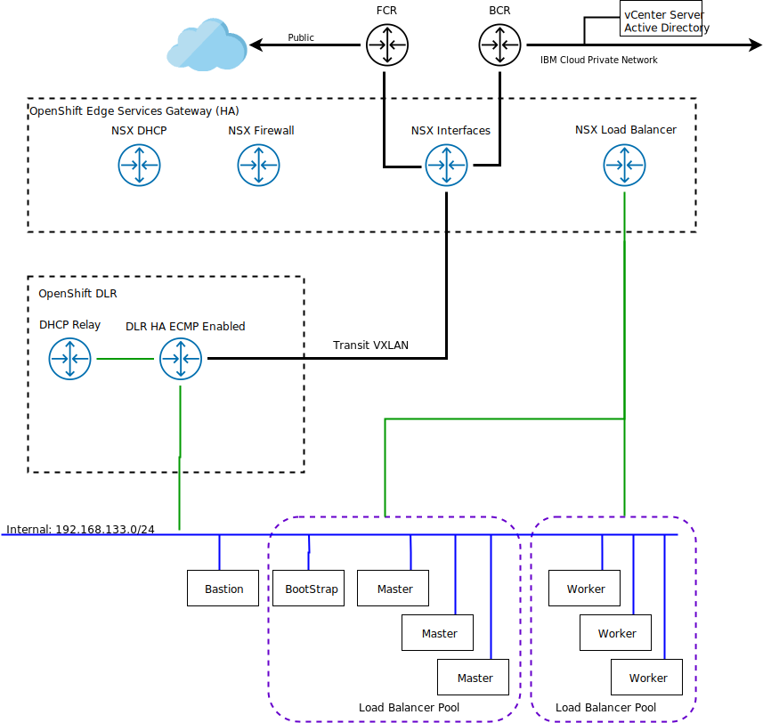

---

copyright:

  years:  2019

lastupdated: "2019-10-16"

subcollection: vmware-solutions


---

{:external: target="_blank" .external}
{:tip: .tip}
{:note: .note}
{:important: .important}

# Red Hat OpenShift NSX Edge configuration
{: #openshift-runbook-runbook-nsxedge-intro}

This section details the NSX components that are used to support the OpenShift 4.1 environment. To use this information, you must understand how to create these components and add the configuration. Review [Add an Edge Services Gateway](https://docs.vmware.com/en/VMware-NSX-Data-Center-for-vSphere/6.4/com.vmware.nsx.install.doc/GUID-B9A97F20-4996-4E16-822C-0B98DDE70571.html){:external}. PowerNSX commands are provided if you would want to use this method.

{: caption="Figure 1. OpenShift 4.1 networking" caption-side="bottom"}

## NSX ESG
{: #openshift-runbook-runbook-nsxedge-config}

The first component that is configured within the {{site.data.keyword.vmwaresolutions_full}} with Red Hat OpenShift is a pair of NSX Edge appliances. The NSX Edge appliances are configured as an Active/Passive pair of X-Large NSX Edge devices.

As part of the configuration process, the NSX Edge is connected to the IBM Cloud Public and Private subnets that are ordered for the Red Hat OpenShift cluster.

| Component | Configuration |
|-----------|---------------|
| CPU       | 6 vCPU        |
| RAM       | 8 GB          |
| Disk      | 4.5 GB VMDK resident on shared storage with 4 GB swap |
{: caption="Table 1. NSX Edge deployment" caption-side="top"}

Since the NSX Edges are configured as active/passive in either the internal or dedicated deployment, vSphere Distributed Resource Scheduler (DRS) anti-affinity rules must be created by the user to ensure that NSX Edges do not run on the same host as their respective peer appliance.

| Field     | Value         |
|-----------|---------------|
| Name      | OpenShift-ESG |
| Type      | Separate virtual machines |
| Members   | OpenShift-ESG-0 <br> OpenShift-ESG-1 |
{: caption="Table 2. NSX Edge anti-affinity rules" caption-side="top"}

## NSX ESG interfaces
{: #openshift-runbook-runbook-nsxedge-interfaces}

The edge is deployed with an interface uplink to the IBM Cloud Public network and an interface uplink to the IBM Cloud Private network. Additionally, there is an interface for the Transit network connection to the Distributed Logical Router (DLR).

| Interface name| Interface type | IP address | Port group / Logical switch |
| --- | ---| --- | --- |
| Private Uplink | Uplink | 10.208.242.130/26 <p> 10.208.242.131/26 </p>| SDDC-DPortGroup-Mgmt |
| Public Uplink | Uplink | 169.48.73.42/29 169.48.73.43/29</p> | SDDC-DPortGroup-External |
| Transit | Internal | 192.168.100.1/24 | OpenShift-Transit  |
{: caption="Table 3. Configuration for NSX Edge - interfaces" caption-side="top"}

## NSX ESG firewall
{: #openshift-runbook-runbook-nsxedge-firewall}

Configure rules to allow communication to the internet, to the IBM Cloud network, and into the VXLAN networks.

| Firewall rule | Source | Destination | Service | Action |
| --- | --- | --- | --- | --- |
| Private Outbound | 10.208.242.128/26 | any | any | Accept |
| Public Outbound | 169.48.73.40/29 | any | any | Accept |
| OpenShift Network | 192.168.133.0/24 | any | any | Accept |
| Transit Network | 192.168.100.0/24 | any | any | Accept |
{: caption="Table 4. Configuration for NSX Edge - NSX firewalls" caption-side="top"}

## NSX ESG DHCP
{: #openshift-runbook-runbook-nsxedge-dhcp}

For the OpenShift 4.1 environment, the bootstrap, control-plane, and compute nodes require access to a DHCP server to obtain an initial address on the network, which provides access to download the bootstrap ignition file. After the initial setup, static IP addresses will be configured on the nodes by using terraform.

| DCHP pool | Value |
| --- | --- |
| Start IP | 192.168.133.50 |
| End IP | 192.168.133.100 |
| Domain Name | ocp.dallas.ibm.local |
| Auto Configure DNS  | false |
| Primary Name Server  | 10.187.214.66 |
| Secondary Name Server |  |
| Default Gateway  | 192.168.133.1 |
| Subnet Mask  | 255.255.255.0 |
| Lease  | off |
| Lease Time  | 86400 |
{: caption="Table 5. Configuration for NSX Edge - DHCP pools" caption-side="top"}

## NSX ESG NAT
{: #openshift-runbook-runbook-nsxedge-nat}

Define NAT to provide a mechanism to allow the OpenShift network access to the public and private networks.

| Property | NSX NAT rule 1 | NSX NAT rule 2 | NSX NAT rule 3 |
| --- | ---- | --- | --- |
| Description| OpenShift network public outbound| OpenShift network private outbound | SSH to bastion node |
| NAT Type | SNAT | SNAT | DNAT |
| Interface | Public | Private | Private |
| Protocol | any | any |  any |
| Original Source IP/Range | 192.168.133.0/24 | 192.168.133.0/24 | 10.208.242.133 |
| Destination IP/Range | any | any | 192.168.100.8 |
| Translated Source IP/Range | 169.48.73.43 | 10.208.242.140 | 10.208.242.133 |
| Status | Enabled | Enabled | Enabled |
| Logging | Disable | Disabled | Disabled |
{: caption="Table 6. Configuration for NSX Edge - NAT definitions" caption-side="top"}

## NSX ESG routes
{: #openshift-runbook-runbook-nsxedge-routes}

On the edge, configure the default route to be to the public internet, then add static routes to access to the IBM Cloud Private networks.

### Global configuration
{: #openshift-runbook-runbook-nsxedge-global-config}

| Global configuration | vNIC | Gateway IP |
| :--- | --- | --- |
| Default Gateway | Public | 169.48.73.41 |
{: caption="Table 7. Configuration for NSX Edge - default gateway" caption-side="top"}

### Static routes
{: #openshift-runbook-runbook-nsxedge-static}


| Property | Network | Next Hop | Interface|
| :--- | --- | --- | --- |
| Static route 1  | 10.0.0.0/8 | 10.208.242.129 | Private |
| Static route 2  | 100.0.0.0/8 | 10.208.242.129 | Private |
| Static route 3  | 161.26.0.0/16 | 10.208.242.129 | Private |
| Static route 4  | 192.168.133.0/24 | 192.168.100.1 | Private |
{: caption="Table 8. Configuration for NSX Edge - static routes" caption-side="top"}

## NSX load balancers
{: #openshift-runbook-runbook-nsxedge-loadbalancers}

Within the OpenShift environment, two load balancers are required, one for accessing the control-plane nodes and the other for accessing the compute nodes. The NSX Edge is enabled to use load balancing and is configured with application profiles that use a certificate for inbound connection from the source. The NSX Edge is also configured with load-balancing pools to point to the OpenShift control-plane nodes and the OpenShift compute nodes. Additionally, a virtual server is created with a virtual IP address (VIP) on the private interface with rules that connect the pools with the VIP.

### Application profile
{: #openshift-runbook-runbook-nsxedge-loadbalancers-profile}

| Name | Type | Persistence |
| --- | --- | --- |
| TCP-Source-Profile | TCP  | Source IP |
{: caption="Table 9. Configuration for NSX Edge - application profile" caption-side="top"}

### Pools
{: #openshift-runbook-runbook-nsxedge-loadbalancers-pools}

| Field | API Pool 6443 | API Pool 22623 | App Pool 80 | App Pool 443 |
| --- | --- | --- | --- | --- |
| Name | api-pool-6443 | api-pool-22623 | app-pool-80 | app-pool-443 |
| Algorithm | ROUND-ROBIN | ROUND-ROBIN | ROUND-ROBIN | ROUND-ROBIN |
| Monitor | default_tcp_monitor | default_tcp_monitor | default_tcp_monitor | default_tcp_monitor |
|Members | control-plane-0 <br> control-plane-1 <br> control-plane-2 <br>bootstrap-0 | control-plane-0 <br> control-plane-1 <br> control-plane-2 <br>bootstrap-0 |compute-0 <br> compute-1 <br> compute-2 | compute-0 <br> compute-1 <br> compute-2 |
{: caption="Table 10. Configuration for NSX Edge - pools" caption-side="top"}

### Virtual servers
{: #openshift-runbook-runbook-nsxedge-loadbalancers-vip}

| Field | LB 6443 | LB 22623  | LB 80 | LB 443 |
|--- | --- | --- | --- | --- |
| Name | api-6443-lb | api-22623-lb | apps-80-lb | apps-443-lb |
| Description | API / API-INT | API / API-INT | Application HTTP | Application HTTPs |
| Default Pool | pool-1 | pool-2 | pool-3 | pool-4 |
| IP address | 10.208.242.132 | 10.208.242.132| 10.208.242.131 | 10.208.242.131 |
| Protocol | tcp | tcp | tcp | tcp |
| Port | 6443 | 22623 | 80 | 443 |
{: caption="Table 11. VIP configuration for NSX Edge - virtual servers" caption-side="top"}

## PowerNSX commands
{: #openshift-runbook-runbook-nsxedge-powernsx}

This section provides example PowerNSX commands that you can use to automate the provisioning and configuration of the NSX ESG.

Use the following table to document the parameters you will need for your deployment, examples are shown that match the deployment described previously.

| Parameters | Example | Your Deployment |
| --- | --- | --- |
| vCenter Server IP address | | |
| vCenter User | | |
| vCenter Password | | |
| AD DNS Server IP address | 10.187.214.66 | |
| Transit Logical Switch| OpenShift-Transit | |
| OpenShift Network | 192.168.133.0/24 |  |
| Transit Network | 192.168.100.0/24 |
| ESG Transit | 192.168.100.1 | |
| DLR Transit | 192.168.100.2 | |
| ESG Name | OpenShift-ESG | |
| vCenter Server instance Cluster | cluster1 | |
| vCenter Server instance Datastore | vsanDatastore | |
| Private Portable Subnet | 10.208.242.128/26| |
| BCR IP address | 10.208.242.129 | |
| ESG Private Primary | 10.208.242.130 |  |
| ESG Private Secondary 1 | 10.208.242.131 |  |
| ESG Private Secondary 2 | 10.208.242.132 |  |
| ESG Private Secondary 3 | 10.208.242.133 |  |
| Public Portable Subnet | 169.48.73.40/29 |  |
| FCR IP address | 169.48.73.41| |
| ESG Public Primary | 169.48.73.42 |  |
| ESG Public Secondary 1 | 169.48.73.43 |  |
| ESG Public Secondary 2 | 169.48.73.44 |  |
| ESG UserName | admin | |
| ESG Password | VMware12345! | |
{: caption="Table 12. PowerNSX DLR Parameters" caption-side="top"}

```powernsx
# Connect to NSX Manager
Connect-NsxServer -vCenterServer <IP_Address> -User <UserName> -Password '<Password>'

# Create Edge interface specification and create Edge
$priUplink = New-NsxEdgeInterfaceSpec -index 0 -Name "Private Uplink" -Type Uplink -ConnectedTo (Get-VDPortgroup SDDC-DPortGroup-Mgmt) -PrimaryAddress 10.208.242.130 -SubnetPrefixLength 26 -SecondaryAddresses 10.208.242.131,10.208.242.132,10.208.242.133
$pubUplink = New-NsxEdgeInterfaceSpec -index 1 -Name "Public Uplink" -Type Uplink -ConnectedTo (Get-VDPortgroup SDDC-DPortGroup-External) -PrimaryAddress 169.48.73.42 -SubnetPrefixLength 29 -SecondaryAddresses 169.48.73.43,169.48.73.44
$transit = New-NsxEdgeInterfaceSpec -index 2 -Name "Transit" -Type internal -ConnectedTo (Get-NsxLogicalSwitch OpenShift-Transit) -PrimaryAddress 192.168.100.1 -SubnetPrefixLength 24
New-NsxEdge -Name OpenShift-ESG -Cluster (Get-Cluster cluster1) -EnableHA -Datastore (Get-Datastore vsanDatastore) -Username admin -Password VMware12345! -FormFactor xlarge -Interface $priUplink,$pubUplink,$transit

# Set default gateway and add static routes to the ESG
Get-NsxEdge OpenShift-ESG | Get-NsxEdgeRouting | Set-NsxEdgeRouting -DefaultGatewayAddress 169.48.73.41 -DefaultGatewayVnic 1 -DefaultGatewayDescription "Public traffic"-confirm:$false
Get-NsxEdge OpenShift-ESG | Get-NsxEdgeRouting | New-NsxEdgeStaticRoute -Network 10.0.0.0/8 -NextHop 10.208.242.129 -Vnic 0 -Description "Private traffic" -confirm:$false
Get-NsxEdge OpenShift-ESG | Get-NsxEdgeRouting | New-NsxEdgeStaticRoute -Network 100.0.0.0/8 -NextHop 10.208.242.129 -Vnic 0 -Description "Private traffic" -confirm:$false
Get-NsxEdge OpenShift-ESG | Get-NsxEdgeRouting | New-NsxEdgeStaticRoute -Network 161.26.0.0/16 -NextHop 10.208.242.129 -Vnic 0 -Description "Private traffic" -confirm:$false
Get-NsxEdge OpenShift-ESG | Get-NsxEdgeRouting | New-NsxEdgeStaticRoute -Network 192.168.100.0/24 -NextHop 192.168.133.2 -Vnic 2 -Description "OpenShift Traffic" -confirm:$false

# Configure ESG firewall rules
Get-NsxEdge OpenShift-ESG | Get-NsxEdgeFirewall | New-NsxEdgeFirewallRule -Name "Private Outbound" -Source 10.208.242.128/26 -Service any -Action accept
Get-NsxEdge OpenShift-ESG | Get-NsxEdgeFirewall | New-NsxEdgeFirewallRule -Name "Public Outbound" -Source 169.48.73.40/29 -Service any -Action accept
Get-NsxEdge OpenShift-ESG | Get-NsxEdgeFirewall | New-NsxEdgeFirewallRule -Name "OpenShift Network" -Source 192.168.133.0/24 -Service any -Action accept
Get-NsxEdge OpenShift-ESG | Get-NsxEdgeFirewall | New-NsxEdgeFirewallRule -Name "Transit Network" -Source 192.168.100.0/24 -Service any -Action accept
Get-NsxEdge OpenShift-ESG | Get-NsxEdgeFirewall | New-NsxEdgeFirewallRule -Name "Private inbound to OpenShift" -Source 10.0.0.0/8 -Destination 10.208.242.131 -Service tcp/80,tcp/443 -Action accept
Get-NsxEdge OpenShift-ESG | Get-NsxEdgeFirewall | New-NsxEdgeFirewallRule -Name "SSH inbound to Bastion" -Source 10.0.0.0/8 -Destination 10.208.242.132 -Service tcp/22 -Action accept

# Configure ESG NAT rules
Get-NsxEdge OpenShift-ESG | Get-NsxEdgeNat | Set-NsxEdgeNat -enabled -confirm:$false
Get-NsxEdge OpenShift-ESG | Get-NsxEdgeNat | New-NsxEdgeNatRule -Vnic 1 -OriginalAddress 192.168.133.0/24 -TranslatedAddress 169.48.73.43 -Action snat -Protocol any -OriginalPort any -TranslatedPort any -Enabled -Description "OpenShift Network Public Outbound"
Get-NsxEdge OpenShift-ESG | Get-NsxEdgeNat | New-NsxEdgeNatRule -Vnic 0 -OriginalAddress 192.168.133.0/24 -TranslatedAddress 10.208.242.131 -Action snat -Protocol any -OriginalPort any -TranslatedPort any -Enabled -Description "OpenShift Network Private Outbound"
Get-NsxEdge OpenShift-ESG | Get-NsxEdgeNat | New-NsxEdgeNatRule -Vnic 0 -OriginalAddress 10.208.242.133 -TranslatedAddress 192.168.133.8 -Action dnat -Protocol any -OriginalPort any -TranslatedPort any -Enabled -Description "SSH to bastion node"

# Configure Load-balancer pool members
get-nsxedge OpenShift-ESG | get-nsxloadbalancer | Set-NsxLoadBalancer -Enabled
$poolMember1 = New-NsxLoadBalancerMemberSpec -name bootstrap-0 -IpAddress 192.168.133.9 -Port 6443
$poolMember2 = New-NsxLoadBalancerMemberSpec -name control-plane-0 -IpAddress 192.168.133.10 -Port 6443
$poolMember3 = New-NsxLoadBalancerMemberSpec -name control-plane-1 -IpAddress 192.168.133.11 -Port 6443
$poolMember4 = New-NsxLoadBalancerMemberSpec -name control-plane-2 -IpAddress 192.168.133.12 -Port 6443
$poolMember5 = New-NsxLoadBalancerMemberSpec -name bootstrap-0 -IpAddress 192.168.133.9 -Port 22623
$poolMember6 = New-NsxLoadBalancerMemberSpec -name control-plane-0 -IpAddress 192.168.133.10 -Port 22623
$poolMember7 = New-NsxLoadBalancerMemberSpec -name control-plane-1 -IpAddress 192.168.133.11 -Port 22623
$poolMember8 = New-NsxLoadBalancerMemberSpec -name control-plane-2 -IpAddress 192.168.133.12 -Port 22623
$poolMember9 = New-NsxLoadBalancerMemberSpec -name compute-0 -IpAddress 192.168.133.13 -Port 80
$poolMember10 = New-NsxLoadBalancerMemberSpec -name compute-1 -IpAddress 192.168.133.14 -Port 80
$poolMember11 = New-NsxLoadBalancerMemberSpec -name compute-2 -IpAddress 192.168.133.15 -Port 80
$poolMember12 = New-NsxLoadBalancerMemberSpec -name compute-0 -IpAddress 192.168.133.13 -Port 443
$poolMember13 = New-NsxLoadBalancerMemberSpec -name compute-1 -IpAddress 192.168.133.14 -Port 443
$poolMember14 = New-NsxLoadBalancerMemberSpec -name compute-2 -IpAddress 192.168.133.15 -Port 443

# Configure Load-balancer pools
$monitor = Get-NsxEdge OpenShift-ESG | Get-NsxLoadBalancer | Get-NsxLoadBalancerMonitor default_tcp_monitor
$pool1 = Get-NsxEdge OpenShift-ESG | Get-NsxLoadBalancer | New-NsxLoadBalancerPool -name api-pool-6443 -Description "OpenShift API TCP 6443" -Transparent:$false -Algorithm Round-Robin -Monitor $monitor -Memberspec $poolMember1,$poolMember2,$poolMember3,$poolMember4
$pool2 = Get-NsxEdge OpenShift-ESG | Get-NsxLoadBalancer | New-NsxLoadBalancerPool -name api-pool-22623 -Description "OpenShift API TCP 22623" -Transparent:$false -Algorithm Round-Robin -Monitor $monitor -Memberspec $poolMember5,$poolMember6,$poolMember7,$poolMember8
$pool3 = Get-NsxEdge OpenShift-ESG | Get-NsxLoadBalancer | New-NsxLoadBalancerPool -name app-pool-80 -Description "OpenShift Application HTTP" -Transparent:$false -Algorithm Round-Robin -Monitor $monitor -Memberspec $poolMember9,$poolMember10,$poolMember11
$pool4 = Get-NsxEdge OpenShift-ESG | Get-NsxLoadBalancer | New-NsxLoadBalancerPool -name app-pool-443 -Description "OpenShift Application HTTPS" -Transparent:$false -Algorithm Round-Robin -Monitor $monitor -Memberspec $poolMember12,$poolMember13,$poolMember14

# Configure Load-balancer application profile
$appProfile = Get-NsxEdge OpenShift-ESG | Get-NsxLoadBalancer | New-NsxLoadBalancerApplicationProfile -Name TCP-Source-Profile -Type TCP -PersistenceMethod sourceip

# Configure Load-balancer VIPs
Get-NsxEdge OpenShift-ESG | Get-NsxLoadBalancer | Add-NsxLoadBalancerVip -name api-6443-lb -Description "API / API-INT" -ipaddress 10.208.242.132 -Protocol tcp -Port 6443 -ApplicationProfile $appProfile -DefaultPool $pool1 -AccelerationEnabled
Get-NsxEdge OpenShift-ESG | Get-NsxLoadBalancer | Add-NsxLoadBalancerVip -name api-22623-lb -Description "API / API-INT" -ipaddress 10.208.242.132 -Protocol tcp -Port 22623 -ApplicationProfile $appProfile -DefaultPool $pool2 -AccelerationEnabled
Get-NsxEdge OpenShift-ESG | Get-NsxLoadBalancer | Add-NsxLoadBalancerVip -name app-80-lb -Description "Application HTTP" -ipaddress 10.208.242.131 -Protocol tcp -Port 80 -ApplicationProfile $appProfile -DefaultPool $pool3 -AccelerationEnabled
Get-NsxEdge OpenShift-ESG | Get-NsxLoadBalancer | Add-NsxLoadBalancerVip -name app-443-lb -Description "Application HTTPS" -ipaddress 10.208.242.131 -Protocol tcp -Port 443 -ApplicationProfile $appProfile -DefaultPool $pool4 -AccelerationEnabled

# Create DHCP pool
$xmlPayload = "
  <dhcp>
    <enabled>true</enabled>
    <ipPools>
      <ipPool>
        <ipRange>192.168.133.50-192.168.133.100</ipRange>
        <defaultGateway>192.168.133.1</defaultGateway>
        <subnetMask>255.255.255.0</subnetMask>
        <leaseTime>86400</leaseTime>
        <autoConfigureDNS>false</autoConfigureDNS>
        <primaryNameServer>10.187.214.66</primaryNameServer>
      </ipPool>
    </ipPools>
    <logging><enable>true</enable>
    <logLevel>info</logLevel></logging>
  </dhcp>"

$edgeID = (Get-NsxEdge -Name "OpenShift-ESG").Id
$uri = "/api/4.0/edges/$($edgeID)/dhcp/config"
$null = invoke-nsxwebrequest -method "put" `
      -uri $uri -body $xmlPayload -connection $nsxConnection

# Disconnect
Disconnect-NsxServer
```


**Next topic:** [OpenShift NSX DLR configuration](/docs/services/vmwaresolutions?topic=vmware-solutions-openshift-runbook-runbook-nsxdlr-intro)

## Related links
{: #vcs-openshift-runbook-nsxedge-related}

* [OpenShift Bastion host setup](/docs/services/vmwaresolutions?topic=vmware-solutions-openshift-runbook-runbook-bastion-intro)
* [Red Hat OpenShift 4.1 user provider infrastructure installation](/docs/services/vmwaresolutions?topic=vmware-solutions-openshift-runbook-runbook-install-intro)
