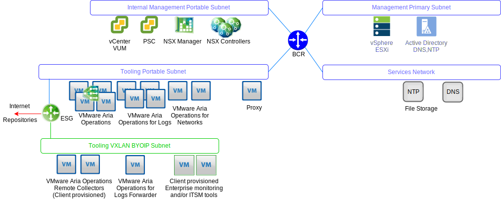

---

copyright:

  years:  2016, 2019

lastupdated: "2019-05-17"

---

# Operations management architecture overview
{: #opsmgmt-arch}
The architecture of the products in the operations management layer provides centralized monitoring with logging data from {{site.data.keyword.vmwaresolutions_full}}. The operations management layer monitors in real-time, the physical infrastructure, virtual infrastructure, and optionally the client’s compute workloads.

At a high level, the following information is collected:
* Topology data, such as physical and virtual compute, networking, and storage objects.
* Monitoring data, such as:
  * Metrics - structured data such as performance and capacity
  * Logs - unstructured data such as system events

## Operation management flows
{: #opsmgmt-arch-flows}

The following diagram shows the key interaction and integration of the operations management tooling.

{: caption="Figure 1. Operational tooling management flow" caption-side="bottom"}

The {{site.data.keyword.vmwaresolutions_short}} operations management consists of the following steps:
* Monitoring - vRealize Operations Manager (vROps) tracks and analyzes the operation of multiple objects in the {{site.data.keyword.vmwaresolutions_short}} architecture by using analytic algorithms. These algorithms help vROps learn and predict the behavior of these objects. System administrators access this information by using views, reports, and dashboards.

  When there is an issue in the environment vROps generates alerts of three impact types:
    * Health alerts - indicate issues that affect the health of the environment and require immediate attention.
    * Risk alerts - indicate issues that are not immediate threats but should be addressed in the near future.
    * Efficiency alerts – information to improve performance or reclaim resources.

  vROps Alerts are events that occur on the monitored objects when data analysis indicates deviations from normal metric values, or when an issue occurs with one of the monitored components. vROps alerts are assigned one of these categories:
    * Critical - should be acted upon immediately.
    * Immediate - should be acted on as soon as possible.
    * Warning - should be checked when time allows.

* Logging - vRealize Log Insight (vRLI) provides real-time log management and log analysis with machine learning-based intelligent grouping, high-performance searching, and troubleshooting across the physical and virtual objects in the {{site.data.keyword.vmwaresolutions_short}} architecture. vRLI collects data from vSphere hosts using the syslog protocol and to other VMware products, like vCenter Server, to collect events, tasks, and alarm data. It integrates with vRops to send notification events and enable launch in context. Other objects in the {{site.data.keyword.vmwaresolutions_short}} architecture that is capable of sending syslog data is pointed to vRLI. Optionally the client can configure any system that is capable of sending syslog data to forward this date to vRLI.

* Network Health - vRealize Network Insight is an analytics tool focused on proactively enabling:
  * Network health and performance monitoring.
  * End-to-end troubleshooting.
  * 360° visibility and analytics.
  * Micro-segmentation-based compliance management.

* Patching and Upgrading - vSphere Update Manager (VUM) provides centralized, automated patch and version management for VMware vSphere hosts and virtual machines (VMs) (not OS and apps).

## Operation management networking
{: #opsmgmt-arch-network}

The network overview diagram is shown below:

{: caption="Figure 2. Operational tooling networking" caption-side="bottom"}

* A tooling private portable subnet is provisioned to provide {{site.data.keyword.cloud_notm}} IP address space that is used for the initial provisioning of the tooling VMs but then becomes the responsibility of the client to manage the IP address space for scale-out of the tooling. VMs on this subnet require access to the components hosted on the Management and Internal Management subnets.
* Tooling VXLAN subnet is used to provide BYOIP IP address space that is used for the initial provisioning of the tooling VMs but then becomes the responsibility of the client to manage the IP address space for scale-out of the tooling. VMs on this subnet require access to the components hosted on the Overlay subnets. The ESG provides NAT between the {{site.data.keyword.cloud_notm}} and BYOIP address spaces.
* The vROps Remote Collectors are deployed by the client if they would like to take advantage of the vROps to monitor their compute VMs.
* The vRLI Forwarders relay log messages from overlay components to the vRLI cluster. The client can also configure their compute VMs to uses these forwarders, if required.
* VMware Update Manager (VUM) provides updating of vSphere hosts and VM hardware and tools. VUM uses the Proxy to gain access to the internet repositories.

vROps collects data from objects in the environment. Each piece of data collected is called a metric observation or value. vROps uses the vCenter adapter to collect raw metrics from vCenter. In addition to the metrics it collects, vROps calculates capacity metrics, badge metrics, and metrics to monitor the health of your system.  Alert definitions are a combination of symptoms and recommendations that identify problem areas and generate alerts on which you act for those areas.

## Monitored components
{: #opsmgmt-arch-components}

### Monitoring of vCenter
{: #opsmgmt-arch-components-vcenter}

The monitoring of vCenter is accomplished with vROps and the VMware SDDC Health Management Pack. vRLI collects the log data from vCenter and the Content Pack for vSphere adds specific understanding to the logs and in turn sends alerts to vROPs.

The VMware SDDC Health Management Pack monitors the SDDC Management stack and provides badges for health and alerts related to configuration and compliance of SDDC product components including vCenter.

### Monitoring of vSphere hosts
{: #opsmgmt-arch-components-hosts}

Monitoring of the vSphere hosts is accomplished with vROps through vCenter and the collection of logs through vRLI.

### Monitoring of vSAN
{: #opsmgmt-arch-components-vsan}

To monitor vSAN, vROps, and vRLI are used. In vCenter there is an additional set of vSAN Health Checks that can be used. Installation of the Management Pack for vSAN provides additional dashboards to aid with the monitoring of vSAN.

vROps generates an alert if a problem occurs in the SDDC product components in the storage area network that the VMware vSAN adapter is monitoring. An alert that is related to config compliance and health is passed through VMware SDDC Health Solution management pack from VMware vSAN Management Pack. vSAN is monitored with the vROps vSAN Management Pack through the vCentre appliance using a vSAN adaptor. The default collection interval is five minutes and the vSAN adapter also collects Health Check Service and Performance Service metrics from vSphere objects. The Health Check Service interval is configured in the vSphere interface and is 60 minutes by default.

To ensure that the vSAN adapter can collect all performance data, the vSAN performance service must be enabled in vSphere.

### Monitoring of NSX for vSphere
{: #opsmgmt-arch-components-nsxv}

To monitor NSX, the following tools are implemented:
* vRealize Operations Manager (vROps)
* vRealize Log Insight (vRLI)
* vRealize Network Insight (vRNI)

This enables system administrators to monitor, manage and troubleshoot VMware NSX. The vROps Management Pack for VMware NSX provides visibility into the network topology. NSX dashboards provide a quick overview of the NSX environment and the health of its components. Correlation between NSX objects and vSphere objects enables easy troubleshooting.

vROps uses the management pack to poll VMware NSX for configuration, performance, and support data. On behalf of vROps, the Management Pack translates the polling requests into REST API calls to retrieve the required data from NSX Manager.

The NSX components need to be configured to send syslog to vRLI.

* NSX Manager - [Specify Syslog Server](https://pubs.vmware.com/NSX-6/topic/com.vmware.nsx.admin.doc/GUID-EA70974C-07F8-469D-8A9D-0ED54F0C8F34.html#GUID-EA70974C-07F8-469D-8A9D-0ED54F0C8F34){:new_window}.
* NSX Controllers - [Configure NSX Controllers](https://kb.vmware.com/s/article/2092228){:new_window}.
* NSX Edge - [Configure Remote Syslog Servers](https://pubs.vmware.com/NSX-6/topic/com.vmware.nsx.admin.doc/GUID-9C25E097-E2CC-461A-9DA6-E8118D16EE62.html#GUID-9C25E097-E2CC-461A-9DA6-E8118D16EE62){:new_window}.
* Firewall - You must configure the remote syslog server for each cluster that has firewall enabled. The remote syslog server is specified in the `Syslog.global.logHost` attribute.

NSX Flow Monitoring can be used in NSX manager to determine which flows are approved and which flows are blocked. If required, then port mirroring can be configured for a vSphere Distributed Switch.

### Monitoring of NSX-T
{: #opsmgmt-arch-components-nsxt}

To monitor NSX-T, the following tools are implemented:

* vRealize Operations Manager (vROps)
* vRealize Log Insight (vRLI)

The VMware SDDC Health Management Pack monitors the following:
* Logical Switches - Monitors admin state of the logical switches.
* Controller Cluster - Monitors the deployed cluster node count for HA and maintains quorum.
* Controller Nodes - Monitors node connectivity with controller cluster and manager node.
* Edge Nodes - Monitors edge node running state and its connectivity with controller cluster and manager nodes.
* NSX-T Management Services.
* T0 Router Service - Monitors static route, NAT, BGP, BFD, and route redistribution services.
* T1 Router Service - Monitors static route, NAT, and route advertisement services.

### Monitoring of vRealize Operations Manager
{: #opsmgmt-arch-components-vrops}

The VMware SDDC Health Management Pack has Alert definitions for the following events:
* Current sizing of the vRealize Operations Manager nodes are not sufficient for given load.
* Cluster node configuration does not follow the vRealize Operations Manager sizing guideline.
* Current sizing of the Remote Collector is not sufficient for given load.
* Remote Collector configuration does not follow the vRealize Operations Manager sizing guideline.
* vRealize Operations Cluster has exceeded the recommended number of analytic nodes.

### Monitoring of vRealize Log Insight
{: #opsmgmt-arch-components-vrli}

vRLI supports alerts that trigger notifications about its health and generates notifications when an important system event occurs, for example, when the disk space is almost exhausted and vRealize Log Insight must start deleting or archiving old log files.

## System requirements
{: #opsmgmt-arch-requirements}

The design uses the following quantity and size of appliances:

Table 1. Operation tooling summary system requirements

||vROps|vRLI|vRNI|Proxy|
|---|---|---|---|---|---|
|VM Qty|4|4|1+1|1|
|vCPU|8|8|4 + 8|4|
|RAM GB|32|16|12 + 32|0.5|
|Disk GB|254|1042|158 + 1000|80|

## Software versions
{: #opsmgmt-arch-versions}

Table 2. Operational tooling software versions

|Product Name|Version|
|---|---|
|VMware vRealize Operations Manager Advanced or higher|7.0|
|vRealize Operations Management Pack for NSX for vSphere|3.5.2|
|vRealize Operations Management Pack for Storage Devices|7.0.0|
|vRealize Operations Management Pack for Site Recovery Manager|8.1.1|
|VMware vRealize Log Insight|4.7|
|vRealize Log Insight Content Pack for NSX for vSphere|3.8|

## Related links
{: #opsmgmt-arch-components-related}

* [vCenter Server on {{site.data.keyword.cloud_notm}} with Hybridity Bundle overview](/docs/services/vmwaresolutions/archiref/vcs?topic=vmware-solutions-vcs-hybridity-intro)
