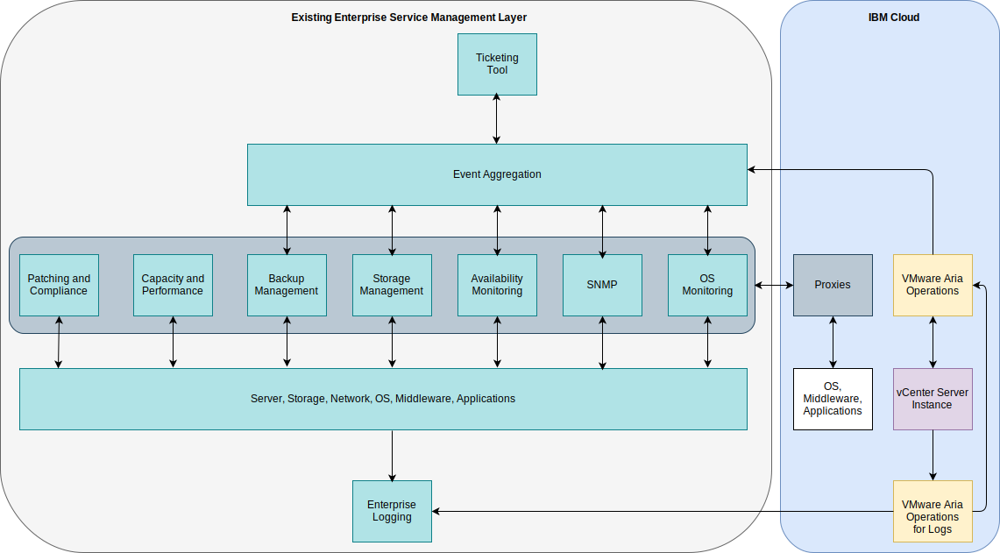

---

copyright:

  years:  2016, 2024

lastupdated: "2024-10-10"

subcollection: vmwaresolutions

---

{{site.data.keyword.attribute-definition-list}}

# Integration
{: #opsmgmt-integration}

Review the following topic to understand the Operational Management layer of the design. However, some enterprises might want to integrate this layer with the Service Management layer. In this design, VMware Aria® Operations™ Manager is the central point where all alerts are surfaced.

Review the following categories of integration.
* Northbound – Integration from VMware Aria Operations to other tools.
   * Notification of alerts to SMTP server or tools like Slack or PagerDuty.
   * Ticket integration into a service desk tool like ServiceNow.
   * Initiating VMware Aria Orchestrator workflows to remediate an issue discovered by VMware Aria® Automation™.
* Southbound – Integration from service management or cloud management tools.
   * VMware Aria Automation configures monitoring when new workload is added.
   * Update VMware Aria Operations objects with event enrichment from external sources.

VMware Aria Operations provides the following outbound alert plug-ins:
* Automated Action – enabled by default.
* Standard email – uses Simple Mail Transfer Protocol (SMTP) to email VMware Aria Operations Manager alert notifications to your interested individuals.
* SNMP Trap– logs alerts on your SNMP Trap server.
* REST Notification – sends VMware Aria Operations alerts to another REST-enabled application where you built a REST web service to accept these messages.
* Log file – enables VMware Aria Operations to log alerts to a file on each of your VMware Aria Operations Manager nodes. If you installed VMware Aria Operations Manager as a multiple-node cluster, each node processes and logs the alerts for the objects that it monitors. Each node logs the alerts for the objects that it processes.
* Smarts SAM Notification – sends alert notifications to EMC Smarts Server Assurance Manager.
* Network Share – sends reports to a shared location, supports SMB version 2.0.

Notifications are alert notifications that meet the filter criteria in the notification rules before they are sent northbound to external systems. Notification rules are configured for the required outbound alerts so that they can be filtered before they are sent to the selected external system. The notifications list is used to manage these rules.

## Integration use case
{: #opsmgmt-integration-usecase}

This example use case is based on an existing generic service management layer that is used by an enterprise. The client provisioned a {{site.data.keyword.vcf-auto}} instance with the Operations Management option, and they want to integrate this platform into their service management platform. They use an event aggregation system to integrate the alerts generated from the domain-specific monitoring tools:

* A tool set to monitor the OS, middleware and applications across their UNIX®, Linux®, and Windows® workloads, but this tool does not monitor the infrastructure components like VMware®, networking devices, or storage.
* An SNMP manager to receive SNMP traps from their network infrastructure. This tool also collects SNMP metrics to enable performance and capacity alerts.
* A backup management tool to manage their backups.
* Storage management tools to manage their storage arrays.
* An availability tool that uses ping to test the devices reachability.

Their service management layer also consists of:

* A server capacity and performance tool to collect metrics to provide reports.
* A patching and compliance server to update OS, middleware, and applications and measure compliance on these platforms.
* A ticketing tool used to manage tickets for, incidents, problems, and changes. This tool is also the enterprise’s Configuration Management Database (CMDB). The tool is able to send emails to the operations teams and SMS messages.
* An enterprise logging system that captures logs from all systems and managed by the security team.

Now that they have VMware Aria Operations they can integrate this tool by using northbound notification that uses the SNMP Trap plug-in. To integrate VMware Aria Operations, the traps that are sent by VMware Aria Operations must be parsed in a way that the client’s event management environment can create alerts and enrich it. The management tool team downloaded the VMware MIBs from VMware and installed them in their event management environment.

VMware Aria Operations™ for Logs is configured to forward all events to the enterprise logging system in accordance with the client’s policies.

The client wants to use their existing OS, middleware, and application monitoring tools so they used proxies in {{site.data.keyword.cloud}} to collect and forward metrics and alerts.

{: caption="VMware Aria Operations integration service management" caption-side="bottom"}

## Related links
{: #opsmgmt-integration-related}

* [Understanding the VMware Aria Operations API](https://docs.vmware.com/en/VMware-Aria-Operations/8.17.1/API-Programming-Operations/GUID-A4113636-D84E-44A5-9672-13EDA9CC4CA2.html){: external}
* [VMware Developer Documentation](https://developer.broadcom.com/xapis){: external}
