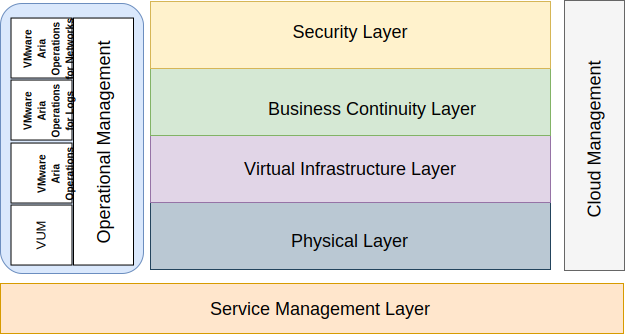

---

copyright:

  years:  2016, 2025

lastupdated: "2025-10-24"

subcollection: vmwaresolutions

---

{{site.data.keyword.attribute-definition-list}}

# Operations management introduction
{: #opsmgmt-intro}

{{site.data.content.vms-deprecated-note}}

The following reference architecture guides and constrains the instantiations of the {{site.data.keyword.vmwaresolutions_full}} architectures.

It also does the following actions:
* It provides a common language for the various stakeholders.
* It provides consistency of technology implementation to solve problems.
* It supports the validation of solutions against proven reference architecture.
* It encourages adherence to common standards, specifications, and patterns.

The primary objective of this reference architecture is to document the Operations Management capability to provide monitoring and alerting of the {{site.data.keyword.vmwaresolutions_short}} environment that is deployed for the client. The tools are configured with best practice parameters and thresholds for use by the client’s operations team.

The design allows the client to complete the following tasks:
* Scale up or down as needed.
* Install their own enterprise monitoring tools as mandated by their operational policies.
* Integrate the tools into their own enterprise IT Service Management (ITSM) platform.

## Operations management
{: #opsmgmt-intro-opsmgmt}

{{site.data.keyword.vmwaresolutions_short}} is based on the following architectural layers:

{: caption="Architectural layers" caption-side="bottom"}

* **Physical Layer** - The lowest layer of the architecture is the physical layer, which consists of the compute, network, and storage components used from {{site.data.keyword.cloud_notm}}:
   * {{site.data.keyword.cloud_notm}} bare metal servers that run the management, edge, and compute workloads.
   * {{site.data.keyword.cloud_notm}} network that consists of VLANs, subnets, Frontend, and Backend Customer Routers (FCR/BCR).
   * vSAN storage, which is a consolidated datastore from the SSDs in the {{site.data.keyword.cloud_notm}} bare metal servers or Endurance storage.

* **Virtual Infrastructure Layer** - The virtual infrastructure layer runs on the physical layer components. The virtual infrastructure layer controls the access to the underlying physical infrastructure, and controls and allocates resources to the management and compute workloads. The management workloads consist of elements in the virtual infrastructure layer itself, together with elements in the cloud management, service management, business continuity, and security layers.

* **Business Continuity Layer** - This layer contains elements to support business continuity by providing data backup, restoration, and disaster recovery. For more information, see the {{site.data.keyword.vmwaresolutions_short}} backup and restoration architecture, Veeam, and Zerto disaster recovery reference architectures.

* **Security Layer** - This layer contains the elements to reduce risk and increase compliance. For more information, see the Fortinet®, F5®, NSX, Entrust, and Caveonix reference architectures.

This document is adding the following layers to the {{site.data.keyword.vmwaresolutions_short}} architecture:

* **Operations Management Layer** - The architecture of the operations management layer includes management components that support the physical and virtual layers and optionally the compute workloads in real time. The operations management layer understands the {{site.data.keyword.vmwaresolutions_short}} topology: physical, virtual, compute, networking, and storage resources. The operations management layer consists primarily of monitoring and logging functions.

    Information is collected in the following forms:
    * Metrics - structured data such as performance and capacity
    * Logs - unstructured data such as system events

    The Operations Management Layer consists of the following tools:
    * VMware Aria® Operations™ Manager - This tool uses data that is collected from system resources (objects) to identify issues in the monitored system components. For many issues, VMware Aria® Automation™ suggests the corrective action that you can take to fix the issue. For more challenging issues, VMware Aria Operations offers rich analytical tools to; reveal hidden issues, investigate complex technical problems, identify trends, or drill down to gauge the health of a single object.
    * VMware Aria Operations™ for Logs - This tool provides intelligent log management for infrastructure and applications in any environment. This highly scalable log management solution provides intuitive, actionable dashboards, sophisticated analytics, and broad third-party extensibility across physical, virtual, and cloud environments.
    * VMware Aria Operations™ for Networks - This tool delivers intelligent operations for software-defined networking and security. It enables visibility across virtual and physical networks, provides operational views to manage and scale NSX deployments, and accelerates micro-segmentation planning and deployment.
    * VMware® Update Manager (VUM) - VUM enables centralized, automated patch and version management for VMware vSphere®. VUM offers solutions for upgrading and patching vSphere hosts, installation and updating the third-party software on hosts, and upgrading the VM hardware, VMware Tools, and virtual appliances.

For a full enterprise architecture, the following layers might be required. However, they are outside of the {{site.data.keyword.vmwaresolutions_short}} architecture.

* **Cloud Management Layer** - The cloud management layer is the highest layer of the cloud architecture. This layer requests resources and orchestrates the other layers from a UI or API. VMware Aria Automation enables cloud automation on the {{site.data.keyword.cloud_notm}}. For more information about how this architecture can be extended with Chef integration, see the Broadcom® documentation.

* **Service Management Layer** - This layer focuses on the full lifecycle of the IT environment, is typically implemented at the enterprise level, and combines inputs from all the silos of IT Operations and technologies. This layer has traditionally been designed on IT Service Management (ITSM) frameworks such as the IT Infrastructure Library (ITIL) and ISO/IEC 20000, which are a framework of best practices for delivering IT services through the processes and stages of the IT service lifecycle. At a product level, ITSM is typified by a centralized workflow management system for handling incidents, service requests, problems, changes, and knowledge connected to a configuration management database.
